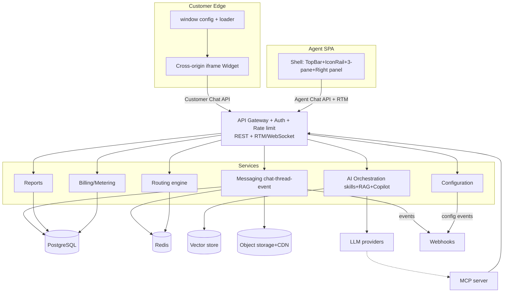
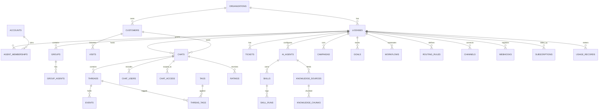

# Ürün Gereksinim Dokümanı (PRD) — "Nexa" Canlı Destek + AI Müşteri Hizmetleri Platformu

<!-- Bu belge, /Users/miracle/Desktop/livechat altındaki 4 perspektiften derlenen tüm analizlerin sentezidir. KOPYA değildir; ilham alınan ÖZGÜN bir platformun sıfırdan geliştirme gereksinim dokümanıdır. Çıktı dili Türkçe; kod/identifier/URL İngilizce. -->

> Kod adı: **Nexa** (çalışma adı). Kaynaklarda incelenen ürünler LiveChat ve Text (text.com/app); Nexa bu iki ürünün TEK bir birleşik platformda yeniden tasarlanmış özgün halidir.

---

<!-- SECTION:1 -->
## 1. Doküman Kontrolü, Sözlük ve İncelenen Kaynaklar

### 1.1 Doküman Kontrolü

| Alan | Değer |
|---|---|
| Belge adı | Nexa — Canlı Destek + AI Müşteri Hizmetleri Platformu, Ürün Gereksinim Dokümanı (PRD) |
| Versiyon | **1.0** |
| Tarih | **2026-07-21** |
| Sahip (Owner) | **Zoro** |
| Durum | **Taslak** |
| Hedef kitle | Ürün, mühendislik (frontend + backend), tasarım, QA, güvenlik/uyumluluk, satış/pazarlama |
| Kaynak temeli | LiveChat (eski panel) + Text App (`text.com/app`, yeni) canlı gözlemleri, 4 analiz perspektifi (A/B/C/D) + 11 kanıt belgesi + ER diyagramı + 66 benzersiz görsel |
| Dil kuralı | Anlatım **Türkçe**; tüm kod / identifier / URL / UI etiketleri İngilizce (gözlemlendiği gibi) |
| Etiketleme | **Gözlem:** kaynakta doğrudan görülen; **Çıkarım:** mimari/davranış tahmini |

**Sürüm geçmişi**

| Versiyon | Tarih | Yazar | Not |
|---|---|---|---|
| 1.0 | 2026-07-21 | Zoro (PRD Specialist) | İlk birleşik taslak; 4 perspektif + kanıt paketi + görseller sentezlendi |

**Onay bekleyenler (v1.0 çıkışı için):** Ürün sahibi, Baş mimar, Güvenlik/uyumluluk lideri, Tasarım lideri.

### 1.2 Sözlük ve Kısaltmalar

| Terim / Kısaltma | Açıklama |
|---|---|
| **Nexa** | Bu PRD'de tanımlanan özgün platformun çalışma (kod) adı |
| **Agent / Teammate** | İnsan müşteri temsilcisi (panel kullanıcısı) |
| **AI Agent** | Müşteriyle doğrudan konuşan, niyet algılayan, adımlı skill yürüten otonom yapay zekâ ajanı |
| **Copilot** | İnsan temsilciyi destekleyen (özet, yanıt önerisi) agent-assist AI; kendi bilgi tabanına sahip |
| **Skill** | AI Agent veya Workspace tarafından çalıştırılan, doğal dille yazılıp adımlara derlenen otomasyon birimi (Playbook) |
| **Workflow** | Node/edge tabanlı, deterministik, görsel no-code otomasyon akışı (Workspace skill'i) |
| **Playbook** | Skill/otomasyon merkezi; eski LiveChat "Automate"in (chatbot + routing + workflows + canned) birleşik halefi |
| **Chat → Thread → Event** | Çekirdek mesajlaşma veri modeli: kalıcı `chat` > oturum parçası `thread` > atomik `event` (mesaj/sistem/rich/dosya) |
| **RTM** | Real-Time Messaging; kalıcı WebSocket push katmanı |
| **Web API** | Stateless REST (XHR/RPC-action) transportu; RTM'in muadili |
| **RAG** | Retrieval-Augmented Generation; AI'ı bilgi kaynaklarıyla besleyen alma-artırılmış üretim |
| **Knowledge source** | RAG kaynağı: Website (crawl) / File / Article / FAQ |
| **AI resolution** | AI Agent'ın insana devretmeden çözdüğü konuşma; faturalanan tüketim birimi |
| **Omnichannel** | Web widget, Chat page, Email, Messenger, Twilio SMS, WhatsApp, Instagram, Telegram kanallarının tek gelen kutusunda birleşmesi |
| **Widget** | Müşteri tarafında siteye gömülen cross-origin iframe sohbet balonu |
| **PAT** | Personal Access Token; sunucu-sunucu kimlik doğrulama (`Basic base64(account_id:PAT)`) |
| **OAuth 2.1 / PKCE** | Temsilci ve uygulama kimlik doğrulama akışı |
| **MCP** | Model Context Protocol; kiracı verisini harici AI asistanlarına (Claude/ChatGPT) açan sunucu |
| **RBAC** | Rol tabanlı erişim kontrolü (Owner / Admin / Agent) |
| **RLS** | PostgreSQL Row-Level Security; kiracı izolasyonu zorlaması |
| **Multi-tenant** | Çok kiracılı SaaS; izolasyon anahtarı `organization_id` / `license_id` / `account_id` |
| **Routing / Queue** | Gelen sohbeti kural + gruba/temsilciye atayan yönlendirme ve kuyruk motoru |
| **Canned response** | `#` kısayolu ile tetiklenen hazır yanıt |
| **Campaign / Greeting** | Ziyaretçiye kural bazlı otomatik karşılama / hedefli mesaj |
| **Goal** | Ziyaretçi → sohbet → dönüşüm (satış/lead/çözüm) hedef takibi (huni) |
| **Manual / Assisted / Automated** | Sohbetin AI katılım kırılımı: yalnız insan / Copilot-destekli insan / AI çözdü |
| **KPI / OKR** | Anahtar performans göstergesi / Hedefler ve anahtar sonuçlar |
| **MoSCoW** | Öncelik yöntemi: Must / Should / Could / Won't |
| **PLG** | Product-Led Growth; ürün-öncülüğünde büyüme (kartsız trial) |
| **SLA / SLO / SLI** | Hizmet seviyesi anlaşması / hedefi / göstergesi |
| **2FA / SSO / SAML / OIDC** | İki faktörlü kimlik / tek oturum açma / kurumsal kimlik federasyonu protokolleri |
| **WCAG** | Web İçerik Erişilebilirlik Kılavuzu (a11y) |
| **GDPR / KVKK / CCPA / HIPAA / PCI DSS / SOC 2 / ISO 27001** | Veri koruma ve güvenlik uyumluluk çerçeveleri |
| **i18n** | Uluslararasılaştırma / çok dillilik |
| **KYC** | Know Your Customer; kimlik doğrulama (regüle sektör örnek senaryosu) |
| **`dal` / `fra`** | Veri merkezi bölgeleri: Dallas (ABD) / Frankfurt (AB) |

### 1.3 İncelenen Kaynaklar

Dört perspektiften derlenen belgeler ve her birinin PRD'ye kattığı temel değer. Çelişki çözümünde **Perspektif D (canlı text.com/app taraması) + `_evidence` önceliklidir**.

| Perspektif | Dosya | Ne kattı |
|---|---|---|
| **D** (en güncel, öncelikli) | `rapor-1-fonksiyonel.md` | MOD-00…MOD-12 + EK-A/B/C fonksiyonel anatomi; MOD-X.Y.Z indeksleme; gerçek etiket/rota/veri |
| **D** | `rapor-2-teknik-mimari.md` | Üst düzey mimari, frontend bileşen ağacı, API v3.6 kontratları, PostgreSQL DDL, güvenlik/performans/bakım, P0–P3 öncelik |
| **D** | `_evidence/00-INDEX.md … 10-settings-detail.md` (11 dosya) | Birinci-el gerçek hesap/fiyat/URL/modül haritası; ekran envanteri |
| **C** (5 açı) | `v2-derin-analiz/v2-00-index.md` | Orkestrasyon indeksi |
| **C** | `v2-01-fonksiyonel-ux-derin.md` | Onboarding, AI Agent kurulum yolculuğu, empty/hata/RBAC state kalitesi, mikro-etkileşimler, IA zayıflıkları, WCAG riskleri |
| **C** | `v2-02-teknik-mimari-derin.md` | Derin teknik gözlem (Go RTM çekirdeği, Emotion, Turborepo, host ayrımı), SLO/kapasite önerileri |
| **C** | `v2-03-api-veri-referans.md` | 23 hata tipi, ~63 scope, ek endpoint/action'lar, webhook kataloğu, sürüm changelog, billing/HelpDesk/ChatBot API |
| **C** | `v2-04-guvenlik-uyumluluk.md` | GDPR/HIPAA/PCI/SOC2/ISO durum haritası, alt-işleyenler, retention, RLS, webhook HMAC boşluğu, STRIDE risk matrisi |
| **C** | `v2-05-rekabet-yol-haritasi.md` | Intercom/Crisp/Tidio/Zendesk/HelpScout/Olark karşılaştırması, etki×çaba matrisi, faz-faz efor (kişi-ay), fiyat stratejisi |
| **B** (en detaylı + ER) | `LiveChat_Anatomik_Harita_ve_Fonksiyonel_Rapor.md` | Eski LiveChat panel anatomisi: Home/Engage/Automate/Archives/Goals/Sales tracker/HelpDesk upsell/Command palette |
| **B** | `LiveChat_Teknik_Mimari_ve_Gelistirici_Blueprint.md` | Eski panel teknik blueprint; `workflows(nodes/edges)`, `campaigns`, `goals`, `visits` tabloları; stack önerileri |
| **B** | `LiveChat_ER_Diyagram.mermaid` | ER diyagramı (ORGANIZATION/LICENSE/ACCOUNT/CHAT/THREAD/EVENT/CAMPAIGN/GOAL/WORKFLOW/RATING…) |
| **B** | `LiveChat_Derin_Analiz_Raporu.docx` | Yönetici düzeyi pazar/panel/konumlandırma analizi; eski plan kademeleri; %74/3x AI iddiaları |
| **A** (özet) | `01-fonksiyonel-analiz.md` | Yeni text.com/app fonksiyonel özeti (D ile örtüşür); 31 workflow şablonu, tohum veri, drag-reorder |
| **A** | `02-teknik-mimari.md` | Yeni text.com/app teknik özeti; Prisma modelleri, host ayrımı |
| **Referans** | `text-com-arastirma-promptu.md` | Ürün niyeti: text.com/app'in modül-modül özgün klonu; React+Node.js; indeksleme ve kapsam kuralları |

> **Marka/ürün birleştirme notu (Gözlem + Çıkarım):** Kaynaklardaki veriler iki ayrı ürün yüzeyinden gelir — eski **LiveChat** paneli (Home/Engage/Automate/Archives modülleri) ve yeni **Text App** (`text.com/app`; Inbox/Customers/Team/Playbook/Reports). Bu PRD ikisini **TEK birleşik Nexa ürünü** olarak sentezler: yeni Text mimarisi taban alınır, eski LiveChat'in özgün modülleri (Goals, görsel Workflows, Sales tracker, Command palette, zengin Home dashboard, Archives) Nexa'da tek üründe konumlandırılır.
<!-- /SECTION:1 -->

<!-- SECTION:2 -->
## 2. Yönetici Özeti, Ürün Vizyonu, Problem Tanımı ve Değer Önerisi

### 2.1 Yönetici Özeti

**Nexa**, web sitesi, e-posta ve mesajlaşma kanallarından (Website widget, Chat page, Email, Facebook Messenger, Twilio SMS, WhatsApp; yakın vadede Instagram, Telegram) gelen tüm müşteri konuşmalarını **tek bir gelen kutusunda (omnichannel inbox)** toplayan, üzerine üç katmanlı bir yapay zekâ mimarisi kuran, canlı destek + AI müşteri hizmetleri platformudur.

Üç AI katmanı: **(1) AI Agent** — müşteriyle doğrudan konuşan, niyet algılayan, doğal dille yazılıp adımlara derlenen `skill`'leri yürüten (bilgi iste, etiketle, özetle, mesaj gönder, ekibe aktar), RAG bilgi tabanıyla beslenen otonom ajan; **(2) Copilot** — insan temsilciyi anlık destekleyen (sohbet özeti, yanıt önerisi), kendi bilgi tabanına sahip agent-assist AI; **(3) yardımcı mikro-özellikler** — Reply Suggestions, mesaj tonu/dilbilgisi geliştirme, otomatik etiketleme.

Ürün iki yüzeyden oluşur ve çekirdek değer bu iki yüzey arasındaki **gerçek zamanlı mesajlaşma omurgasıdır**: müşteri tarafında cross-origin iframe **widget**, temsilci tarafında `/app/<module>` derin-bağlantılı **SPA panel**. Bunları bir **RTM WebSocket** katmanı (stateless muadili Web API/REST ile birlikte) bağlar. Veri modeli **chat → thread → event** üçlüsüdür.

İş modeli **koltuk + tüketim (metered)** hibritidir: **$99 / kullanıcı / ay** + dahil **200 AI resolution** (aşım $49.50/50) + **API call** aşımı ($29.50/100.000) + 14 günlük kartsız trial. **Gözlem:** Kaynak üründe üç tutarsız fiyat yüzeyi (eski LiveChat koltuk $19–89, `text.com/pricing` platform ücreti, in-app $99) bir zayıflık olarak öne çıkar; **Nexa bu sorunu tek, şeffaf, öngörülebilir bir fiyat yüzeyiyle çözmeyi bir farklılaştırıcı olarak benimser.**

Nexa; küçük ekipler için hızlı kurulum ve düşük teknik bariyer (snippet + platform rehberi + kod-yazmadan AI skill), büyük/regüle ekipler için gelişmiş yönlendirme, rol/grup yönetimi, kurumsal güvenlik (SSO/2FA/audit) ve MCP tabanlı AI-native entegrasyon sunar. Hedef bir referans dikey olarak, kaynak verideki **çevrimiçi bahis/casino müşteri desteği** (KYC, para çekme, çevrim/wager, sorumlu oyun) senaryosu benimsenir; bu regüle dikey için hazır şablon skill kütüphanesi bir giriş avantajıdır.

### 2.2 Ürün Vizyonu

> **"Müşteri hizmetlerini bir maliyet merkezinden bir gelir/deneyim motoruna dönüştürmek."**

Nexa'nın vizyonu, canlı sohbetin klasik reaktif desteğini; proaktif satış (traffic/campaigns/goals), otonom AI çözümü (AI Agent + Playbook) ve insan-AI işbirliği (Copilot) ile birleştiren, teknik olmayan ekiplerin bile **kod yazmadan güçlü otomasyon** kurabildiği, tek panelde omnichannel bir platform olmaktır. Uzun vadede ürün, MCP üzerinden harici AI asistanlarına açık, API-öncelikli ve genişletilebilir bir **AI-native müşteri iletişim işletim sistemi** olmayı hedefler.

**Konumlandırma ilkeleri (kaynak ilhamı + Nexa farklılaşması):**
- **Gelir odaklı anlatı** (Gözlem: kaynak ürün "service as your profit engine" konumlanır) — Nexa da desteği dönüşüm/satış aracı olarak konumlar (proaktif kampanya, lead qualification, upsell skill'leri).
- **AI'yı takımın parçası yap** — AI Agent ve Copilot, insan temsilcilerle aynı "Team" çatısında yönetilir.
- **Şeffaf ve öngörülebilir AI faturası** (Nexa farklılaşması) — kota + %80 eşiğinde proaktif uyarı + net aşım fiyatı; rakiplerin öngörülemeyen AI maliyeti şikâyetine karşı.
- **Tek app / tam mobil parite** — tüm modüller tek mobil uygulamada.
- **Regüle dikeyde nişleşme** — hazır uyumluluk şablonları (KYC/withdrawal/responsible-gambling).

### 2.3 Problem Tanımı

İşletmelerin müşteri iletişimi bugün parçalı, yavaş ve pahalıdır:

1. **Kanal parçalanması.** Müşteriler web, e-posta, WhatsApp, Messenger, SMS gibi farklı kanallardan ulaşır; ekipler her kanal için ayrı araç kullanır, bağlam kaybolur, yanıt gecikir.
2. **Ölçeklenmeyen insan desteği.** Tekrarlayan sorular (para çekme durumu, KYC, şifre sıfırlama, kargo) ajanların zamanını tüketir; hacim arttıkça maliyet doğrusal büyür.
3. **Kod-bağımlı otomasyon.** Klasik chatbot/otomasyon kurmak teknik ekip gerektirir; iş birimleri hızlı değişiklik yapamaz.
4. **Kör AI ve halüsinasyon riski.** Bilgi tabanına bağlı olmayan (RAG'siz) AI yanlış yanıt verir; regüle sektörde bu bir uyumluluk riskidir.
5. **Görünmeyen AI değeri ve öngörülemeyen maliyet.** Ekipler AI'ın sohbetlerin ne kadarını çözdüğünü ölçemez; rakip ürünlerde AI faturası önceden kestirilemez şekilde şişer (Gözlem: v2-05 — Intercom Fin maliyeti sticker fiyatın 2–3 katına çıkabiliyor; Zendesk 2026 itibarıyla önceden uyarısız aşım faturalıyor).
6. **Proaktif fırsat kaybı.** Sitedeki yüksek niyetli ziyaretçiye doğru anda ulaşılmaz; dönüşüm kaçar.
7. **Regülasyon ve güvenlik.** Bahis/fintech gibi dikeylerde KYC, denetim izi, veri saklama, sorumlu oyun uyumluluğu zorunludur ancak genel amaçlı araçlar bunları hazır sunmaz.
8. **Kurulum ve keşif sürtünmesi.** (Gözlem: kaynak üründe) widget kurulmadan modüllerin `/install-code` geçidine düşmesi, agresif trial upgrade baskısı ve tutarsız empty state'ler ilk deneyimi yorar.

### 2.4 Değer Önerisi

| Hedef | Nexa'nın sunduğu değer |
|---|---|
| **Kanal birleştirme** | Tüm kanallar tek omnichannel inbox'ta; ortak `event` modeli; her yerde tek bağlam |
| **AI ile ölçekleme** | AI Agent sohbetlerin büyük kısmını insana devretmeden çözer; "AI resolution" olarak ölçülür ve raporlanır (Manual/Assisted/Automated kırılımı) |
| **Kod-yazmadan otomasyon** | Doğal dil talimatı → sıralı, denetlenebilir, canlı önizlemeli adımlara derlenen `skill`'ler; şablon galerisi ile hızlı başlangıç |
| **Doğru ve güvenli AI** | RAG bilgi tabanı (Website/File/Article/FAQ) ile halüsinasyon azaltma; şeffaf adım akışı; regüle dikey şablonları |
| **Ölçülebilir ROI + şeffaf fiyat** | AI değeri raporlarda görünür; kota + proaktif uyarı ile öngörülebilir, tek yüzeyli fiyat |
| **Proaktif dönüşüm** | Canlı ziyaretçi takibi (traffic), kural bazlı kampanya/karşılama, goal hunisi, lead qualification |
| **İnsan-AI işbirliği** | Copilot özet + yanıt önerisi; vardiya devri; yeni ajan eğitimi |
| **Kurumsal hazırlık** | RBAC, SSO/2FA, RLS tenant izolasyonu, audit log, GDPR/KVKK/HIPAA yol haritası, MCP AI-native entegrasyon |
| **Düşük kurulum bariyeri** | Tek satır snippet + 11+ platform rehberi + geliştirici davet; kartsız 14 gün trial (PLG) |
<!-- /SECTION:2 -->

<!-- SECTION:3 -->
## 3. Hedefler ve Ölçülebilir Başarı Metrikleri (KPI / OKR)

### 3.1 Ürün Hedefleri (stratejik)

1. **G1 — Omnichannel çekirdek:** Tüm birincil kanalları tek gelen kutusunda, gerçek zamanlı ve tek bağlamda birleştirmek.
2. **G2 — AI ile otomasyon:** Sohbetlerin ölçülebilir bir bölümünü AI Agent ile insana devretmeden çözmek ("AI resolution").
3. **G3 — Kod-yazmadan güç:** İş birimlerinin doğal dille otomasyon (skill/workflow) kurabilmesini sağlamak.
4. **G4 — Şeffaf değer ve fiyat:** AI ROI'sini görünür kılmak; tek, öngörülebilir fiyat yüzeyi sunmak.
5. **G5 — Kurumsal ve regüle hazırlık:** Güvenlik/uyumluluk (RBAC, SSO, RLS, audit, GDPR/HIPAA) ile büyük ve regüle müşterilere hazır olmak.
6. **G6 — Düşük sürtünmeli edinim (PLG):** Kartsız trial → değere hızlı ulaşım → ücretli dönüşüm.

### 3.2 OKR'ler (ilk 12 ay — örnek/öneri)

**Objective O1 — Ürün-pazar uyumu ve aktivasyon (G1, G6)**
- KR1.1: Trial → ücretli dönüşüm ≥ **%8** (MVP), ≥ **%12** (v1 sonunda).
- KR1.2: Widget kurulum süresi (medyan) < **10 dk**; ilk hafta aktivasyon (≥1 sohbet/gün) ≥ **%60**.
- KR1.3: Onboarding checklist tamamlama oranı ≥ **%50**.

**Objective O2 — AI otomasyon değeri (G2, G3, G4)**
- KR2.1: AI çözüm oranı (Automated / Total chats) ≥ **%40** (v1), hedef trend ≥ **%60**.
- KR2.2: Kod-yazmadan yayınlanan aktif skill sayısı ≥ **3 / aktif hesap**.
- KR2.3: AI faturası "sürpriz aşım" şikâyeti oranı ≤ **%2** (kota + %80 proaktif uyarı sayesinde).

**Objective O3 — Operasyonel verimlilik (G1, G2)**
- KR3.1: Medyan ilk yanıt süresi (FRT) < **2 dk**.
- KR3.2: Temsilci başına çözülen sohbet ≥ **%25 artış** (v2 sonunda).
- KR3.3: CSAT ≥ **%80** (rated good oranı).

**Objective O4 — Kurumsal genişleme (G5)**
- KR4.1: SSO/2FA benimseme (Enterprise hesaplarında) ≥ **%90**.
- KR4.2: SOC 2 Type II + ISO 27001 sertifikasyonu (Enterprise fazı) tamamlanmış.
- KR4.3: Enterprise ARR payı ≥ **%25**; yıllık churn < **%5**.

**Objective O5 — Ekosistem ve genişletilebilirlik (G1, G5)**
- KR5.1: Hesap başına aktif entegrasyon ≥ **3** (v2).
- KR5.2: Entegrasyon aktivasyon oranı ≥ **%50**.
- KR5.3: MCP sunucusunu bağlayan hesap oranı ölçülüyor ve büyüyor.

### 3.3 Çekirdek KPI Kataloğu (kaynak metriklerle hizalı)

| KPI | Tanım | Kaynak izlenebilirliği |
|---|---|---|
| **Total chats** | Dönemdeki toplam sohbet | Gözlem: Reports Overview (örnek: 20) |
| **Manual / Assisted / Automated split** | Sohbetin AI katılım kırılımı (yalnız insan / Copilot destekli / AI çözdü) | Gözlem: Reports Overview (örnek: Manual 9 / Assisted 6 / Automated 5) |
| **AI resolution count** | AI'ın insana devretmeden çözdüğü konuşma; billing sayacı | Gözlem: Billing meter "0/200"; Reports "Automated" |
| **Resolution rate** | AI Agent çözüm oranı | Gözlem: AI Agent Performance (örnek: %100 — düşük baz uyarısı) |
| **Transferred chats %** | AI'dan insana devir oranı | Gözlem: AI Agent Performance (örnek: %57.1) |
| **Total cases** | Chats + Tickets | Gözlem: Reports (örnek: 20 = Chats 20 + Tickets 0) |
| **First response time (FRT)** | İlk yanıt süresi | Gözlem: Reports/Agent performance (örnek: 8s) |
| **Chat satisfaction (CSAT)** | Rated good / (good+bad) | Gözlem: Reports Satisfaction (örnek: %67 vs %57 önceki dönem) |
| **Chat duration** | Toplam / otomatik sohbet süresi | Gözlem: Total 6h 51m; Automated 15m 57s |
| **Efficiency** | Ajan verimliliği (sohbet/saat/ajan) | Gözlem: Home dashboard (örnek: 56.4) |
| **Chat availability** | Erişilebilirlik saati / status kırılımı | Gözlem: Reports (örnek: 166h 59m; Accepting %100) |
| **Queued visitors** | Kuyruktaki ziyaretçi | Gözlem: Reports |
| **Goals conversion** | Ziyaretçi → sohbet → hedef (satış/lead/çözüm) | Gözlem: Engage/Goals hunisi; Reports "Achieved goals / Tracked sales" |
| **Leads qualified** | Nitelikli lead sayısı | Gözlem: Üst çubuk pill "1 Leads qualified" |
| **Trial→paid conversion** | Dönüşüm oranı | Çıkarım: billing/subscription olayları |
| **API calls (metered)** | Faturalanan API çağrısı | Gözlem: Billing "$29.50/100k extra" |
| **Uptime / p99 latency** | Servis SLO'ları | Çıkarım/öneri: bkz. §7 NFR |

> **Çelişki notu (Gözlem):** Kaynak ekranlarda AI Agent "off" iken Performance %100 resolution ve 7 chat gösteriyor; ayrıca metrikler "vs 0 for previous period" olduğundan yüzdeler şişkin görünüyor. **Nexa gereği:** Metrik kartları düşük-baz (low-N) durumunu açıkça işaretlemeli (ör. "n<30, gösterge güvenilir değil") ve AI Agent kapalıyken geçmiş performansı "arşiv" olarak ayırmalıdır.
<!-- /SECTION:3 -->

<!-- SECTION:4 -->
## 4. Personalar ve Kullanıcı Hikâyeleri (Kabul Kriterleriyle)

### 4.1 Personalar

**P1 — Agent (Müşteri Temsilcisi)**
- **Rol:** İnsan temsilci; sohbetleri karşılar, yanıtlar, etiketler, gerektiğinde aktarır.
- **Bağlam:** Aynı anda birden çok sohbet yürütür (Gözlem: "6 concurrent chats limit"; gerçek hesapta 12–20). Presence durumu: Accepting chats / Not accepting chats / Offline.
- **İhtiyaçlar:** Hızlı yanıt (Reply Suggestions, canned `#`), müşteri bağlamı (Details paneli: geçmiş, ziyaret, sayfalar), Copilot yardımı, düşük bağlam-değiştirme.
- **Sıkıntılar:** Tekrarlayan sorular, bağlam kaybı, uzun sohbet özetleme yükü, kaçan bildirimler.

**P2 — Admin / Owner (Yönetici / Hesap Sahibi)**
- **Rol:** Ekip, kanal, otomasyon, güvenlik, faturalandırma yöneticisi. **Owner** tek ve faturalandırmadan sorumlu; **Admin** yapılandırma yetkili (Gözlem: bazı görünümler — Teams/Billing — Admin/Member'a kapalı olabilir: "You don't have access to this view").
- **Bağlam:** Ekip büyütme (davet), rol atama, routing kurma, AI Agent/skill yapılandırma, KB yönetimi, rapor izleme, plan yönetimi.
- **İhtiyaçlar:** RBAC, ölçeklenebilir yönlendirme, AI ROI görünürlüğü, öngörülebilir fatura, güvenlik/uyumluluk kontrolleri, denetim izi.
- **Sıkıntılar:** Karmaşık kurulum, tutarsız fiyat, öngörülemeyen AI maliyeti, regülasyon yükü.

**P3 — End Customer (Son Müşteri / Ziyaretçi)**
- **Rol:** Web sitesi ziyaretçisi veya kanal kullanıcısı; destek/satış için sohbet başlatır.
- **Bağlam:** Widget üzerinden (veya WhatsApp/Email/…); önce AI Agent, gerekirse insana devir. Karşılama kartı + quick replies ("Let's chat / Just browsing").
- **İhtiyaçlar:** Hızlı, doğru yanıt; kanal özgürlüğü; dosya paylaşımı; şeffaf "kiminle konuşuyorum" (AI persona / insan).
- **Sıkıntılar:** Uzun bekleme, yanlış/kör yanıt, kanal kısıtı.

> **Ek persona (Çıkarım, genişletilmiş kapsam):** **P4 — Developer/Partner** (API/webhook/MCP ile entegrasyon kuran), **P5 — Supervisor/Team Lead** (canlı sohbetleri izleyen "Supervise", ajan performansını yöneten). Bunlar P1/P2 yetkilerinin uzantısıdır ve ilgili user story'lerde ele alınır.

### 4.2 Kullanıcı Hikâyeleri (kabul kriterleriyle)

> Format: **US-#** — "… olarak, … istiyorum, çünkü …" + **Kabul Kriterleri (KK)**. İlgili fonksiyonel gereksinim ID'leri §6'ya referanslıdır.

#### Agent (P1)

**US-1 — Omnichannel gelen kutusunda çalışma**
Bir agent olarak, tüm kanallardan gelen sohbetleri tek listede görmek istiyorum, çünkü bağlam kaybetmeden hızlı yanıt vermek istiyorum.
- KK1: Sohbetler `All / My chats / Queued / Unassigned / Supervised / Archive` kovalarına canlı sayaçlarla ayrışır (FR-MOD-02.1.1).
- KK2: Yeni sohbet WebSocket ile listeye anlık düşer, sayaç artar, unread işaretlenir (FR-EK-C.1).
- KK3: Sohbet seç → 3-pane açılır (liste | transcript+composer | details) (FR-MOD-02.3, 02.4).
- KK4: Kanal görünümleri (WhatsApp/Messenger/Twilio) filtrelenebilir (FR-MOD-02.1.4).

**US-2 — Hızlı ve tutarlı yanıt**
Bir agent olarak, hazır yanıt ve AI önerileriyle hızlı cevap vermek istiyorum, çünkü çok sayıda sohbeti eşzamanlı yürütüyorum.
- KK1: Composer'da `Space` → Reply Suggestions çipleri üretilir; çipe tıklama metni composer'a yerleştirir (düzenlenebilir) (FR-MOD-02.3.2).
- KK2: `#` → canned response listesi açılır, seçilen metin eklenir (FR-MOD-02.3.5).
- KK3: Rich text, emoji, dosya ekleme (File sharing kurallarına tabi) mevcut (FR-MOD-02.3.5).
- KK4: Enter gönderir, Shift+Enter yeni satır; boş mesaj gönderilemez (FR-MOD-02.3.3, 02.3.6).

**US-3 — Müşteri bağlamını görme**
Bir agent olarak, müşterinin kim olduğunu ve ne yaptığını görmek istiyorum, çünkü kişiselleştirilmiş yanıt vermek istiyorum.
- KK1: Details paneli Chat info, Chat tags, Visited pages, Visit info (Device, Referring page, Visit duration, IP), Assignee, Chat ID, Duration bölümlerini gösterir (FR-MOD-02.4).
- KK2: Süre/ziyaret sayaçları canlı güncellenir (FR-EK-C.1).
- KK3: Etiket ve assignee anında düzenlenebilir (FR-MOD-02.4).

**US-4 — Copilot ile özet ve yardım**
Bir agent olarak, uzun sohbeti özetleyip yanıt yardımı almak istiyorum, çünkü vardiya devri ve hızlı çözüm istiyorum.
- KK1: "Summarize this chat as internal note" → Copilot özeti internal note olarak eklenir (FR-MOD-02.5, 12.3).
- KK2: Internal note müşteriye gitmez, transcript'te farklı stilde görünür (FR-MOD-02.3.4).
- KK3: Copilot kendi bilgi tabanından yanıt taslağı üretebilir (FR-MOD-12.2).

**US-5 — Sohbeti aktarma/izleme (Supervisor P5 dahil)**
Bir agent/supervisor olarak, sohbeti doğru ekibe aktarmak veya izlemek istiyorum, çünkü uzmanlık gerektiren konular var.
- KK1: Transfer → grup/temsilci seçilir; `chat_transferred` olayı yayılır (FR-MOD-02.6, 04.5).
- KK2: Supervise → sohbeti salt-izleme; Assign to me → kendine atama (FR-MOD-03.1.3).
- KK3: Create ticket from chat → asenkron takip ticket'ı üretir (FR-MOD-02.6).

#### Admin / Owner (P2)

**US-6 — Ekip daveti ve rol atama**
Bir admin olarak, çoklu e-postayı rolüyle davet etmek istiyorum, çünkü ekibi hızlı büyütmek istiyorum.
- KK1: Invite modal virgülle ayrılmış çoklu e-posta kabul eder; Role dropdown (Owner/Admin/Agent, default Admin) (FR-MOD-04.4).
- KK2: En az bir geçerli e-posta olmadan submit pasif; geçersiz e-posta satır-içi hata ("Enter a valid email address") (FR-MOD-04.4, EK-A.1).
- KK3: Copy invite link ile paylaşılabilir davet; koltuk sayısı faturaya yansır (FR-MOD-04.3.1, 10.1.3).
- KK4: Yarım-form kapatmada "Cancel inviting agents?" onayı (FR-EK-A.2).

**US-7 — AI Agent'ı yapılandırıp yayınlama**
Bir admin olarak, AI Agent'ın kişiliğini, bilgisini ve yeteneklerini ayarlayıp açmak istiyorum, çünkü sohbetleri otomatik çözmek istiyorum.
- KK1: Profile'da Name, Instructions (~10.000 karakter), Language, Tone, Answer length ayarlanır; sağda canlı Preview (FR-MOD-06.4).
- KK2: Knowledge'a Website/File/Article/FAQ kaynağı eklenir, indekslenir (RAG) (FR-MOD-06.3).
- KK3: Skill doğal dille yazılır → sıralı adımlara derlenir → Preview'de simüle edilir → Skill active toggle ile yayınlanır (FR-MOD-06.2).
- KK4: **Readiness check:** Knowledge boş veya hiç aktif skill yokken "Turn on AI Agent" öncesi uyarı gösterilir (Nexa iyileştirmesi; FR-MOD-06.1).
- KK5: "AI Agent is off" durumunda müşteriye AI yanıtı gitmez (FR-MOD-06.5).

**US-8 — Yönlendirme kurma**
Bir admin olarak, sohbetleri koşullara göre doğru ekibe yönlendirmek istiyorum, çünkü uzmanlık bazlı hız istiyorum.
- KK1: Chat routing kural motoru: koşul (URL/domain/geolocation/page) → hedef Chatting Team (FR-MOD-08.6.1).
- KK2: Fallback zorunlu: "If a chat doesn't match a rule, route it to [Team]" (FR-MOD-08.6.1).
- KK3: Kurallar sıralı/öncelikli değerlendirilir; concurrent-chat limitine saygı (FR-MOD-08.6.1, 04.3.4).

**US-9 — AI ROI'yi ve fatura şeffaflığını görme**
Bir owner olarak, AI'ın ne kadar çözdüğünü ve maliyeti öngörmek istiyorum, çünkü bütçe kontrolü istiyorum.
- KK1: Reports Overview'da Manual/Assisted/Automated kırılımı ve AI resolution sayacı görünür (FR-MOD-07.3.2).
- KK2: Billing'de kullanım sayacı (ör. "7/100", "0/200") gösterilir (FR-MOD-10.1.4).
- KK3: **Kota %80'e ulaşınca proaktif uyarı e-postası** gönderilir (Nexa iyileştirmesi; FR-MOD-10.2).
- KK4: Aylık toplam ve "trial bitince ne kadar" net gösterilir; trial boyunca "Billed now $0" (FR-MOD-10.1.6).

**US-10 — Kanal bağlama ve widget kurulumu**
Bir admin olarak, siteme widget kurmak ve kanalları bağlamak istiyorum, çünkü müşterilere her yerde ulaşmak istiyorum.
- KK1: Website widgets: Add website / Install code manually / Invite developer; snippet `</body>` öncesine (FR-MOD-08.5.2).
- KK2: Kod yerleştikten sonra Status "Connected"; **doğrulama sinyali** ("test message received") gösterilir (Nexa iyileştirmesi; FR-MOD-08.5.2).
- KK3: Trusted domains allowlist ile widget yalnız izinli domainlerde çalışır (FR-MOD-08.9.1).
- KK4: Diğer kanallar (Email/Messenger/Twilio/WhatsApp) OAuth/kimlik ile bağlanır (FR-MOD-08.5).

**US-11 — Güvenlik ve uyumluluk yönetimi (Enterprise)**
Bir owner olarak, SSO/2FA, denetim izi ve veri saklama kontrolü istiyorum, çünkü regüle bir sektördeyim.
- KK1: 2FA zorunlu politikası tanımlanabilir (FR-MOD-04.3.3, §7).
- KK2: SSO (SAML 2.0 / OIDC) yapılandırılabilir (Enterprise) (§7).
- KK3: Audit log (login, rol değişimi, veri silme, webhook değişimi) tutulur (§7).
- KK4: Yapılandırılabilir retention + "right to erasure" API (GDPR Md.17) (§7).

#### End Customer (P3)

**US-12 — Kanaldan sohbet başlatma**
Bir müşteri olarak, sitede sohbet başlatmak istiyorum, çünkü hızlı yardım istiyorum.
- KK1: Launcher balonu her sayfada; tıklayınca widget açılır (FR-MOD-11.1).
- KK2: Karşılama kartı + quick replies ("Let's chat / Just browsing"); "Let's chat" gerekiyorsa pre-chat form açar (FR-MOD-11.2, 08.7.7).
- KK3: Composer ile mesaj/dosya/emoji gönderilir; canlı olarak ajan/AI tarafına iletilir (FR-MOD-11.4).
- KK4: "Powered by" alt bilgisi (üst planlarda kaldırılabilir/white-label) (FR-MOD-11.5).

**US-13 — AI'dan hızlı yanıt, gerekirse insana devir**
Bir müşteri olarak, önce hızlı AI yanıtı, gerekirse insan almak istiyorum, çünkü çözümüm hızlı olsun.
- KK1: AI Agent niyet algılar, bilgi tabanından yanıt verir (FR-MOD-06).
- KK2: Skill adımı gerektiğinde bilgi ister (ör. username + transaction date), etiketler, özetler, insana aktarır (FR-MOD-06.2.4).
- KK3: Kiminle konuştuğu (AI persona adı, ör. "Product Expert" / "Hit Asistan") başlıkta görünür (FR-MOD-11.3).

**US-14 — Kanal özgürlüğü ve süreklilik**
Bir müşteri olarak, WhatsApp/Email gibi tercih ettiğim kanaldan yazmak ve konuşmanın sürmesini istiyorum, çünkü kanal değiştirmek istemiyorum.
- KK1: WhatsApp/Messenger/SMS/Email mesajları aynı inbox'a chat/ticket olarak düşer (FR-MOD-08.5).
- KK2: Lisans başına tek aktif chat; kapanınca yeni `thread` ile devam (FR-MOD-02, §8 veri modeli).
- KK3: Chat page linki ile site olmadan da sohbet edilebilir (FR-MOD-08.5.9).

#### Developer/Partner (P4)

**US-15 — API/webhook/MCP entegrasyonu**
Bir geliştirici olarak, programatik erişim ve olay bildirimleri istiyorum, çünkü kendi sistemlerimle entegre olmak istiyorum.
- KK1: PAT ve OAuth 2.1 ile Agent/Customer/Configuration/Reports API'lerine erişim (FR-MOD-08.8.2, §8, EK-C).
- KK2: Webhook kaydı + **HMAC-SHA256 imza doğrulaması** (Nexa iyileştirmesi) + retry (§7, EK-C).
- KK3: MCP sunucusu ile Claude/ChatGPT gibi araçlardan doğal dil sorgusu (FR-MOD-08.8.3).
<!-- /SECTION:4 -->

<!-- SECTION:5 -->
## 5. Kapsam ve Fazlandırma (MVP / v1 / v2 / Enterprise)

Tüm özellikler **TEK Nexa ürününde** birleşir; fazlandırma yalnızca teslim sırasıdır (ürün bölünmesi değildir). Faz atamaları Perspektif D'nin P0–P3 önceliklendirmesi ve Perspektif C'nin (v2-05) etki×çaba matrisiyle hizalıdır. Efor tahminleri §10'da (kişi-ay) detaylandırılır.

### 5.1 MVP (Faz 0) — "Çalışan canlı sohbet çekirdeği" (~3–4 ay)

**Amaç:** Güvenli, gerçek zamanlı, faturalanabilir bir canlı sohbet + temel ticketing çekirdeği.

| Alan | Kapsam |
|---|---|
| Auth & Shell | MOD-00 (login/signup/forgot + 14 gün kartsız trial), MOD-01 global shell (top bar, icon rail, right panel, ⌘K temel), RBAC Owner/Admin/Agent |
| Realtime çekirdek | RTM WebSocket + kaçırılan olay senkronizasyonu (P0); chat→thread→event modeli |
| Inbox | MOD-02 3-pane (list/transcript/details), Chats kovaları, composer (canned `#`, emoji, attach, message-type), Archive |
| Widget | MOD-11 launcher + greeting + composer + snippet kurulumu; MOD-08.5.2 website widgets; MOD-08.9.1 trusted domains |
| Kanallar | Website widget + Chat page + Email (forwarding→ticket) |
| Ticketing | Temel ticket (Open/Pending/Solved), create ticket from chat |
| CRM | MOD-03.2 Contacts (temel), ziyaretçi listesi (temel Real-time) |
| Team & Routing | MOD-04 teammates/roller/teams; MOD-08.6.1 temel chat routing + queue + concurrent limit (P0) |
| Inbox araçları | Tags, Canned responses |
| AI (temel) | Reply Suggestions VEYA tek-sağlayıcı AI yanıt önerisi (Copilot'un tohumu) |
| Reports (temel) | Overview KPI'ları (Total chats, temel süre/CSAT) |
| Billing | Koltuk + tüketim metering iskeleti (P0); tek net fiyat sayfası; trial mantığı |
| Güvenlik (P0) | Tenant izolasyonu (RLS + negatif testler), OAuth 2.1 + PAT + scope enforcement |

**Çıkış kriteri:** trial→ücretli ≥%8, kurulum <10 dk, ilk hafta ≥1 sohbet/gün.

### 5.2 v1 (Faz 1) — "AI Agent + omnichannel + mobil" (+3–4 ay, ~toplam 7–8 ay)

| Alan | Kapsam |
|---|---|
| AI Agent (P1) | MOD-06 skill motoru (NL→adımlar) + RAG Knowledge (Website/File/Article/FAQ) + Profile/Performance; escalation |
| Playbook | MOD-05 skill listesi + şablon galerisi + toggle + runs |
| Copilot (P1) | MOD-12 özet (internal note) + reply help + ayrı knowledge tabanı |
| Omnichannel | Messenger, Twilio SMS, **WhatsApp** (birinci-parti), Instagram adaptörleri |
| Ticketing (gelişmiş) | Ticket rules, custom fields, saved views, bulk actions, email templates, Forms builder |
| Reports | AI Agent raporu, Manual/Assisted/Automated split, Metrics breakdown |
| Campaigns | MOD-03.3 hedefli mesaj/karşılama motoru + temel A/B + per-campaign rapor |
| Billing şeffaflık | Kota %80 proaktif uyarı; kullanım şeffaflığı |
| Mobil | Tüm modülleri kapsayan **tek birleşik mobil uygulama** + push |
| Entegrasyon | İlk 15–20 marketplace app (MOD-09) |
| Güvenlik | SSO (Google/Microsoft OAuth) + 2FA; mesaj düzenleme (edit-after-send) |

**Çıkış kriteri:** AI çözüm oranı ≥%40, FRT <2 dk, entegrasyon aktivasyon ≥%50.

### 5.3 v2 (Faz 2) — "Skill builder + Copilot BI + gelişmiş operasyon" (+4–6 ay, ~toplam 11–14 ay)

| Alan | Kapsam |
|---|---|
| Otomasyon | NL skill + **görsel node/edge Workflow builder** (Workspace skill) + canlı preview; 31+ şablon |
| Routing (gelişmiş) | Skills-based routing, supervision + takeover, çoklu-ajan çakışma uyarısı |
| Reports (gelişmiş) | **Chat topics** (AI kümeleme), Team performance, zamanlanmış export, Goals hunisi (MOD Engage/Goals) |
| Knowledge/KB | SEO'lu self-servis bilgi bankası (public KB) |
| Engage | Traffic gelişmiş filtreler, Goals, Sales tracker |
| Ekip/Vardiya | Work scheduler / staffing prediction |
| Güvenlik | IP allowlist, CC masking, banned customers, spam, temel audit log (tüm planlarda) |
| AI-native | **MCP server** (search_tickets/list_chats/get_report/summarize_chat) |
| Marka | Multibrand; 100+ entegrasyon; command palette AI komutları |

**Çıkış kriteri:** temsilci başına çözülen ≥%25 artış, NPS ≥40, hesap başına ≥3 aktif entegrasyon.

### 5.4 Enterprise (Faz 3) — "Uyumluluk, ölçek, kurumsal kontrol" (+6–9 ay, ~toplam 17–23 ay)

| Alan | Kapsam |
|---|---|
| Kimlik | SAML 2.0 SSO (Okta/OneLogin/Auth0/Azure AD), SCIM provisioning |
| Uyumluluk | HIPAA BAA + bölgesel barındırma (US/EU), SOC 2 Type II, ISO 27001, tam audit log + SIEM |
| Kurumsal | White-label widget, SLA yönetimi, dedicated onboarding/account manager, sandbox |
| Kanal | Sesli/telefon (voice/IVR), skills-based + IVR routing |
| AI ileri | Gerçek zamanlı canlı çeviri (agent↔müşteri), sesli sentiment |
| Veri | Veri ambarı export (Snowflake/BigQuery), ayrı kolon-tabanlı analitik depo |
| Kanal genişleme | Telegram, kalan marketplace app'leri |

**Çıkış kriteri:** Enterprise ARR ≥%25, SOC2 Type II + ISO 27001, ortalama sözleşme ≥12 ay, churn <%5/yıl.

### 5.5 Modül → Faz Matrisi (özet)

| Modül | MVP | v1 | v2 | Ent. |
|---|:--:|:--:|:--:|:--:|
| MOD-00 Auth + trial | ● | | | |
| MOD-01 Global shell + ⌘K | ● | ○ | ○ (AI komutları) | |
| MOD-02 Inbox 3-pane + Archive | ● | ○ | | |
| MOD-03.1 Real-time traffic | ○ (temel) | ○ | ○ (gelişmiş) | |
| MOD-03.2 Contacts CRM | ● | ○ | | |
| MOD-03.3 Campaigns | | ● | ○ | |
| Engage/Goals + Sales tracker | | | ● | |
| MOD-04 Team/roller/teams | ● | ○ | ○ | ○ (SCIM) |
| MOD-05 Playbook | | ● | ○ | |
| MOD-06 AI Agent + RAG | | ● | ○ | ○ (çeviri) |
| Görsel Workflow builder (nodes/edges) | | | ● | |
| MOD-07 Reports | ○ (temel) | ○ | ● (topics/team) | ○ (DWH export) |
| MOD-08.5 Channels | ○ (web/chat-page/email) | ● (messenger/twilio/whatsapp/ig) | | ○ (voice/telegram) |
| MOD-08.6 Routing | ○ (temel) | ○ | ● (skills-based) | ○ (IVR) |
| MOD-08.7 Inbox araçları (tags/canned/forms/custom fields) | ○ (tags/canned) | ● | | |
| MOD-08.8 API access / MCP | ○ (API/PAT) | ○ | ● (MCP) | |
| MOD-08.9 Security | ○ (trusted domains) | ○ (2FA/SSO OAuth) | ● (audit/CC mask/ban/spam) | ● (SAML/HIPAA/SOC2/ISO) |
| MOD-09 Apps marketplace | | ○ (15–20) | ○ (100+) | ○ |
| MOD-10 Billing (koltuk+tüketim) | ● | ○ (kota uyarı) | | ○ (SLA/white-label) |
| MOD-11 Customer widget | ● | ○ (kanal) | | ○ (white-label) |
| MOD-12 Copilot | ○ (tohum) | ● | ○ (BI komut) | |
| Mobil app | | ● | ○ | |

(● = fazın ana teslimi; ○ = o fazda başlar/derinleşir.)
<!-- /SECTION:5 -->

<!-- SECTION:6 -->
## 6. Fonksiyonel Gereksinimler (MOD-X.Y.Z indeksleme korunarak)

**İndeksleme:** Kaynak `rapor-1-fonksiyonel.md`'deki sabit, bağımsız `[MOD-X.Y.Z]` şeması korunur. Her fonksiyonel gereksinim ID'si **`FR-MOD-X.Y.Z`** biçimindedir; bir özellik çıkarılırsa yalnız ilgili blok silinir, kardeş numaralar sabit kalır. Öncelikler **MoSCoW** (Must/Should/Could/Won't-now) + faz etiketi taşır. Her satır: **ID · Açıklama · Öncelik · Kabul Kriteri (KK) · Bağımlılıklar · Kaynak**. "Kaynak" sütunu Gözlem (kaynakta açık) / Çıkarım (mimari tahmin) ayrımını taşır.

> Kapsanan modüllerin tamamı: chat widget, agent dashboard/inbox, customer management/CRM, visitor/traffic tracking, live typing preview, file sharing, chat history/archives, AI features & AI agent/copilot, chatbot, automation/workflows, tags, departments/groups, routing, canned responses, knowledge hub/sources, playbook & skills, analytics, reports, notifications, integrations/marketplace apps, mobile apps, team management, roles & permissions, billing/subscription/trial, security, settings (channels, websites/widgets, API access), API capabilities, webhooks, omnichannel (email/helpdesk/messaging), command palette, goals, campaigns, engage/targeted messages.

### FR-MOD-00 — Ön-Uygulama / Kimlik Doğrulama (Auth)

| ID | Açıklama | Öncelik | Kabul Kriteri | Bağımlılıklar | Kaynak |
|---|---|---|---|---|---|
| FR-MOD-00.1 | **Login** (email+password + opsiyonel Google/Microsoft/Apple SSO + 2FA adımı) | Must (MVP) | Başarılı doğrulama → oturum jetonu set + `/app/inbox`; 2FA aktifse ikinci adım; enumeration nötr hata | §8 auth, MOD-01 | Çıkarım (ekran görülmedi) + Gözlem (2FA sütunu) |
| FR-MOD-00.2 | **Signup + 14 günlük kartsız trial** başlatma; yeni license/account, Owner atanır | Must (MVP) | Trial başlar, "N days left" sayacı bitiş tarihine göre canlı; "Billed now $0" | MOD-10 | Gözlem (trial rozeti, "Starts on Jul 28") |
| FR-MOD-00.3 | **Forgot password**: süreli reset token + nötr mesaj (enumeration koruması) | Must (MVP) | "If an account exists, we sent a link"; token süreli | §7 güvenlik | Çıkarım |
| FR-MOD-00.4 | **Onboarding sihirbazı** (ad, website, ek kanallar, şirket büyüklüğü, ekip daveti) + tohum veri (örnek sohbet, hazır KB, örnek skill) | Should (MVP) | 5 adım tamamlanınca Home checklist + örnek "sample chat" gösterilir | MOD-01, MOD-06 | Gözlem (docx onboarding; tohum veri) |

### FR-MOD-01 — Global Shell / Navigation

| ID | Açıklama | Öncelik | Kabul Kriteri | Bağımlılıklar | Kaynak |
|---|---|---|---|---|---|
| FR-MOD-01.1.1 | **Logo/Hamburger** — marka + nav daraltma/genişletme | Should | Menü/uygulama seçici açılır; nav pin/unpin | FR-MOD-01.5 | Gözlem |
| FR-MOD-01.1.2 | **"N Leads qualified" pill** — nitelikli lead sayısını canlı gösterir | Could | Sayı>0 iken görünür; tıklama lead görünümü/rapora götürür | MOD-07 | Gözlem ("1 Leads qualified") |
| FR-MOD-01.1.3 | **Global arama / Command Palette (⌘K)** — içerik araması + rota atlama + AI komutları | Must (MVP temel, v2 AI) | "Search Text or go to…"; 3 sonuç tipi: aksiyon ("Stop Accepting Chats"), navigasyon, AI sorgusu ("Summarize my team's activity…"); klavye ↑↓/esc | MOD-02/03/07 | Gözlem (⌘K, üç sonuç tipi) |
| FR-MOD-01.1.4 | **Avatar grubu (presence)** — çevrimiçi takım üyeleri (WebSocket presence) | Should | Online/offline halka; hover isim | EK-C.1 | Gözlem |
| FR-MOD-01.1.5 | **Invite +N** — her ekrandan ekip daveti | Should | [MOD-04.4] modalını açar | FR-MOD-04.4 | Gözlem |
| FR-MOD-01.1.6 | **Trial rozeti "N days"** + Subscribe CTA | Must (MVP) | Kalan gün canlı; CTA → MOD-10; expired → kısıt | MOD-10 | Gözlem |
| FR-MOD-01.2 | **Sol ikon rayı** — Inbox·Contacts·Team·Engage/Playbook·Reports + Settings·Help·Account | Must (MVP) | Her ikon ana modül rotasına atlar; aktif vurgulanır; badge sayaç | tüm modüller | Gözlem |
| FR-MOD-01.3 | **Sağ panel anahtarı** — Details ↔ Copilot ↔ Expand; tüm uygulamada kalıcı | Must (MVP) | Panel açılır/kapanır; Details/Copilot geçişi persist | MOD-02.4, MOD-12 | Gözlem |
| FR-MOD-01.4 | **Promosyon/onboarding banner'ları** (dismiss + CTA; "Take tour", "Top chat topics") | Could | Dismiss kalıcı; segmentli gösterim | — | Gözlem |
| FR-MOD-01.5 | **Unpin side navigation** — nav daraltma (tercih saklanır) | Could | Pinned/Unpinned; kullanıcı bazında persist | — | Gözlem |

> **Nexa notu (Gözlem→iyileştirme):** Banner'lar kalıcı kapatılabilir ve kullanıcı olgunluğuna göre segmentli gösterilmelidir; "Leads" pill'i domain-özel KPI'ya (ör. "Qualified players") bağlanabilir olmalı.

### FR-MOD-02 — Inbox / Chats (Agent Dashboard)

| ID | Açıklama | Öncelik | Kabul Kriteri | Bağımlılıklar | Kaynak |
|---|---|---|---|---|---|
| FR-MOD-02.1.1 | **Chats grubu** — All / My chats / Queued / Unassigned / Supervised / Archive + canlı sayaç | Must (MVP) | Her öğe orta listeyi filtreler; sayaçlar RTM ile canlı | EK-C.1, routing | Gözlem |
| FR-MOD-02.1.2 | **AI Agents grubu** — AI agent (aktif) / Solved | Must (v1) | AI konuşmalarını insan kuyruğundan ayırır; Solved → AI resolution sayacı | MOD-06, MOD-10 | Gözlem |
| FR-MOD-02.1.3 | **Tickets grubu** — All / Unassigned / My open / More (grid) | Must (MVP temel) | Ticket'lar `sortBy=lastMessageAt&order=desc`; erişim/izin durumuna göre görünürlük | ticketing | Gözlem (+"Ticket views unavailable" hata-empty) |
| FR-MOD-02.1.4 | **Views grubu** — WhatsApp/Messenger/Twilio SMS kanal görünümleri + "My recent chats" + **kullanıcı-tanımlı custom views** | Should (v1) | Kanal bağlı değilse channel-promo; custom saved views eklenebilir | MOD-08.5 | Gözlem + Nexa iyileştirmesi |
| FR-MOD-02.2.1 | **Liste başlığı + sıralama** (Oldest/Newest, My chats kapsam) | Should | Sıralama/filtre uygulanır | — | Gözlem |
| FR-MOD-02.2.2 | **Sohbet liste öğesi** (avatar+isim+önizleme+zaman+durum; unread; typing) | Must (MVP) | Tıklama transcript açar; RTM'de yukarı taşınır+unread | EK-C.1 | Gözlem ("Reopened - by agent — 9m") |
| FR-MOD-02.2.3 | **Onboarding "Take tour" banner** | Could | Tek sefer + kalıcı kapatma | FR-MOD-01.4 | Gözlem |
| FR-MOD-02.3.1 | **Transcript** — müşteri+ajan+AI+sistem olayları kronolojik; canlı akış | Must (MVP) | WebSocket ile canlı; skeleton; reverse infinite scroll; reconnect telafi | §8 events | Gözlem |
| FR-MOD-02.3.2 | **Reply Suggestions çipleri** (AI, `Space` ile) | Should (v1) | Çip → composer'a düzenlenebilir metin | MOD-12 | Gözlem |
| FR-MOD-02.3.3 | **Composer** (çok satır, placeholder, Enter gönder / Shift+Enter satır) | Must (MVP) | Boş mesaj engellenir; optimistic gönderim; hata retry | §8 send_event | Gözlem |
| FR-MOD-02.3.4 | **Message type dropdown** (Reply / Internal note) | Must (MVP) | Note müşteriye gitmez; farklı stil; **Note modunda amber arka plan** (Nexa) | — | Gözlem + iyileştirme |
| FR-MOD-02.3.5 | **Composer araçları** (canned `#`, #tags, rich text, emoji, attach) | Must (MVP) | `#` canned menüsü; attach File sharing kurallarına tabi | MOD-08.7.2, 08.9.4 | Gözlem |
| FR-MOD-02.3.6 | **Send butonu** (optimistic, disabled/loading/error) | Must (MVP) | Boşken pasif; hata retry | — | Gözlem |
| FR-MOD-02.4.1–.6 | **Details paneli** — Chat info, Chat tags, Visited pages, Visit info (Device/Referring/Duration/IP), Assignee, Chat ID, Duration | Must (MVP) | Bölümler katlanır; tag/assignee anında kaydeder; süre/ziyaret canlı | EK-C.1, MOD-08.7.1 | Gözlem (IP 127.122.53.34, 7m49s, TI1H8CFKRV) |
| FR-MOD-02.5 | **Copilot özeti — internal note** ("Summarize this chat as internal note") | Should (v1) | Özet internal note olarak eklenir; arşivde görünür | MOD-12 | Gözlem |
| FR-MOD-02.6 | **Sohbet aksiyonları** — Create ticket / Copy chat link / Reopen | Must (MVP) | Ticket üretir; kalıcı link kopyalar; arşiv reopen → yeni thread + "Reopened" olayı | ticketing, §8 | Gözlem |
| FR-MOD-02.7 | **Tickets grid** — sıralanabilir tablo, deep-link filtre | Should (v1) | Satır → ticket konuşması; URL param sıralama | ticketing | Gözlem |
| FR-MOD-02.8 | **Archive** (chat history/archives) — salt-okuma transcript + Copilot özeti; Reopen/Create ticket | Must (MVP) | Kapanan sohbetler; salt-okuma; reopen/ticket aksiyonları; denetim kaydı | §8, MOD-12 | Gözlem (20 arşiv; gerçek hesapta 180.238) |
| FR-MOD-02.9 | **Live typing preview** (ajan/müşteri "is typing" göstergesi) | Should (v1) | RTM `sender_typing`/`send_typing_indicator`; sneak-peek (müşteri yazarken) | §8 RTM | Gözlem (RTM typing) + Çıkarım (sneak_peek) |

> **Bağımlılık zinciri (MVP kritik yol):** FR-MOD-01 shell → FR-MOD-02.3 composer + FR-MOD-11 widget → RTM (§8) → routing (FR-MOD-08.6).

### FR-MOD-03 — Customers (CRM + Visitor/Traffic Tracking + Campaigns)

| ID | Açıklama | Öncelik | Kabul Kriteri | Bağımlılıklar | Kaynak |
|---|---|---|---|---|---|
| FR-MOD-03.1.1 | **Real-time sekmeleri** — All/Chatting/Supervised/Queued/Waiting for reply/Invited/Browsing; canlı ziyaretçi durumu | Should (MVP temel, v2 gelişmiş) | RTM traffic akışı; Browsing→Chatting→Invited canlı | EK-C.1 | Gözlem |
| FR-MOD-03.1.2 | **Empty state + Add more channels** | Should | Boş ekran kanal ekleme CTA'sına dönüşür (**anlamlı empty state** zorunlu) | MOD-08.5 | Gözlem + iyileştirme (boş dikdörtgen sorunu) |
| FR-MOD-03.1.3 | **Ziyaretçi tablosu + satır aksiyonları** — Name/Email/Activity/**Chatting with**; Start chat / Supervise / Assign to me / edit | Should (v1) | Proaktif temas; "Chatting with" insan+AI ajanı gösterir (ör. "Hazal AI") | MOD-02 | Gözlem |
| FR-MOD-03.2.1 | **Contacts header + arama + filter** ("Enter name, email, or phone"; "N customers") | Must (MVP) | Debounce arama; filtre paneli; sonuç yoksa empty | §8 customers | Gözlem (13 customers) |
| FR-MOD-03.2.2 | **Contacts alt sekmeler** — All / Leads / Last 30 days | Should | Segment filtreleri; `sortBy=last_activity` | — | Gözlem (All 13/Leads 2) |
| FR-MOD-03.2.3 | **Contacts tablosu** — Name/Email/Phone/Country(flag)/Last active/Chats/Tickets; satır → profil | Must (MVP) | Sıralanabilir; satır profili açar; custom kolonlar (Nexa: player ID/KYC/bakiye) | §8, MOD-08.7.6 | Gözlem |
| FR-MOD-03.3.1 | **Campaigns alt sekmeler** — All/Ongoing/Scheduled/Inactive | Should (v1) | Durum bazlı filtre | §8 campaigns | Gözlem (Ongoing 2) |
| FR-MOD-03.3.2 | **New campaign builder** (targeted message/greeting: koşullar + içerik + zamanlama) | Should (v1) | Tetikleyici+mesaj zorunlu; kayıt sonrası eşleşen ziyaretçiye otomatik gönderim | MOD-11.2 | Gözlem + Çıkarım (builder alanları) |
| FR-MOD-03.3.3 | **Kampanya kartı** — Edit / View report; grid/list; active toggle; Recurring/One-time | Should (v1) | Düzenleme + performans (Displayed/Chats/Conversion) | MOD-07 | Gözlem (5 hazır kampanya; exit-intent) |

### FR-MOD-04 — Team (Team Management + Roles & Permissions)

| ID | Açıklama | Öncelik | Kabul Kriteri | Bağımlılıklar | Kaynak |
|---|---|---|---|---|---|
| FR-MOD-04.1 | **Team kenar çubuğu** — AI Agents (AI agent + Copilot), Teammates, Teams; "+" hızlı oluştur | Must (MVP) | İnsan + AI varlıkları tek çatı | MOD-06, MOD-12 | Gözlem |
| FR-MOD-04.2 | **AI Agents (team tarafı)** — performance + Copilot knowledge girişleri | Must (v1) | Per-agent performance; Copilot knowledge yönetimi | MOD-06, MOD-12 | Gözlem |
| FR-MOD-04.3.1 | **Header aksiyonları** — Copy invite link / Invite teammates | Must (MVP) | Link kopyalar; modal açar | FR-MOD-04.4 | Gözlem |
| FR-MOD-04.3.2 | **Teammates arama + filter** (role/status/2FA) | Should | Debounce arama; sonuç yoksa empty | — | Gözlem |
| FR-MOD-04.3.3 | **Teammates tablosu** — Name/Role/Status/2FA + satır menüsü; roller **Owner/Admin/Agent**; status Accepting/Not accepting/Offline | Must (MVP) | RBAC + presence + 2FA; Owner tekil; kendi rolünü düşürme kısıtı | §7, §8 | Gözlem (Owner Can, Admin Calendertasker) |
| FR-MOD-04.3.4 | **Profile paneli** — avatar/isim/rol/last seen/email/**concurrent chats limit**/Manage profile/Chatting teams | Must (MVP) | Limit yönlendirmeyi besler; düzenleme izin bazlı | routing | Gözlem ("6 concurrent chats limit") |
| FR-MOD-04.4 | **Invite teammates modal** — çoklu email (virgül) + Role dropdown (default Admin) + Copy link/Cancel/Invite | Must (MVP) | En az bir geçerli email; geçersiz satır-içi hata; yarım-form kapatma onayı; davet + rol ön-atama; koltuk faturaya yansır | MOD-10, §7 | Gözlem |
| FR-MOD-04.5 | **Teams (Chatting Teams / departmanlar)** — grup CRUD, üye ekle/çıkar, **Primary agent önceliği**, yönlendirme hedefi | Must (MVP) | Routing hedefi; edit sayfası; Priority dropdown | FR-MOD-08.6.1 | Gözlem (gerçek: VIPAGENTS 10 üye) |
| FR-MOD-04.6 | **Chatbots / Suspended agents sekmeleri** (bot hesapları ayrı; askıya alma) | Should (v1) | Bot hesabı ücretsiz; suspend/unsuspend | MOD-06, §8 | Gözlem (eski Team: Agents/Chatbots/Groups/Suspended) |

> **RBAC netleştirme (Gözlem+Çıkarım):** Rota-seviyesi yetki gerçek (UI gizleme değil): yetkisiz kullanıcı "You don't have access to this view" boş-durumu görür (ör. Admin → Teams/Billing). Nexa'da yetki hem UI hem API/route katmanında zorlanır (§7).

### FR-MOD-05 — Playbook (Automation / Skills Hub)

| ID | Açıklama | Öncelik | Kabul Kriteri | Bağımlılıklar | Kaynak |
|---|---|---|---|---|---|
| FR-MOD-05.1 | **Header** — Browse templates + Create skill ▾ (AI agent skill / Workspace workflow) | Must (v1) | Şablon galerisi; tür seçimi → editör | MOD-06.2 | Gözlem |
| FR-MOD-05.2 | **Recommended skills (şablon kartları)** — Prebuilt/AI Agent/Trending/Popular/Essential; Try this / See more / toggle | Should (v1) | [Try this] şablonu kopyalayıp editöre açar; entegrasyon gerektirenler uyarır | MOD-09 | Gözlem (4 örnek şablon) |
| FR-MOD-05.3 | **Skill listesi sekmeleri** — All / AI agents / Workspace / Drafts | Must (v1) | AI (✦) vs Workspace (⚡) vs taslak ayrımı | MOD-06 | Gözlem (All 9/AI 8/Workspace 1/Drafts 0) |
| FR-MOD-05.4 | **Liste kontrolleri** — Search / Sort / Filter | Should | Ada göre arama; tür/durum/sahip filtre | — | Gözlem |
| FR-MOD-05.5 | **Skill satırı** — ikon + Name + "N runs" + tarih + sahip + [+AI agent] + chat-trigger + **enable toggle** | Must (v1) | Satır → editör; toggle canlı aç/kapa; runs sayısı | MOD-06.2 | Gözlem (Withdrawal Issue 1 run, Age Restriction 4 runs) |

### FR-MOD-06 — AI Agent (Chatbot + AI Features + Knowledge/RAG)

| ID | Açıklama | Öncelik | Kabul Kriteri | Bağımlılıklar | Kaynak |
|---|---|---|---|---|---|
| FR-MOD-06.1 | **AI Agent sekmeleri** — Performance / Profile / Skills / Knowledge | Must (v1) | Tek yerde persona+yetenek+bilgi+performans; **readiness check** (KB/skill boşsa açma uyarısı) | — | Gözlem + iyileştirme |
| FR-MOD-06.2.1 | **Skill editör üst barı** — Run log (N run ▾) + Skill active toggle + … + Save changes | Must (v1) | Dirty/saving/saved; kaydedilmemişte çıkış uyarısı; run log denetim | §8 skill_runs | Gözlem |
| FR-MOD-06.2.2 | **Skill name** | Must (v1) | Boş isim kaydedilemez | — | Gözlem |
| FR-MOD-06.2.3 | **Doğal dil talimat textarea'sı** (~10.000 karakter) | Must (v1) | NL talimat → ordered steps'e derlenir; boş talimatla adım üretilemez | LLM | Gözlem (placeholder + gerçek TR talimat) |
| FR-MOD-06.2.4 | **Ordered steps (akordeon, reorder)** — detect-intent / request-info / tag / summarize / send-message / transfer-to-team | Must (v1) | Her adım araç çağrısı; drag reorder (+ **klavye alternatifi**); zorunlu parametre (ör. transfer hedefi) boşsa hata | §8 skills.steps | Gözlem (6 adımlı Withdrawal Issue) + a11y iyileştirme |
| FR-MOD-06.2.5 | **Preview (canlı simülasyon)** — örnek mesaja karşı skill'i çalıştırır, adımları anlatır | Must (v1) | Örnek girdi → AI eylem narrasyonu (toplama, etiket, özet, transfer); hata gösterir | LLM | Gözlem |
| FR-MOD-06.3.1 | **Knowledge alt sekmeler** — All / Websites / Files / Articles / FAQ | Must (v1) | Tür bazlı filtre | §8 knowledge_sources | Gözlem (All 13/Websites 1/Articles 12) |
| FR-MOD-06.3.2 | **+ New source** — Website(crawl) / File / Article / FAQ; chunk+embedding+index | Must (v1) | Geçersiz URL/tür reddi; crawl/parse; RAG indeksleme; **bulk/CSV import** (Nexa) | §8 knowledge_chunks (pgvector) | Gözlem + iyileştirme (bulk yok) |
| FR-MOD-06.3.3 | **Kaynak tablosu** — Name/Last Updated/Added by/Actions; düzenle/sil/yeniden-crawl | Must (v1) | … menü; silme onayı; kaynak retrieval'da kullanılır; **geçerlilik tarihi + otomatik yeniden crawl** (Nexa) | — | Gözlem (TR bahis makaleleri) + iyileştirme |
| FR-MOD-06.4 | **Profile (persona)** — Name/Avatar/Tone/Language/Answer length + canlı Preview | Must (v1) | Widget'ta persona görünür; çok dilli; zorunlu isim | MOD-11.3 | Gözlem (Vippark TR asistan; Tone Polite, Short) |
| FR-MOD-06.5 | **Performance (AI analitiği)** — Resolution rate, AI chats, CSAT, Transferred % | Should (v1) | KPI kartları; düşük-baz uyarısı; AI off iken arşiv ayrımı | MOD-07.4, MOD-10 | Gözlem (%100 res, %57.1 transfer) |
| FR-MOD-06.6 | **Chatbot (kural-tabanlı bot)** — deterministik akış/bot (AI Agent'tan ayrı, LLM'siz) | Should (MVP temel) | Kural bazlı bot; gruplara priority ile atanır | §8 bots | Gözlem (eski Automate Chatbots; bot token) |

### FR-MOD-07 — Reports (Analytics)

| ID | Açıklama | Öncelik | Kabul Kriteri | Bağımlılıklar | Kaynak |
|---|---|---|---|---|---|
| FR-MOD-07.1 | **Reports kenar çubuğu** — Overview / AI Agent / Metrics breakdown / Chat topics(NEW) / Leads / Cases / Sales / Team performance / Export | Should (MVP temel, v2 tam) | Kategoriler + grup genişleticiler | — | Gözlem |
| FR-MOD-07.2 | **Onboarding survey popover** ("What are you tracking?") | Could | Tek sefer, atlanabilir; kişiselleştirme sinyali | — | Gözlem (5 seçenek) |
| FR-MOD-07.3.1 | **Overview header** — range tabs (7/30/90/365 + custom) + vs previous period + Share | Should | Range → tüm metrik yeniden hesap; custom takvim; Share export/link | — | Gözlem ("14–20 Jul vs 7–13 Jul") |
| FR-MOD-07.3.2 | **KPI kartları — Manual/Assisted/Automated split** + Total cases + All sales | Must (MVP temel) | AI katılım kırılımı; billing AI resolution ile hizalı; **düşük-baz uyarısı** | MOD-06, MOD-10 | Gözlem (Manual 9/Assisted 6/Automated 5) |
| FR-MOD-07.3.3 | **Chats bölümü kartları** — automated chats/hour, durations, response times, satisfaction | Should | Dönemsel + karşılaştırmalı | — | Gözlem (Total 6h 51m; Automated 15m 57s) |
| FR-MOD-07.4 | **AI Agent raporu** — resolution/deflection/AI resolution | Should (v1) | Billing sayacıyla ilişkili | MOD-06.5, MOD-10 | Gözlem |
| FR-MOD-07.5 | **Metrics breakdown** — ajan/takım/kanal/saat boyutlarında | Should (v2) | Boyutlu kırılım | — | Gözlem |
| FR-MOD-07.6 | **Chat topics (AI-clustered)** — sohbetleri konu kümelerine ayırır | Could (v2) | AI kümeleme; hacim/trend; yeterli veri yoksa empty | LLM | Gözlem (NEW) |
| FR-MOD-07.7 | **Rapor grupları** — Leads / Cases / Sales / Team performance / Export (CSV/PDF), benchmark, Save view | Should (v1–v2) | İzin bazlı görünürlük; export; benchmark karşılaştırma | §7 | Gözlem (gerçek: Agent performance ısı haritası, benchmark, Export CSV) |
| FR-MOD-07.8 | **Reviews / Ratings** (rated good/bad; iki dönem karşılaştırma; Ecommerce/Tracked sales; Insights) | Should (v1) | CSAT donut; günlük bar; e-ticaret satış izleme | MOD-08.7.x | Gözlem (gerçek: satisfaction 67% vs 57%) |

### FR-MOD-08 — Settings (Omnichannel Configuration)

**FR-MOD-08.1 — Settings kabuğu/kenar çubuğu:** Notifications, Company details, Desktop app; Channels; Routing; Inbox; Integrations; Security; Billing gruplu navigasyon; izin bazlı görünürlük; "Unpin side navigation" ile daraltma. (Must, MVP) — Gözlem. **Nexa iyileştirmesi:** Settings içi arama (20+ alt sayfa).

**FR-MOD-08.2 — Notifications:** ses/masaüstü/e-posta/tarayıcı bildirim tercihleri (yeni sohbet/atama/mention); kullanıcı bazında; **tarayıcı bildirimi varsayılan açık davet**. (Must, MVP) — Gözlem.

**FR-MOD-08.3 — Company details:** şirket adı/sektör/adres/saat dilimi (fatura/marka/rapor temeli). (Must, MVP) — Gözlem.

**FR-MOD-08.4 — Desktop app:** Windows/macOS indirme; native bildirim/ayrı pencere. (Could, v1) — Çıkarım.

#### FR-MOD-08.5 — Channels (Omnichannel)

| ID | Açıklama | Öncelik | Kabul Kriteri | Bağımlılıklar | Kaynak |
|---|---|---|---|---|---|
| FR-MOD-08.5.1 | **All channels** kart gridi (icon+name+status+desc+CTA) | Must (MVP) | Connected/Ready/Not connected/Coming soon; Manage/Connect/Get link/Get notified | — | Gözlem |
| FR-MOD-08.5.2 | **Website widgets** (+ Add website / Install code manually / Invite developer; site tablosu; Customize widget) | Must (MVP) | Snippet üretimi; platform ikonları (Shopify/WordPress/GTM/raw); Status Connected + **doğrulama sinyali**; per-row get code/remove | MOD-11, MOD-08.9.1 | Gözlem (2 site; localhost, surge.sh) |
| FR-MOD-08.5.3 | **Email (forwarding→ticket)** | Must (MVP) | Çoklu adres forward → ticket; test doğrulama | ticketing | Gözlem |
| FR-MOD-08.5.4 | **Messenger** (Facebook page OAuth) | Must (v1) | OAuth; mesaj → inbox chat | §8 channels | Gözlem |
| FR-MOD-08.5.5 | **Twilio SMS** | Must (v1) | Twilio kimlik/numara; SMS gönder-al | §8 | Gözlem |
| FR-MOD-08.5.6 | **WhatsApp (Business)** | Must (v1) | WhatsApp bağlama; mesaj → chat | §8 | Gözlem |
| FR-MOD-08.5.7 | **Instagram** (DM) | Should (Ent./v2) | Coming soon → Get notified → tam entegrasyon | §8 | Gözlem (SOON) |
| FR-MOD-08.5.8 | **Telegram** | Should (Ent.) | Get notified → tam entegrasyon (**TR pazarında öncelik — Nexa**) | §8 | Gözlem (SOON) + iyileştirme |
| FR-MOD-08.5.9 | **Chat page** (hosted, paylaşılabilir link) | Must (MVP) | Get link; site olmadan sohbet | — | Gözlem |

#### FR-MOD-08.6 — Routing

| ID | Açıklama | Öncelik | Kabul Kriteri | Bağımlılıklar | Kaynak |
|---|---|---|---|---|---|
| FR-MOD-08.6.1 | **Chat routing** kural motoru + New rule + fallback team | Must (MVP) | Koşul (URL/domain/geolocation/page)→team; fallback zorunlu; sıralı/öncelikli; concurrent limit | MOD-04.5, §8 routing_rules | Gözlem |
| FR-MOD-08.6.2 | **Ticket rules** (atama/etiket/öncelik otomasyonu) | Should (v1) | Koşul+eylem zorunlu | ticketing | Gözlem |
| FR-MOD-08.6.3 | **Skills-based routing + supervision/takeover** | Could (v2) | Uzmanlık/skill bazlı; supervisor takeover | MOD-06 | Çıkarım (roadmap) |

#### FR-MOD-08.7 — Inbox araçları

| ID | Açıklama | Öncelik | Kabul Kriteri | Bağımlılıklar | Kaynak |
|---|---|---|---|---|---|
| FR-MOD-08.7.1 | **Tags** kütüphanesi (CRUD; grup kapsamı) | Must (MVP) | Yinelenen ad engeli; kullanımda silme uyarısı; skill "tag" adımı + Details besler | MOD-02.4, MOD-06 | Gözlem |
| FR-MOD-08.7.2 | **Canned responses** (Chat/Ticket; shortcut `#`+text+grup kapsamı; **suggested responses**) | Must (MVP) | `#` composer'da; yinelenen shortcut engeli; grup scope; sürüm izi ("Modified by") | MOD-02.3.5 | Gözlem (demo 23, gerçek 889) |
| FR-MOD-08.7.3 | **Chat timeout** (boşta/timeout eşikleri) | Should (v1) | Pozitif süre; ölü sohbet otomatik kapanma | — | Gözlem |
| FR-MOD-08.7.4 | **Chat transcripts** (otomatik e-posta transcript) | Should (v1) | Bitişte müşteri/ekibe transcript e-postası | MOD-08.7.5 | Gözlem |
| FR-MOD-08.7.5 | **Ticket email templates** (markalı, değişkenli) | Should (v1) | Geçersiz değişken/format engeli | ticketing | Gözlem |
| FR-MOD-08.7.6 | **Custom fields** (ticket/contact özel alanları) | Should (v1) | Tip/zorunluluk; Details+CRM'de görünür; Nexa: player ID/KYC/bakiye | MOD-03.2.3 | Gözlem |
| FR-MOD-08.7.7 | **Forms builder** (pre-chat/post-chat/ticket/prospect; alan builder) | Should (v1) | En az bir alan; tip validasyon; widget'ta gösterim → contact/ticket'a yazma; Nexa: yaş/sorumlu-oyun onayı | MOD-11.2 | Gözlem |

#### FR-MOD-08.8 — Integrations (API Capabilities + Webhooks + MCP)

| ID | Açıklama | Öncelik | Kabul Kriteri | Bağımlılıklar | Kaynak |
|---|---|---|---|---|---|
| FR-MOD-08.8.1 | **Apps (marketplace) girişi** | Should (v1) | Üçüncü parti dizin (detay MOD-09) | MOD-09 | Gözlem |
| FR-MOD-08.8.2 | **API access** — APIs & SDKs + Personal access tokens; PAT üret; API pricing/docs linkleri | Must (MVP) | PAT bir kez gösterilir; scope oluşturmada sabitlenir; API call billing sayacı; get-started kartları | §8, §7, EK-C | Gözlem (Reports/Agent Chat/Configuration/Customer Chat API) |
| FR-MOD-08.8.3 | **MCP server** (mcp URL + Copy + Claude setup + örnek prompt) | Could (v2) | search_tickets/list_chats/get_report/summarize_chat tool'ları; OAuth scope bazlı; tenant izole | §7, LLM | Gözlem (mcp.text.com) |
| FR-MOD-08.8.4 | **Webhooks** (register/list/unregister; olay push) | Must (v1) | **HMAC-SHA256 imza** (Nexa) + timestamp/nonce; retry (3×); SSRF koruması; secret log'a yazılmaz | §7, EK-C | Gözlem + kritik iyileştirme (HMAC yok) |

#### FR-MOD-08.9 — Security

| ID | Açıklama | Öncelik | Kabul Kriteri | Bağımlılıklar | Kaynak |
|---|---|---|---|---|---|
| FR-MOD-08.9.1 | **Trusted domains** (widget allowlist) | Must (MVP) | Yalnız izinli origin widget yükler | MOD-11 | Gözlem |
| FR-MOD-08.9.2 | **Banned customers** (IP/visitor yasak) | Should (v2) | Yasaklı sohbet başlatamaz | — | Gözlem |
| FR-MOD-08.9.3 | **Spam** (filtre) | Should (v2) | Spam sohbet/ticket otomatik filtre | — | Gözlem |
| FR-MOD-08.9.4 | **File sharing** (izinli tür/boyut + virüs tarama) | Must (MVP) | İzinsiz tür/boyut reddi; composer+müşteri yüklemesini kısıtlar | MOD-02.3.5, MOD-11.4 | Gözlem + Çıkarım (AV) |
| FR-MOD-08.9.5 | **CC masking** (kart no maskeleme, yazma anında, Luhn) | Should (v2) | PCI SAQ A; DB/log'a maskeli yazılır (yalnız UI değil) | §7 | Çıkarım (v2-04) |
| FR-MOD-08.9.6 | **IP allowlist / oturum güvenliği** (Enterprise) | Could (Ent.) | IP kısıtı; oturum politikaları | §7 | Çıkarım |

**FR-MOD-08.10 — Billing (Settings içinde):** Subscription / Payment details / Invoices grubu; tam akış MOD-10. (Must, MVP) — Gözlem.

### FR-MOD-09 — Apps Marketplace (Integrations / Marketplace Apps)

| ID | Açıklama | Öncelik | Kabul Kriteri | Bağımlılıklar | Kaynak |
|---|---|---|---|---|---|
| FR-MOD-09.1 | **Entegrasyon kartları gridi** — OAuth app dizini; koleksiyonlar (By Text/AI-Powered/New/Staff Picks); kategori/ödeme/yerleşim filtreleri + arama | Should (v1) | Kart → izin/OAuth akışı; bağlanınca veri sohbet içinde (Details/Copilot) | §8 app_install | Gözlem |
| FR-MOD-09.2 | **Tam entegrasyon listesi** — Messenger, Twilio, WhatsApp, HubSpot, Mailchimp, Shopify, Slack, Adobe Commerce, BigCommerce, Google Calendar, Instagram, Medusa, Salesforce, Segment, Stripe | Should (v1: 15–20; v2: 100+) | Her biri OAuth/API key; kanal-tipli olanlar Channels'ta da yönetilir | MOD-08.5 | Gözlem (15 kart) |
| FR-MOD-09.3 | **API istek paketleri (marketplace)** — Essential/Pro/Pro+ | Could (v2) | Fiyatlı API paketleri satışı | MOD-10 | Gözlem (Essential 100K $29.99, Pro/Pro+ 500K $149.99) |
| FR-MOD-09.4 | **Zapier/Make + Build-your-app + webhooks (partner/creator)** | Could (v2) | 700+ Zapier; partner/creator portalı | MOD-08.8.4 | Gözlem (v2-05: Zapier 700+; Apps: Build your app) |

> **Nexa önceliklendirme (Gözlem→karar):** Bahis/fintech dikeyinde Stripe/ödeme + CRM (HubSpot/Salesforce) + Segment öne alınır; e-ticaret (Shopify/BigCommerce/Adobe/Medusa) MVP'de ertelenebilir. Çekirdek OAuth app framework korunur.

### FR-MOD-10 — Billing / Subscription / Trial

| ID | Açıklama | Öncelik | Kabul Kriteri | Bağımlılıklar | Kaynak |
|---|---|---|---|---|---|
| FR-MOD-10.1.1 | **Plan + Change plan** | Must (MVP) | Plan tier geçişi; downgrade kısıtları (kullanım>plan) | §8 subscriptions | Gözlem (Growth) |
| FR-MOD-10.1.2 | **Billing cycle (Monthly/Annual)** + yıllık indirim | Must (MVP) | Annual seçince toplam yeniden hesap + indirim | — | Gözlem ("Save $480"/"%15-17") |
| FR-MOD-10.1.3 | **Users stepper** ($/user/mo × qty) | Must (MVP) | Anlık toplam; alt sınır = aktif kullanıcı | MOD-04.4 | Gözlem ($99/user, 2 user) |
| FR-MOD-10.1.4 | **AI resolutions meter + stepper** (dahil kota + aşım paketi) | Must (v1) | Sayaç "N/limit (% used)"; aşım paketi; **%80 proaktif uyarı** (Nexa) | MOD-06.5, §8 usage_records | Gözlem (0/200; $49.50/50) |
| FR-MOD-10.1.5 | **API calls** (aşım paketi) | Should (v1) | Aşım faturaya; sayaç | §8 | Gözlem ($29.50/100k) |
| FR-MOD-10.1.6 | **Subscription summary + Enter payment details** | Must (MVP) | Toplam + "trial bitince X" + "Billed now $0"; ödeme formu (**kullanıcı doldurur; PRD/otomasyon kart girmez**) | §7 | Gözlem |
| FR-MOD-10.2 | **14 günlük trial mantığı** (global rozet + kısıtlama) | Must (MVP) | Kayıt→trial; canlı gün sayacı; bitince kısıt/ödeme | FR-MOD-00.2, FR-MOD-01.1.6 | Gözlem |
| FR-MOD-10.3 | **Invoices** (fatura geçmişi) + **Payment details** yönetimi | Should (v1) | Fatura listesi/indirme; ödeme yöntemi güncelleme | — | Gözlem |

> **Fiyat yüzeyi kararı (Gözlem→Nexa farklılaşması):** Kaynak üründeki 3 tutarsız fiyat yüzeyi (koltuk $19–89 / platform ücreti / in-app $99) birleştirilir. Nexa önerisi: Free/Starter → Growth ($25–35/user, 100–300 AI çözüm dahil, opt-in aşım) → Scale → Enterprise; AI aşımı $0.50–0.75/çözüm; API aşımı ~$0.17/1.000; bot hesapları ücretsiz; yıllık %15–20 indirim.

### FR-MOD-11 — Customer Widget (Chat Widget, müşteri tarafı)

| ID | Açıklama | Öncelik | Kabul Kriteri | Bağımlılıklar | Kaynak |
|---|---|---|---|---|---|
| FR-MOD-11.1 | **Launcher bubble** (sağ alt; unread rozeti) | Must (MVP) | Aç/kapa; yeni greeting'te rozet/animasyon; Trusted domains dışıysa yüklenmez | MOD-08.9.1 | Gözlem |
| FR-MOD-11.2 | **Greeting card + quick replies** ("Let's chat / Just browsing") | Must (MVP) | Proaktif karşılama (campaigns'ten); Let's chat → pre-chat form; Just browsing → erteler | MOD-03.3, MOD-08.7.7 | Gözlem |
| FR-MOD-11.3 | **Agent identity** (AI persona/insan adı) | Must (MVP) | Kiminle konuştuğu görünür (Profile'dan) | MOD-06.4 | Gözlem ("Product Expert") |
| FR-MOD-11.4 | **Composer** (mesaj + attach + emoji + send) | Must (MVP) | Customer Chat API ile canlı iletim; File sharing kuralı; boş mesaj engeli | MOD-08.9.4, §8 | Gözlem |
| FR-MOD-11.5 | **"Powered by" alt bilgisi** (üst planda kaldırılabilir/white-label) | Should | Marka linki; Enterprise'da white-label | MOD-10 | Gözlem |
| FR-MOD-11.6 | **Embed snippet** (async JS + `window.__lc` config, `</body>` öncesi) | Must (MVP) | License-scoped iframe; RTM bağlantısı; Trusted domains kontrolü | §8, MOD-08.5.2 | Gözlem |
| FR-MOD-11.7 | **Widget customization** (Appearance/Position/Mobile; canlı önizleme; 45+ dil) | Should (v1) | Tema/renk/konum; mobil tam ekran; çok dilli; WCAG | §7 i18n/a11y | Gözlem (eski widget customizer) |
| FR-MOD-11.8 | **Typing indicator (sneak-peek)** — müşteri yazarken ajana önizleme | Could (v1) | RTM sneak-peek; ajan müşteri yazarken görür | §8 RTM | Çıkarım (send_sneak_peek) |

### FR-MOD-12 — Copilot (Agent-Assist AI)

| ID | Açıklama | Öncelik | Kabul Kriteri | Bağımlılıklar | Kaynak |
|---|---|---|---|---|---|
| FR-MOD-12.1 | **Copilot butonu** (her sohbette; sağ panel sekmesi) | Should (v1) | Panel açılır; bağlamda yardım; Assisted metriğini besler | MOD-01.3, MOD-07.3.2 | Gözlem |
| FR-MOD-12.2 | **Copilot knowledge base** (AI Agent'tan ayrı RAG) | Should (v1) | Ajana-özel bilgi kaynakları; müşteriye açık değil | MOD-06.3 | Gözlem (`/copilot/knowledge`) |
| FR-MOD-12.3 | **Özet + yanıt yardımı** ("Summarize as internal note"; reply help; enhance/rephrase) | Should (v1) | Özet internal note; reply taslak composer'a; ton/dilbilgisi geliştirme | MOD-02.3.2, MOD-02.5 | Gözlem |

### FR-MOD-13 — Engage, Goals, Home Dashboard, Görsel Workflow Builder, Sales Tracker, Mobil (birleşik LiveChat mirası)

> Bu modül, eski LiveChat panelinde bulunup yeni Text yüzeyinde farklı yerlere dağılmış/yeniden adlandırılmış özgün özellikleri **Nexa'da tek üründe** açıkça konumlar.

| ID | Açıklama | Öncelik | Kabul Kriteri | Bağımlılıklar | Kaynak |
|---|---|---|---|---|---|
| FR-MOD-13.1 | **Home dashboard** (dolu hâl) — kişiselleştirilmiş karşılama + onboarding checklist + Performance overview (Total chats/Satisfaction/Response time/Efficiency, "Updated every Monday") + Real time overview (Customers online / Ongoing chats / Logged in agents) + Last 7 days | Should (v1) | Aktivasyon checklist; canlı gerçek-zaman kartları; haftalık performans | MOD-07, EK-C.1 | Gözlem (gerçek: online 9, agents 4/21, 5.345 chat) |
| FR-MOD-13.2 | **Engage / Traffic** (gelişmiş) — Match all filters + Add filter; ziyaretçi 360° panel (pre-chat form, returning visitor N visits, came from, groups, visited pages) | Should (v2) | Gelişmiş filtre; ziyaretçi geçmişi; proaktif aksiyon | MOD-03.1 | Gözlem |
| FR-MOD-13.3 | **Goals** — ziyaretçi→sohbet→dönüşüm hunisi (satış/lead/çözüm); Create goal; Reports "Achieved goals" | Should (v2) | 3 aşamalı huni; hedef tanımı; rapor entegrasyonu | MOD-07, MOD-08 sales-tracker | Gözlem (Engage/Goals; ER: GOAL) |
| FR-MOD-13.4 | **Görsel Workflow builder (nodes/edges)** — no-code, sürükle-bırak düğüm/kenar akış editörü; Empty workflow / şablon (31+); trigger+condition+action | Could (v2) | Görsel canvas (react-flow benzeri); şablon galerisi; canlı test; DB nodes/edges | §8 workflows, MOD-05 | Gözlem (Automate/Workflows Beta şablon galerisi) + Çıkarım (canvas) |
| FR-MOD-13.5 | **Sales tracker** — satış/dönüşüm izleme kodu/kuralı; Ecommerce/Tracked sales | Could (v2) | İzleme yapılandırması; Reports Ecommerce ile ilişki | MOD-07.8, MOD-13.3 | Gözlem (Settings/Sales tracker) |
| FR-MOD-13.6 | **Omnichannel Ticketing / HelpDesk katmanı** — asenkron ticket sistemi (merge/unmerge, followers, priority, silo, audit) | Should (v1) | Chat↔ticket köprüsü; ticket yaşam döngüsü; birleşik (ayrı ürün değil) | MOD-02.7, MOD-08.6.2 | Gözlem (HelpDesk API; upsell ekranı) |
| FR-MOD-13.7 | **Mobil uygulamalar** — tüm modülleri kapsayan tek iOS/Android app + push bildirim | Should (v1) | Inbox/AI/CRM/Reports mobilde; push; **tam modül paritesi** (Nexa farklılaşması) | MOD-08.2 | Gözlem (Desktop app) + Çıkarım/roadmap |
| FR-MOD-13.8 | **Notifications (bildirim sistemi)** — ses/masaüstü/tarayıcı/e-posta + mobil push | Must (MVP) | Bkz. FR-MOD-08.2; kanallar arası tutarlı | MOD-08.2 | Gözlem |

### FR-EK — Çapraz Kesit Fonksiyonel Desenler

| ID | Açıklama | Öncelik | Kabul Kriteri | Kaynak |
|---|---|---|---|---|
| FR-EK-A.1 | **Form & girdi mantığı** — tüm formlar (Invite, Add website, New campaign, New skill, New canned, Forms builder, Custom fields, aramalar, Payment) istemci-tarafı anlık validasyon + geçerli girdi olmadan submit pasif + Default/Focus/Filled/Error/Disabled/Loading/Success | Must (MVP) | Tek form/validasyon kütüphanesi; alan-altı hata mesajı | Gözlem (EK-A envanteri) |
| FR-EK-A.2 | **Ortak girdi davranışları** — debounce arama, filtre panelleri, dropdown (Role/Message type/Billing cycle/Fallback), stepper, toggle (optimistic kaydetme), yarım-form kapatma onayı | Must (MVP) | Tutarlı davranış; optimistic + hata geri alma | Gözlem |
| FR-EK-B.1 | **Sayfalama & yükleme** — virtualized grids (Contacts/Teammates/Skills/Tickets/Knowledge/Apps/Campaigns), infinite scroll, skeleton, anlamlı empty state | Must (MVP) | 10.000+ satırda 60fps; skeleton; her boş liste için anlamlı empty state (boş dikdörtgen yok) | Gözlem (virtualized; empty state kalite tutarsızlığı) |
| FR-EK-C.1 | **Realtime katman** — yeni sohbet/sayaç/transcript/traffic/presence/duration canlı (WebSocket push, polling değil) + reconnect telafi | Must (MVP) | RTM olayları UI state'i push ile günceller; reconnect'te kaçırılan olay sync | Gözlem |
| FR-EK-C.2 | **Banner/dropdown/panel/modal** — dismiss/CTA banner, hover/click dropdown, kalıcı sağ panel, modallar; tek tasarım sistemi | Should (MVP) | Tutarlı davranış; segmentli/kapatılabilir banner | Gözlem |
<!-- /SECTION:6 -->

<!-- SECTION:7 -->
## 7. Fonksiyonel Olmayan Gereksinimler (NFR)

Her NFR **`NFR-#`** ID'si + öncelik + ölçülebilir hedef taşır. Kaynak: Perspektif D (rapor-2 §6) + Perspektif C (v2-02 SLO, v2-04 güvenlik/uyumluluk). SLO rakamları kaynak ürünün yayınlanmış SLA'sı değil, **Nexa için önerilen mühendislik hedefleridir (Çıkarım)**.

### 7.1 Performans (NFR-P)

| ID | Gereksinim | Hedef | Kaynak |
|---|---|---|---|
| NFR-P1 | RTM mesaj teslim gecikmesi (fan-out) | p99 **< 500 ms** | Çıkarım (v2-02 SLO) |
| NFR-P2 | Core REST API gecikmesi | p99 **< 300 ms yazma / < 150 ms okuma** | Çıkarım |
| NFR-P3 | Widget ilk yükleme (bundle) | **< 50 KB**, async, ana sayfayı bloklamaz; CDN edge | Çıkarım (Preact önerisi) |
| NFR-P4 | Liste render (virtualization) | 10.000+ satırda **60 fps**; yalnız görünür satır DOM'da | Gözlem/Çıkarım |
| NFR-P5 | Transcript yükleme | reverse infinite scroll + keyset pagination; skeleton | Gözlem |
| NFR-P6 | DB büyük liste sorguları | `events` aylık RANGE partition + kompozit indeks + cursor pagination → sabit-zaman | Gözlem (DDL) |
| NFR-P7 | Ağır raporlar | read-replica / ayrı kolon-tabanlı analitik depo (OLTP'yi yormaz) | Çıkarım |
| NFR-P8 | Eşzamanlı bağlantı ölçeği | ~20k WS bağlantı/pod (uWebSockets.js); yatay ölçek | Çıkarım (v2-02 kapasite) |

### 7.2 Güvenlik (NFR-S)

| ID | Gereksinim | Detay | Kaynak |
|---|---|---|---|
| NFR-S1 | **Kimlik doğrulama** | OAuth 2.1 (Auth Code + PKCE `S256`, code_verifier 43–128) temsilci; PAT (`Basic base64(account_id:PAT)`) sunucu; customer token (cookie grant, kısa TTL, `organization_id` kapsamlı, Customer Chat API dışına çıkamaz); bot token. Implicit grant **kullanılmaz** (OAuth 2.1). | Gözlem (v2-04) |
| NFR-S2 | **Token yönetimi** | Access token TTL kısaltılır (kaynak 8 saat—uzun; Nexa ≤1 saat + refresh); maks 25 access+25 refresh/istemci; revocation; PAT/secret **hash'lenerek** saklanır (argon2/HMAC-SHA256), asla düz metin | Gözlem+iyileştirme |
| NFR-S3 | **Yetkilendirme** | İki katman: rol (Owner/Admin/Agent) + scope (`chats--all:rw` vs `chats--my:rw`, `reports_read`…, ~63 scope). Rota+API seviyesi zorlama (UI gizleme değil) | Gözlem |
| NFR-S4 | **Tenant izolasyonu** | Her sorgu `organization_id`/`license_id` filtreli; PostgreSQL **RLS** (`current_setting('app.current_org')`) + `TenantScopedRepository`; PgBouncer transaction-mode + `SET LOCAL`; **CI'da çapraz-tenant reddi negatif testleri** | Gözlem (v2-04, kritik R3) |
| NFR-S5 | **IDOR koruması** | Kısa ID'ler (base32) tek başına yeterli değil; her istekte org+scope; enumeration için **404** (403 değil) | Gözlem |
| NFR-S6 | **Widget izolasyonu** | Cross-origin iframe (ana DOM'a erişemez); Trusted domains allowlist; kullanıcı içeriği HTML **escape** (asla innerHTML); CORS izinli origin | Gözlem |
| NFR-S7 | **Webhook güvenliği** | **HMAC-SHA256 imza** (`X-Webhook-Signature`) + timestamp + nonce (±5 dk) + `timingSafeEqual`; SSRF koruması (private/loopback/link-local IP reddi, redirect kapalı, yalnız http(s)); secret log'a yazılmaz | Gözlem (kritik boşluk R1/R2) |
| NFR-S8 | **Rate limiting** | Katmanlı token-bucket (Redis): authed 300 req/60s/hesap, anon 30 req/60s/IP; **her 429'da `Retry-After`**; RTM: 10 bekleyen istek/soket, 15s timeout, 15s ping | Gözlem (kaynakta `Retry-After` yok—boşluk) |
| NFR-S9 | **PII / şifreleme** | Transit TLS 1.2+ / WSS + HSTS; at rest CMEK/sütun-şifreleme (hassas alan); CC masking (yazma anında, Luhn); FullStory-benzeri session replay'de input maskeleme | Gözlem |
| NFR-S10 | **File sharing güvenliği** | İzinli tür/boyut + AV taraması; imzalı URL object storage | Gözlem+Çıkarım |
| NFR-S11 | **2FA / SSO** | 2FA (tüm planlar, zorunlu politika); SSO OAuth (v1); **SAML 2.0 / OIDC + SCIM** (Enterprise) | Gözlem |
| NFR-S12 | **Denetim izi (audit log)** | Temel audit (login, rol değişimi, veri silme, webhook değişimi, son 30 gün) **tüm planlarda**; genişletilmiş + SIEM Enterprise | Gözlem+iyileştirme (kaynakta yalnız Enterprise) |

### 7.3 Ölçeklenebilirlik & Güvenilirlik (NFR-R)

| ID | Gereksinim | Hedef |
|---|---|---|
| NFR-R1 | Yatay ölçek | Stateless servisler + RTM pod ölçeği; Redis Pub/Sub fan-out |
| NFR-R2 | RTM dayanıklılık | Otomatik reconnect (exponential backoff) + kaçırılan olay `sync` (son event id'den) |
| NFR-R3 | Veri kalıcılığı | PostgreSQL (ilişkisel çekirdek) + Redis (presence/unread/rate-limit, hot path) + vektör depo (RAG) + object storage/CDN |
| NFR-R4 | Darboğaz yönetimi | Postgres yazım throughput'u ana darboğaz → partition + read-replica + kuyruk (Kafka/RabbitMQ) |
| NFR-R5 | Felaket kurtarma | Yedekleme + point-in-time recovery; yedekler de retention politikasına tabi |

### 7.4 Uptime / SLA / SLO (NFR-U) — *Nexa önerisi (Çıkarım)*

| ID | Servis / SLI | SLO | Hata bütçesi (30 gün) |
|---|---|---|---|
| NFR-U1 | RTM login başarı oranı | **%99.9** | ~43 dk |
| NFR-U2 | Core API kullanılabilirlik (5xx hariç) | **%99.95** | ~21 dk |
| NFR-U3 | RTM mesaj fan-out p99 | **< 500 ms** | — |
| NFR-U4 | Webhook teslimi (3 deneme içinde) | **%99** | — |
| NFR-U5 | Enterprise SLA | Sözleşmeli uptime taahhüdü + kredi mekanizması | — |

### 7.5 Erişilebilirlik (NFR-A11Y)

| ID | Gereksinim | Hedef |
|---|---|---|
| NFR-A11Y1 | Standart | **WCAG 2.1 AA** (widget + panel), 2.2 hedefi |
| NFR-A11Y2 | Renk bağımsız durum | Online/offline yalnız renkle değil, metin/ikonla da (1.4.1) |
| NFR-A11Y3 | Kontrast | İkincil gri metin/grafik renkleri AA kontrast (1.4.3) |
| NFR-A11Y4 | Klavye | Tüm etkileşim klavyeyle; **sürükle-bırak yeniden sıralamaya klavye alternatifi** (2.1.1 — kaynakta eksik, Nexa kritik) |
| NFR-A11Y5 | Odak & isim | Focus visible (2.4.7); ikon-only butonlarda erişilebilir isim (4.1.2); target size (2.5.8) |
| NFR-A11Y6 | ⌘K & liste | Komut paleti tam klavye gezilebilir; `role`/`aria-current` |

### 7.6 Uluslararasılaştırma / Çok Dillilik (NFR-I18N)

| ID | Gereksinim | Hedef |
|---|---|---|
| NFR-I18N1 | Widget dilleri | **45+ dil**, RTL desteği |
| NFR-I18N2 | Panel i18n | En az TR/EN (genişletilebilir); tema+i18n provider (Emotion benzeri) |
| NFR-I18N3 | AI çok dilli | AI Agent Language/Tone/Answer length; talimat ~10.000 karakter |
| NFR-I18N4 | Canlı çeviri (Enterprise) | Agent↔müşteri gerçek zamanlı çeviri (erken-mover fırsatı) |
| NFR-I18N5 | Yerelleştirme | Tarih/saat/para/sayı biçimleri; saat dilimi (Company details) |

### 7.7 Gizlilik & Uyumluluk (NFR-C)

| ID | Çerçeve | Hedef durum | Not |
|---|---|---|---|
| NFR-C1 | **GDPR** | Uyumlu — DPA + SCC Module 2 + UK Addendum; Nexa=Processor | 10 gün alt-işleyen bildirim + 5 gün itiraz penceresi |
| NFR-C2 | **KVKK** (TR) | Uyumlu (TR pazarı hedefi) | GDPR üzerinden + yerel KVKK gereklilikleri; VERBİS |
| NFR-C3 | **CCPA/CPRA** | Uyumlu — Service Provider | — |
| NFR-C4 | **HIPAA** | Şartlı (imzalı BAA + **yalnız US hosting**) — Enterprise | EU/`fra` bölgesinde HIPAA kapsamı yok |
| NFR-C5 | **PCI DSS** | SAQ A (kart verisi saklanmaz; CC masking) | Stripe/ödeme entegrasyonu ile |
| NFR-C6 | **SOC 2** | **Type II** hedefi (kaynakta tip belirsiz) | Enterprise fazı |
| NFR-C7 | **ISO 27001** | **Sertifikasyon hedefi** (kaynakta doğrulanamamış → RFP elenme riski) | Enterprise fazı; boşluk kapatılır |
| NFR-C8 | **Veri saklama (retention)** | Yapılandırılabilir (30/60/365/sınırsız) + **gerçek hard-delete** + "right to erasure" API (GDPR Md.17), yedekler dahil | Kaynakta 60 gün (Starter) / sınırsız; "erişim ≠ silme" gerilimi giderilir |
| NFR-C9 | **Veri bölgesi** | `dal` (US) / `fra` (EU); `region` token+RTM'de zorunlu, kayıtta immutable; yanlış bölge → `misdirected_request` | AI çıkarımı için OpenAI-benzeri "Worldwide" alt-işleyen → SCC + EU veri sakinliği vaadi netleştirilir |
| NFR-C10 | **Alt-işleyen şeffaflığı** | Kamuya açık alt-işleyen listesi + değişiklik bildirimi | AWS/GCP/Cloudflare/Akamai/LLM sağlayıcı/e-posta/session-replay/hata-izleme |
| NFR-C11 | **Regüle dikey (bahis/fintech)** | KYC/withdrawal/responsible-gambling hazır şablon; yaş/sorumlu-oyun pre-chat onayı; IP allowlist; CC masking; audit | Referans dikey uyumluluğu |
| NFR-C12 | **Erişilebilirlik uyumu** | WCAG 2.1 AA beyanı + VPAT | Enterprise satış |

### 7.8 Bakım Kolaylığı & Gözlemlenebilirlik (NFR-M)

| ID | Gereksinim | Hedef |
|---|---|---|
| NFR-M1 | Monorepo | pnpm/Turborepo; ortak `@nexa/types` (chat/thread/event/webhook kontratları tek kaynak) |
| NFR-M2 | Domain sınırları | DDD bounded contexts: messaging/routing/configuration/ai/reports/billing/identity; feature-sliced frontend |
| NFR-M3 | SOLID | Transport↔domain ayrık; repository (DIP); skill step tipleri Strategy deseni (OCP) |
| NFR-M4 | Test | Unit + Integration (testcontainers) + Contract (JSON Schema webhook/RTM) + E2E (Playwright: müşteri→routing→ajan→arşiv) + Load (k6/Gatling) + Security (cross-tenant/rate-limit) |
| NFR-M5 | Gözlemlenebilirlik | Yapılandırılmış log (correlation `request_id`), OpenTelemetry izleme, metrikler (RTM bağlantı, event/sn, p95, rate-limit isabet), ayrı kullanım (billing) sayaçları; her webhook teslimi/retry loglanır |
<!-- /SECTION:7 -->

<!-- SECTION:8 -->
## 8. Bilgi Mimarisi, Üst Düzey Akışlar ve Veritabanı Şeması

### 8.1 Bilgi Mimarisi (IA) — birleşik Nexa

İki yüzey, tek ürün:
- **Agent SPA** (`app.nexa.example/app/<module>`): kalıcı kabuk (TopBar + Icon Rail + Module Sidebar + 3-pane + Right panel), client-side routing (React Router), kod bölme (`React.lazy`).
- **Customer Widget** (cross-origin iframe): async loader + `window.__lc`-benzeri config; CDN'den servis.

**Birincil navigasyon (sol ikon rayı):** Home · Inbox · Customers (Real-time/Contacts/Campaigns) · Team (AI Agents/Copilot/Teammates/Teams) · Playbook · Engage (Traffic/Goals/Campaigns) · Reports · [alt] Settings · Help · Account.

**Rota semantiği (öngörülebilir):**
```
/app/inbox/chats/{all|my|queued|unassigned|supervised|archive}/{threadId}/{chatId}
/app/inbox/ai-agents/{uuid}/active , /ai-agents/solved
/app/inbox/tickets/grid/{all|unassigned|my-open}?sortBy=lastMessageAt&order=desc
/app/customers/{real-time|contacts|campaigns}/...
/app/team/ai-agents/{uuid}/{performance|profile|skills|knowledge}
/app/team/ai-agents/copilot/knowledge
/app/team/teammates , /app/team/teams
/app/playbook
/app/reports/{overview|ai-agent|metrics-breakdown|chat-topics}
/app/settings/{notifications|company-details|channels|routing|...|security|billing}
```
**IA iyileştirmeleri (Gözlem→Nexa):** Tickets üst-seviye görünür kılınır (yalnız Inbox'ta gizli değil); AI yetenekleri tek eve toplanır (Skills+Playbook tutarlılığı); Settings içi arama eklenir (20+ alt sayfa).

### 8.2 Üst Düzey Mimari (6 katman)

**(A) Customer Edge** — snippet + async loader + cross-origin iframe → Customer Chat API (Web API + opsiyonel RTM).
**(B) Auth/Accounts** — OAuth 2.1 (agents), customer token (cookie grant), PAT, bot token.
**(C) Realtime/RTM** — kalıcı WebSocket; `login`→`subscribe`→push (`incoming_chat`, `incoming_event`, `chat_transferred`, `routing_status_set`…).
**(D) Backend Services** — Chat/Messaging, Routing, Configuration, AI Orchestration (skill+RAG+Copilot), Reports/Analytics, Billing/Metering; hepsi versiyonlanmış REST.
**(E) Data+Cache** — PostgreSQL (ilişkisel), Redis (presence/unread/RTM fan-out/rate-limit), vektör depo (RAG/pgvector), object storage+CDN.
**(F) AI+MCP** — LLM sağlayıcılar; dışa dönük MCP server.



### 8.3 Üst Düzey Akışlar

**Akış 1 — Auth / Session**
1. Signup → yeni `organization` + `license` + `account` (Owner) + 14 gün trial (`trial_ends_at`).
2. Login → OAuth 2.1 (PKCE) → access+refresh token (kısa TTL) → `/app/inbox`.
3. SPA açılışta RTM `login` (token, region) → sunucu chat özetleri + routing durumu döner → `subscribe`.
4. `set_routing_status` = accepting_chats → ajan sohbet almaya hazır.
5. Customer widget → `POST /customer/token` (cookie grant, `organization_id`) → Bearer customer token.

**Akış 2 — Sohbet yaşam döngüsü (chat → thread → event)**
1. Müşteri widget'tan `start_chat` (ilk `event`) → yeni `chat` (lisans başına 1 aktif) + `thread` + `event`.
2. Routing motoru koşulları değerlendirir → `chat_access` (group) + atama; eşleşme yoksa fallback team; kuyruk pozisyonu.
3. RTM `incoming_chat`/`incoming_event` ilgili ajanlara push; UI store optimistic günceller.
4. AI Agent önce devreye girebilir (skill/Knowledge) → çözerse "Automated" (AI resolution +1); çözemezse `transfer_to_team` → insana.
5. Ajan `send_event` (reply/internal note); `send_typing_indicator`; `tag_thread`; Copilot `request_thread_summary`.
6. `deactivate_chat` → thread kapanır (`chat` sürer). `resume_chat`/Reopen → aynı `chat` içinde yeni `thread`.
7. Kapanan sohbet Archive'a düşer (salt-okuma + Copilot özeti); `mark_events_as_seen`.

**Akış 3 — AI Agent skill akışı**
1. Admin doğal dil talimatı yazar → ordered steps'e derlenir (detect_intent → request_info → tag → summarize → send_message → transfer_to_team).
2. Knowledge kaynakları chunk+embedding+index (RAG); yanıt üretiminde retrieval.
3. Preview'de örnek mesaja karşı simülasyon; hata varsa gösterilir.
4. Skill active + readiness check (KB/skill boş değil) → yayın.
5. Canlıda müşteri mesajı → intent eşleşirse skill yürütülür; her `run` `skill_runs`'a loglanır (`runs_count++`).

**Akış 4 — Omnichannel gelen kutusu**
1. Kanal adaptörü (Email forward / Messenger OAuth / Twilio / WhatsApp) gelen mesajı ortak `event` modeline normalize eder.
2. `channels` tablosu kanal durumunu tutar; kanal-bazlı `views` filtreler.
3. Async kanallar (Email) `ticket` üretir (Ticket rules otomasyonu); canlı kanallar `chat`.
4. Tüm kanallar tek inbox'ta; Details paneli kaynak/bağlam gösterir.

**Akış 5 — Faturalandırma / Trial**
1. Trial (14 gün) boyunca `Billed now $0`; global gün sayacı.
2. Kullanım ölçümü: `usage_records` (api_calls, ai_resolutions) aylık toplulaştırma; Redis sliding-window sayaç.
3. AI resolution: AI'ın insana devretmeden kapattığı konuşma → sayaç +1 (Reports "Automated" ile hizalı).
4. Kota %80 → proaktif uyarı e-postası. Aşım → 50'lik ($49.50) / 100k ($29.50) paketler faturaya.
5. Trial bitince ödeme alınır (`subscriptions.status` trialing→active); ödeme yoksa erişim kısıtı.

### 8.4 Veritabanı Şeması (PostgreSQL — türetilmiş)

Çekirdek depo PostgreSQL. Her tablo kiracı izolasyonu için `organization_id`/`license_id` taşır (RLS zorlaması, NFR-S4). ID stratejisi: chat/thread/event **base32 kısa token** (`TI1H8CFKRV`), kullanıcı/org/AI **UUID**, grup **integer**, temsilci **email/UUID**.

**Tablo envanteri (kolonlar özet):**

- **organizations**(`id uuid pk`, `name`, `created_at`) — kiracı kökü.
- **licenses**(`id bigint pk`, `organization_id fk`, `plan`, `billing_cycle`, `trial_ends_at`, `status`).
- **accounts**(`id uuid pk`, `email citext unique`, `name`, `avatar_url`, `last_seen_at`) — bir kullanıcı çok lisansa üye olabilir.
- **agent_memberships**(`license_id fk`, `agent_id fk`, `role` [owner/admin/agent/viceowner], `routing_status` [accepting/not_accepting/offline], `concurrent_chats_limit`, `two_factor_enabled`, `awaiting_approval`, `suspended`; **pk(license_id,agent_id)**).
- **groups**(`id bigint`, `license_id fk`, `name`, `language_code`; **pk(license_id,id)**) — teams/departments.
- **group_agents**(`group_id fk`, `agent_id fk`, `priority` [first/normal/last / primary]).
- **customers**(`id uuid pk`, `organization_id fk`, `name`, `email citext`, `phone`, `country_code char(2)`, `country`, `is_lead`, `chats_count`, `tickets_count`, `last_activity_at`).
- **chats**(`id varchar(12) pk`, `license_id fk`, `customer_id fk`, `active`, `created_at`) — **kısmi unique index: lisans+müşteri başına 1 aktif chat**.
- **threads**(`id varchar(12) pk`, `chat_id fk`, `active`, `queue_position`, `summary`, `summary_updated_at`, `closed_at`).
- **events**(`id varchar(40)`, `thread_id`, `chat_id` denorm, `license_id`, `type` [message/system_message/rich_message/file/filled_form], `text`, `author_id`, `author_type` [agent/customer/bot/system], `recipients` [all/agents], `attachment_url`, `properties jsonb`, `created_at`; **pk(id,created_at)**, **aylık RANGE partition**).
- **chat_users**(`chat_id`, `user_id`, `user_type` [agent/customer], `present`, `seen_up_to`; pk(chat_id,user_id)).
- **chat_access**(`chat_id`, `group_id`; pk) — chat↔grup erişim.
- **tickets**(`id varchar(12) pk`, `license_id fk`, `customer_id fk`, `source_chat_id fk?`, `subject`, `status` [open/pending/solved/closed/spam], `assignee_id?`, `group_id?`, `last_message_at`).
- **tags**(`id uuid pk`, `license_id fk`, `name`, `author_id`, `group_ids bigint[]`; unique(license_id,name)).
- **thread_tags**(`thread_id`, `tag_id`; pk).
- **canned_responses**(`id uuid pk`, `license_id fk`, `scope` [chat/ticket], `shortcut`, `text`, `group_id?`, `visibility`, `updated_by`).
- **campaigns**(`id uuid pk`, `license_id fk`, `name`, `type` [greeting/targeted_message], `status` [ongoing/scheduled/inactive], `conditions jsonb`, `content jsonb`, `starts_at`, `ends_at`, `recurring bool`).
- **goals**(`id uuid pk`, `license_id fk`, `name`, `definition jsonb`, `active`) — ziyaretçi→sohbet→dönüşüm hedefi.
- **ai_agents**(`id uuid pk`, `license_id fk`, `kind` [ai_agent/copilot], `name`, `persona jsonb`, `tone`, `avatar_url`, `languages text[]`, `instruction text`, `active`).
- **skills**(`id uuid pk`, `license_id fk`, `ai_agent_id fk?`, `name`, `kind` [ai_agent/workspace], `instruction text`, `steps jsonb`, `trigger jsonb`, `active`, `runs_count`, `created_by`, `updated_at`).
- **skill_runs**(`id uuid pk`, `skill_id fk`, `chat_id fk`, `status`, `log jsonb`, `ran_at`).
- **workflows**(`id uuid pk`, `license_id fk`, `nodes jsonb`, `edges jsonb`, `status`) — görsel no-code akış (nodes/edges).
- **knowledge_sources**(`id uuid pk`, `ai_agent_id fk`, `type` [website/file/article/faq], `name`, `source_url`, `content`, `status`, `added_by`, `updated_at`).
- **knowledge_chunks**(`id uuid pk`, `source_id fk`, `chunk_text`, `embedding vector(1536)`, `token_count`) — pgvector ivfflat index.
- **routing_rules**(`id uuid pk`, `license_id fk`, `kind` [chat/ticket], `conditions jsonb` [url/domain/geolocation/page], `target_group_id`, `priority`, `is_fallback`, `enabled`).
- **channels**(`id uuid pk`, `license_id fk`, `type` [website_widget/email/messenger/twilio/whatsapp/instagram/telegram/chat_page], `status` [connected/off/soon], `config jsonb`).
- **websites**(`id uuid pk`, `license_id fk`, `domain`, `created_by`, `connected_at`, `setup` [manual/platform], `status`).
- **visits**(`id uuid pk`, `customer_id fk`, `came_from`, `pages jsonb`, `ip`, `os`, `browser`, `user_agent`) — ziyaret telemetrisi.
- **webhooks**(`id uuid pk`, `license_id fk`, `client_id`, `url`, `action`, `secret_key`, `type` [license/bot], `enabled`).
- **api_tokens**(`id uuid pk`, `license_id fk`, `owner_id`, `kind` [pat/oauth/bot], `token_hash`, `scopes text[]`, `last_used_at`, `revoked_at`) — token **hash**'lenerek saklanır.
- **oauth_clients**(`id varchar pk = client_id`, `organization_id fk`, `display_name`, `secret_hash`, `redirect_uris text[]`, `client_type`).
- **subscriptions**(`id uuid pk`, `license_id fk`, `plan`, `billing_cycle`, `seats`, `unit_price_cents` [9900], `ai_resolutions_included` [200], `status`, `trial_ends_at`, `current_period_end`).
- **usage_records**(`id uuid pk`, `license_id fk`, `metric` [api_calls/ai_resolutions], `period char(6)`, `quantity`, `included`, `overage_unit`, `overage_unit_price_cents`; unique(license_id,metric,period)).
- **ratings**(`id uuid pk`, `chat_id fk`, `value` [good/bad], `created_at`) — CSAT.
- **security_settings** — trusted_domains, banned_customers, spam_filters, file_sharing_policy (license_id'ye bağlı yapılandırma).
- **audit_log**(`id uuid pk`, `license_id fk`, `actor_id`, `action`, `target`, `metadata jsonb`, `created_at`) — Nexa (tüm planlarda temel).

**Kritik indeksler / kısıtlar:**
- `chats`: `CREATE UNIQUE INDEX uq_one_active_chat ON chats(license_id, customer_id) WHERE active;`
- `events`: aylık RANGE partition (`events_YYYY_MM`) + `idx_events_thread(thread_id,created_at)` + `idx_events_chat(chat_id,created_at)` + `idx_events_license_time(license_id,created_at)`.
- `threads`: `idx_threads_chat(chat_id, created_at)`.
- `tickets`: `idx_tickets_license_status(license_id, status, last_message_at DESC)`.
- `knowledge_chunks`: `USING ivfflat (embedding vector_cosine_ops)`.
- `tags`: `UNIQUE(license_id, name)`; `usage_records`: `UNIQUE(license_id, metric, period)`.
- CHECK kısıtları: role, routing_status, event.type/author_type/recipients, ticket.status, billing_cycle, skill.kind, channel.type, knowledge.type, metric.

**ER (çekirdek ilişkiler):**

<!-- /SECTION:8 -->

<!-- SECTION:9 -->
## 9. Bağımlılıklar, Varsayımlar, Kısıtlar, Riskler ve Azaltımlar

### 9.1 Bağımlılıklar (Dependencies)

| # | Bağımlılık | Tür | Not |
|---|---|---|---|
| D1 | LLM sağlayıcı(lar) (AI Agent/Copilot/Reply Suggestions/Chat topics) | Dış | Maliyet+gecikme+veri-yerleşimi; çoklu sağlayıcı soyutlaması |
| D2 | Vektör deposu (pgvector / Pinecone) — RAG | Dış/İç | Embedding+retrieval hattı |
| D3 | Kanal sağlayıcıları — Meta (Messenger/Instagram/WhatsApp), Twilio (SMS), e-posta altyapısı | Dış | OAuth/kimlik + API kotaları/onayları |
| D4 | Ödeme sağlayıcı (Stripe) — subscription + metered billing | Dış | PCI SAQ A; recurrent/direct charge, ledger |
| D5 | Kimlik altyapısı — OAuth 2.1 IdP + SSO (SAML/OIDC), SCIM | Dış/İç | Enterprise |
| D6 | Bulut altyapı — PostgreSQL, Redis, object storage, CDN, K8s, mesaj kuyruğu (Kafka/RabbitMQ) | İç | Bölgesel (US/EU) barındırma |
| D7 | MCP protokolü + harici AI istemcileri (Claude/ChatGPT) | Dış | AI-native entegrasyon |
| D8 | Sertifikasyon denetçileri (SOC 2 / ISO 27001) | Dış | 6–12 ay dış denetim takvimi |
| D9 | Fonksiyonel bağımlılık zinciri: RTM → routing → inbox/widget → AI Agent → reports/billing | İç | §5 faz sırası bunu izler |

### 9.2 Varsayımlar (Assumptions)

- A1: Hedef stack **React 18 + TypeScript (frontend) + Node.js/Go (backend)** (araştırma promptunda dayatılmış).
- A2: Ürün **SPA** (SEO gerekmez, oturum-arkası); pazarlama sayfaları ve Chat page için SSR/SSG uygun.
- A3: Realtime birincil transport **WebSocket**; long-polling yalnız fallback (kurumsal proxy).
- A4: Çok kiracılı, paylaşılan şema + RLS (DB-per-tenant değil).
- A5: PLG modeli: kartsız 14 gün trial; self-servis dönüşüm.
- A6: Referans dikey **bahis/casino** (KYC/withdrawal/responsible-gambling); ürün genel amaçlıdır, dikey şablonlarla nişleşir.
- A7: AI değeri "AI resolution" olarak ölçülebilir ve faturalanabilirdir.
- A8: Örnek/gözlem verilerindeki tutarlılıklar (AI off iken performans, düşük-baz yüzdeler, iki hesap/ürün) test/demo artefaktıdır; ürün mantığı bunları doğru ele almalıdır.

### 9.3 Kısıtlar (Constraints)

- C1: **Ödeme/finansal işlem ve kart verisi girişi otomasyon kapsamı dışıdır** — kullanıcı kendi girer (kaynak gözlem paketinde de yasak). Nexa PCI SAQ A; kart Stripe'a gider.
- C2: **Veri bölgesi** kayıt anında sabitlenir (immutable `region`); yanlış bölge → `misdirected_request`.
- C3: HIPAA yalnız US hosting + imzalı BAA ile (Enterprise); EU bölgesinde HIPAA kapsamı yok.
- C4: AI çıkarımı bazı sağlayıcılarda "Worldwide" olabilir → EU veri sakinliği vaadi SCC ile telafi gerektirir.
- C5: Kaynak API "action/RPC" tarzı (çoğu `POST`), versiyonlu (`v3.6`); Nexa kendi kontratını türetir ama chat→thread→event modeline sadık kalır.
- C6: Trial bitince erişim kısıtlanır; ödeme yoksa veri okunur ama yazma/aktif kanal kapanır (Çıkarım).
- C7: Rakip fiyat/özellik verileri Temmuz 2026 anlıktır; değişebilir.

### 9.4 Riskler ve Azaltımlar (STRIDE + ürün riskleri)

| # | Risk | Skor/Seviye | Azaltım |
|---|---|---|---|
| R1 | **Çapraz-kiracı veri sızıntısı (IDOR)** | **15 — Kritik** | RLS + TenantScopedRepository + her istekte org+scope + CI negatif testleri + 404 (enumeration) |
| R2 | **Webhook SSRF** (dahili ağ/metadata erişimi) | **15 — Kritik** | URL doğrulama (private/loopback/link-local reddi), redirect kapalı, yalnız http(s), DNS pin |
| R3 | **Webhook sahteciliği** (HMAC yok) | 12 — Yüksek | HMAC-SHA256 imza + timestamp + nonce + timingSafeEqual |
| R4 | **Rate-limit yokluğu → scraping / maliyet DoS** | 12 — Yüksek | Katmanlı token-bucket + `Retry-After` + WS mesaj limiti |
| R5 | **Audit log yalnız üst planda** | 12 — Yüksek | Temel audit tüm planlarda; SIEM Enterprise |
| R6 | **CC maskesiz DB/log yazımı (PCI ihlali)** | 10 — Orta-Yüksek | Yazma anında Luhn maskeleme; log redaction |
| R7 | **RTM yeniden bağlanmada mesaj kaybı** | Yüksek | `sync` (son event id'den) + optimistic reconcile |
| R8 | **Öngörülemeyen AI maliyeti** (rakip şikâyeti) | Orta-Yüksek | Kota + %80 proaktif uyarı + opt-in aşım + net fiyat |
| R9 | **ISO 27001 yokluğu → RFP elenme** | Orta (Ent. Yüksek) | Enterprise fazında sertifikasyon; şeffaf durum sayfası |
| R10 | **AI halüsinasyon (RAG'siz)** | Yüksek (regüle dikey) | Zorunlu RAG + readiness check + adım şeffaflığı + insan devri |
| R11 | **Onboarding sürtünmesi** (install-code geçidi, tutarsız empty state) | Orta | Kalıcı "skip", anlamlı empty state, kurulum doğrulama sinyali |
| R12 | **Fiyat yüzeyi karmaşası** (3 yüzey) | Orta | Tek şeffaf fiyat; net karşılaştırma |
| R13 | **a11y klavye erişimi (sürükle-bırak)** | Orta (uyumluluk) | Klavye alternatifi + WCAG 2.1 AA testleri |
| R14 | **LLM sağlayıcı bağımlılığı/gecikmesi** | Orta | Çoklu sağlayıcı soyutlaması, cache, fallback yanıt |
| R15 | **Postgres yazım throughput darboğazı** (ölçek) | Orta-Yüksek | Partition + read-replica + kuyruk + kolon-tabanlı analitik depo |
<!-- /SECTION:9 -->

<!-- SECTION:10 -->
## 10. Yol Haritası ve Kaba Efor / Karmaşıklık

Kaynak: Perspektif C (v2-05) etki×çaba matrisi + faz-faz kişi-ay tahmini; Perspektif D (rapor-2) P0–P3. Efor **kaba** tahmindir; keşif/tasarım netleştikçe güncellenir.

### 10.1 Faz-Faz Efor (kişi-ay)

| Faz | Takvim | Karmaşıklık | Kişi-ay (faz) | Kümülatif | Ekip (öneri) |
|---|---|---|---|---|---|
| **MVP (Faz 0)** | 3–4 ay | Orta | ~10–14 | ~10–14 | 2 BE + 2 FE + 1 QA + 0.5 tasarım |
| **v1 (Faz 1)** | +3–4 ay (~7–8 ay) | Yüksek | ~20–26 | ~30–40 | + AI/ML + mobil |
| **v2 (Faz 2)** | +4–6 ay (~11–14 ay) | Yüksek | ~26–32 | ~56–72 | + otomasyon/BI |
| **Enterprise (Faz 3)** | +6–9 ay (~17–23 ay) | Yüksek | ~30–40 | ~86–112 | + güvenlik/uyumluluk |

**En riskli/uzun kalemler:** MVP — WebSocket altyapısı + widget SDK; v1 — AI Agent (RAG/embedding + LLM orkestrasyon ~8–10 kişi-ay tek başına), WhatsApp Business API (~3), mobil app (~6–8); v2 — görsel skill/workflow motoru (~10), Copilot/BI (~6), MCP (~4); Enterprise — SSO/uyumluluk sertifikasyonu (takvim-açısından en uzun: 6–12 ay dış denetim), sesli/IVR (~8–10), canlı çeviri (~6–8).

### 10.2 Özellik Bazında Efor / Karmaşıklık (Low/Medium/High)

| Özellik | Faz | Karmaşıklık | Not |
|---|---|:--:|---|
| RTM WebSocket + kaçırılan olay sync | MVP | **High** | Çekirdek; reconnect+sync kritik |
| Tenant izolasyon (RLS + negatif test) | MVP | **Medium-High** | Güvenlik temeli |
| OAuth 2.1 + PAT + scope enforcement | MVP | **High** | Tüm API bunun üstünde |
| Metering (API call + AI resolution) | MVP | **Medium** | Gelir buna bağlı |
| Chat routing/queue + concurrent limit | MVP | **Medium-High** | — |
| Inbox 3-pane + widget + composer | MVP | **Medium** | UI yoğun |
| Tek net fiyat sayfası | MVP | **Low** | Yüksek etki/düşük çaba |
| AI Agent skill motoru + RAG Knowledge | v1 | **High** | Ana farklılaştırıcı |
| Copilot (agent-assist) | v1 | **Medium-High** | — |
| Omnichannel adaptörleri (WhatsApp/Messenger/Twilio/IG) | v1 | **Medium** | WhatsApp ~3 kişi-ay |
| Tek birleşik mobil app | v1 | **High** | ~6–8 kişi-ay |
| Kota %80 proaktif uyarı | v1 | **Low-Medium** | Yüksek etki |
| Mesaj düzenleme (edit-after-send) | v1/v2 | **Low** | — |
| SSO (Google/MS OAuth) + 2FA | v1 | **Medium** | — |
| Görsel Workflow builder (nodes/edges) | v2 | **High** | ~10 kişi-ay |
| Gelişmiş routing (skills-based, supervision) | v2 | **High** | ~5 kişi-ay |
| Chat topics (AI kümeleme) + Team performance | v2 | **Medium-High** | — |
| MCP server | v2 | **Medium** | Stratejik |
| Self-servis KB (SEO) | v2 | **Medium** | — |
| Çoklu-ajan çakışma uyarısı | v2 | **Low-Medium** | — |
| SAML 2.0 SSO + SCIM | Ent. | **High** | — |
| HIPAA/SOC2/ISO 27001 | Ent. | **High** | Takvim uzun (denetim) |
| Sesli/telefon (voice/IVR) | Ent. | **High** | ~8–10 kişi-ay |
| Gerçek zamanlı canlı çeviri | Ent. | **High** | ~6–8; erken-mover fırsatı |
| Veri ambarı export (Snowflake/BigQuery) | Ent. | **Medium-High** | — |

### 10.3 Etki × Çaba Öncelik Özeti (v2-05)

- **Faz 1 — Hemen (yüksek etki/düşük çaba):** tek tutarlı fiyat yüzeyi, AI kota %80 uyarısı, kota şeffaflığı.
- **Faz 1–2 (yüksek etki/orta çaba):** native WhatsApp/Instagram, mesaj düzenleme, çoklu-ajan çakışma uyarısı.
- **Faz 2–3 (orta-yüksek etki/yüksek çaba):** tek-app mobil parite, gelişmiş self-servis KB, skills-based routing.
- **Faz 3–4 (kurumsal, yüksek çaba):** sesli/IVR, ISO 27001, canlı çeviri, sesli sentiment.
<!-- /SECTION:10 -->

<!-- SECTION:11 -->
## 11. Kapsam Dışı ve Açık Sorular

### 11.1 Kapsam Dışı (Out of Scope — bu sürüm/PRD)

1. **Ödeme/finansal işlem otomasyonu:** kart bilgisi girişi, ödeme/transfer yürütme kapsam dışı (kullanıcı kendi yapar; PCI C1).
2. **Kaynak ürünün birebir kopyalanması:** Nexa ilham alınan **özgün** üründür; kaynak markaların (LiveChat/Text) UI/marka varlıkları/telif içerikleri kopyalanmaz.
3. **Ses/telefon (voice/IVR):** Enterprise fazına ertelenir; MVP–v2 kapsam dışı.
4. **Gerçek zamanlı canlı çeviri, sesli sentiment:** Enterprise fazı.
5. **Ayrı kolon-tabanlı analitik ambar (ClickHouse/BigQuery), soğuk arşiv depolama:** P3/ölçek fazı.
6. **KnowledgeBase için genel REST API:** kaynakta yok; yalnız marketplace entegrasyonu.
7. **Instagram/Telegram tam kanal:** v2/Enterprise (MVP–v1 "coming soon").
8. **Masaüstü native uygulama:** web-öncelikli; opsiyonel/geç faz.
9. **Pazarlama sitesi / blog / fiyat-karşılaştırma SEO sayfaları:** ürün dışı (ayrı iş kolu).
10. **Detaylı UI tasarım/spesifik görsel kimlik:** bu PRD gereksinim düzeyindedir; ayrı tasarım dokümanı üretilecek.

### 11.2 Açık Sorular (Open Questions)

| # | Soru | Sahip | Not |
|---|---|---|---|
| Q1 | Nihai fiyat kademeleri ve AI aşım birim fiyatı ne olacak? ($25–35/user + $0.50–0.75/çözüm önerisi onaylanacak) | Ürün/Finans | Tek şeffaf yüzey ilkesi korunacak |
| Q2 | "AI resolution" kesin tanımı nedir? (AI'ın insana devretmeden kapattığı konuşma; kısmi katkı sayılır mı?) | Ürün/AI | Billing+Reports hizası kritik |
| Q3 | Backend dili Node.js mi Go mu? (RTM çekirdeği için Go performansı vs Node ekosistemi) | Mimari | Kaynakta RTM=Go gözlemi; hibrit mümkün |
| Q4 | Trial bitince tam erişim politikası (salt-okuma mı, tam kilit mi)? | Ürün | C6 netleştirilecek |
| Q5 | Veri bölgesi seçenekleri (US/EU + TR?) ve KVKK için TR barındırma gerekli mi? | Uyumluluk | TR pazarı hedefi |
| Q6 | AI Agent ile Copilot bilgi tabanları ne kadar paylaşılacak/ayrılacak? | Ürün/AI | Kaynakta ayrı; birleştirme opsiyonu? |
| Q7 | Görsel Workflow builder (nodes/edges) ile NL skill editörü nasıl birleşecek? (tek mi iki paradigma mı) | Ürün | Kaynakta iki ayrı (AI vs Workspace) |
| Q8 | Rakip fiyatları değişken; konumlandırma hangi rakibe göre ana çapa? (Intercom/Zendesk vs Crisp/Tidio) | Pazarlama | v2-05 karşılaştırması EK-A |
| Q9 | Regüle dikey (bahis) hedefi hukuki/marka riski taşır mı? Genel + dikey şablon dengesi? | Ürün/Hukuk | Referans dikey, tek dikey değil |
| Q10 | Webhook/RTM tam olay kontratı ve sürümleme stratejisi (v3.6 türevi) nasıl dondurulacak? | Mimari | EK-C referans; `@nexa/types` |
| Q11 | Sayısal REST rate limit değerleri ve `Retry-After` politikası kesinleşecek | Mimari/Güvenlik | Kaynakta yayınlanmamış |
| Q12 | Onboarding tohum verisi (örnek sohbet/KB/skill) sektöre göre değişecek mi? | Ürün | Dikey şablonlar |
<!-- /SECTION:11 -->

<!-- SECTION:EK-A -->
## EK-A. Rakip Karşılaştırması

Kaynak: Perspektif C (v2-05), Temmuz 2026 anlık verileri. Fiyatlar yıllık faturalandırmada/koltuk-başı aylık liste fiyatıdır; değişebilir (Q8/C7).

### EK-A.1 Özellik & Fiyat Matrisi

| Boyut | Nexa (hedef) | LiveChat/Text (ilham) | Intercom | Crisp | Tidio | Zendesk | Help Scout | Olark |
|---|---|---|---|---|---|---|---|---|
| **Fiyat modeli** | **Tek şeffaf yüzey**: koltuk + kota + opt-in aşım | 3 tutarsız yüzey (koltuk $19–89 + platform $1.499/ay + in-app $99) | Koltuk $29–132 + Fin $0,99/sonuç (+$9,99 satış nitelendirme) | Düz/workspace $0–295 + AI kredi | Kademe $0–300+ + Lyro $32,50/50 konuşma | Koltuk $19–115+ + zorunlu AI $50/koltuk + $1–2/çözüm | Koltuk $0–75 + AI Answers $0,75/çözüm | Düz $400/ay (AI dahil) veya $29/koltuk (insan) |
| **AI/Chatbot** | AI Agent (NL skill + görsel builder) + Copilot | AI Agent + Copilot | Fin AI Agent (outcome) + Copilot $29/koltuk | AI ajan (kredi) | Lyro AI (konuşma-tabanlı) | Zendesk AI Agents (resolution) | AI Answers + AI Drafts | Aiden AI Website Agent |
| **Entegrasyon** | Hedef 100+ + Zapier | 200+ + Zapier 700+ | 450+ (App Store) | 100+ (Plus) | Marketplace + Shopify | **1.500+ (en büyük)** | 100+ | Sınırlı (~30–40) |
| **Ticketing** | Var (birleşik) | Var (HelpDesk) | Var | Var | Var | Var (derin) | E-posta odaklı (temel) | **Yok** |
| **Bilgi bankası** | Var (SEO KB) | Var (KnowledgeBase) | Var | Var | Var | Var | Docs (1–5 site) | **Yok** |
| **Ziyaretçi izleme/proaktif** | Var (traffic/campaigns/goals) | Var (güçlü) | Var | Var | Var | Var | **Yok** | Çekirdek güçlü yön |
| **Mobil app** | **Tek app tam parite (hedef)** | Yalnız LiveChat markası (HelpDesk/ChatBot yok) | Var | Var | Var | Var | Var | Var |
| **MCP / AI-native** | Var (MCP) | Var (MCP) | Kısmi | Yok | Yok | Kısmi | Yok | Yok |

### EK-A.2 Rakip Fiyat Rakamları (VERBATIM — v2-05 §10)

- **Intercom:** Essential $29, Advanced $85, Expert $132/koltuk/ay; Fin $0,99/sonuç, $9,99 satış nitelendirme.
- **Crisp:** Free / Mini $45 / Essentials $95 / Plus $295 + AI kredi paketleri.
- **Tidio:** Free / Starter $24,17 / Growth $49,17+ / Plus $300+ / Premium; Lyro $32,50/50 konuşma.
- **Zendesk:** Support Team $19 / Suite Team $55 / Suite Professional $115/koltuk/ay; AI resolution $1,50–2,00/çözüm + zorunlu $50/koltuk AI eklentisi.
- **Help Scout:** Free / Standard $25 / Plus $45 / Pro $75/kullanıcı/ay; AI Answers $0,75/çözüm.
- **Olark:** Standard AI Website Agent $400/ay sabit; İnsan-yalnız $29/koltuk/ay.

### EK-A.3 Güçlü / Zayıf Yön (VERBATIM)

| Ürün | Güçlü | Zayıf |
|---|---|---|
| **Intercom** | En olgun AI ajan ekosistemi, en geniş entegrasyon, güçlü marka | Fin maliyeti öngörülemez şişebilir (3x), pahalı üst kademe |
| **Crisp** | Fiyat/performans, hızlı kurulum, şeffaf düz fiyat | Sınırlı derin enterprise, küçük ekosistem |
| **Tidio** | Ucuz giriş, Shopify, kolay kurulum | AI ayrı ücretli, karmaşık kademe atlamaları ($49→$300) |
| **Zendesk** | En derin enterprise, en büyük ekosistem, omnichannel routing | Karmaşık/pahalı fiyat istifleme, öngörülemez AI maliyeti, KOBİ'ye ağır |
| **Help Scout** | Basitlik, e-posta iş akışı olgunluğu, şeffaf fiyat | Proaktif satış/ziyaretçi izleme yok, native ticketing sığ |
| **Olark** | Tahmin edilebilir sabit AI fiyatı (kota kaygısı yok) | Ticketing/KB yok, entegrasyon zayıf, dar özellik seti |
| **LiveChat/Text (ilham)** | AI Agent skill-editörü + NL otomasyon, satış-odaklı proaktif, MCP | 3 tutarsız fiyat, mesaj düzenlenemez, sınırlı native kanal, mobil boşluk, ISO 27001 belirsiz |

### EK-A.4 Nexa Farklılaştırma Stratejisi (v2-05 §5, §9)

1. **"Şeffaf AI faturası"** — Zendesk (2026: önceden uyarısız aşım) ve Intercom (öngörülemez Fin, 2–3x) karşısında: kota + %80 proaktif uyarı + öngörülebilir tek fiyat.
2. **Regüle dikey nişleşme** — hazır KYC/withdrawal/responsible-gambling şablon skill kütüphanesi (Intercom/Zendesk'te bu derinlik yok).
3. **Tek app / tam mobil parite** — rakiplerin mobil boşluğuna karşı launch mesajı.
4. **NL AI skill-builder içerik pazarlaması** — kod-yazmadan otomasyon "wow" anı + şablon galerisi (time-to-value).
5. **"vs Zendesk / vs Intercom" fiyat SEO sayfaları.**
6. **Free kademe + Zapier/Make ekosistemi** ile viral büyüme.
7. **Partner/ajans kanalı** (Shopify/WooCommerce).
8. **Konumlandırma:** "service as your profit engine" — maliyet-merkezi değil gelir/satış aracı.
<!-- /SECTION:EK-A -->

<!-- SECTION:EK-B -->
## EK-B. Kaynak Kapsama Checklist'i

### EK-B.1 Belgeler

**Toplam belge dosyası (find sonucu):** 37 (.md + .docx + .mermaid; `_calisma/` ve `~$` hariç). **Benzersiz içerik belgesi:** 26 (11 `.docx` dosyası, içerik olarak `.md` ikizinin aynısı olduğundan `.md` okundu). `.docx` ikizi OLMAYAN tek `.docx` = `LiveChat_Derin_Analiz_Raporu.docx` → pandoc ile okundu. **Tüm 26 benzersiz belge okundu.**

| # | Belge | Perspektif | Okundu | Not |
|---|---|---|:--:|---|
| 1 | rapor-1-fonksiyonel.md | D | ✓ | Tam (2287 satır) — MOD-00…12 + EK-A/B/C |
| 2 | rapor-2-teknik-mimari.md | D | ✓ | Tam (mimari, API, DDL, güvenlik, P0–P3) |
| 3 | _evidence/00-INDEX.md | D | ✓ | Master index + ekran envanteri |
| 4 | _evidence/01-chats.md | D | ✓ | Inbox/Chats |
| 5 | _evidence/02-customers.md | D | ✓ | Real-time/Contacts/Campaigns |
| 6 | _evidence/03-team.md | D | ✓ | Teammates/Teams/Invite |
| 7 | _evidence/04-playbook.md | D | ✓ | Skills/şablonlar |
| 8 | _evidence/05-ai-agent.md | D | ✓ | Skill editörü + Knowledge |
| 9 | _evidence/06-reports.md | D | ✓ | Overview KPI'ları |
| 10 | _evidence/07-settings.md | D | ✓ | Channels/Settings haritası |
| 11 | _evidence/08-billing.md | D | ✓ | Gerçek fiyat |
| 12 | _evidence/09-api-integrations.md | D | ✓ | API/MCP/doc URL'leri |
| 13 | _evidence/10-settings-detail.md | D | ✓ | Apps/Routing/Canned/Tags |
| 14 | v2-derin-analiz/v2-00-index.md | C | ✓ | Orkestrasyon indeksi |
| 15 | v2-01-fonksiyonel-ux-derin.md | C | ✓ | Onboarding/UX/state/a11y |
| 16 | v2-02-teknik-mimari-derin.md | C | ✓ | Go RTM, SLO, kapasite |
| 17 | v2-03-api-veri-referans.md | C | ✓ | 23 hata tipi, ~63 scope, endpoint'ler |
| 18 | v2-04-guvenlik-uyumluluk.md | C | ✓ | GDPR/HIPAA/PCI/SOC2/ISO, STRIDE |
| 19 | v2-05-rekabet-yol-haritasi.md | C | ✓ | Rakipler, efor, fiyat stratejisi |
| 20 | LiveChat_Anatomik_Harita_ve_Fonksiyonel_Rapor.md | B | ✓ | Eski panel: Home/Engage/Automate/Archives/Goals |
| 21 | LiveChat_Teknik_Mimari_ve_Gelistirici_Blueprint.md | B | ✓ | workflows/campaigns/goals/visits tabloları |
| 22 | LiveChat_ER_Diyagram.mermaid | B | ✓ | ER diyagramı |
| 23 | LiveChat_Derin_Analiz_Raporu.docx | B | ✓ | pandoc; yönetici analizi + eski plan kademeleri |
| 24 | 01-fonksiyonel-analiz.md | A | ✓ | Yeni text.com/app fonksiyonel özet |
| 25 | 02-teknik-mimari.md | A | ✓ | Yeni text.com/app teknik özet |
| 26 | text-com-arastirma-promptu.md | Referans | ✓ | Ürün niyeti/kapsam kuralları |

**`.docx` ikizleri (içerik = ilgili `.md`, ayrıca okunmadı):** 01-fonksiyonel-analiz.docx, 02-teknik-mimari.docx, LiveChat_Teknik_Mimari_ve_Gelistirici_Blueprint.docx, rapor-1-fonksiyonel.docx, rapor-2-teknik-mimari.docx, v2-00…v2-05.docx (6). Toplam 11 ikiz. **Okunmayan benzersiz belge: YOK.**

### EK-B.2 Görseller

**Toplam görsel dosyası:** 103 (`.png`/`.jpg`/`.jpeg`; `_calisma/` hariç). **Benzersiz (md5):** 66. **Tüm 66 benzersiz görsel görsel olarak incelendi (görüldü ✓).** 0-byte/bozuk dosya yok.

> **Önemli dedup bulgusu (Gözlem):** `gorseller/fonksiyonel/` (19) ve `gorseller/teknik/` (3) klasörlerindeki 22 jpg'nin 21'i **aynı md5** (`ceaf3fd…`, 59850 bytes) taşır — yani tek bir görselin 21 kopyasıdır (yalnız `gorseller/fonksiyonel/01-chats-inbox-all.jpg` farklı/benzersiz). Bu md5 grubunun tek temsilcisi `gorseller/teknik/01-settings-api-access.jpg` incelendi: **dosya adı "API access" dese de içerik aslında Customers → Real-time boş-durum ekranıdır (yanlış isimlendirme; bozuk/placeholder değil).** Gerçek API access ekranı ayrı ve benzersizdir: `gorseller/mod-10-settings-api-access.png`. Bu, kaynak talimatındaki "fonksiyonel/teknik klasörü otoritatif" varsayımını düzelten bir çelişkidir: pratikte otoritatif/benzersiz güncel ekranlar `gorseller/mod-*.png` ve `images/real_*.png` dosyalarıdır.

**Benzersiz görsel envanteri (66/66 ✓):**

Yeni Text arayüzü — otoritatif (`gorseller/mod-*.png`, 15): mod-04-chats-inbox-all ✓, mod-05-customers-contacts-crm ✓, mod-05-customers-realtime-traffic ✓, mod-06-ai-agent-custom-skill-editor ✓, mod-06-ai-agent-knowledge-sources ✓, mod-06-ai-agent-performance ✓, mod-06-ai-agent-profile ✓, mod-06-playbook-skills-list ✓, mod-07-team-invite-modal ✓, mod-07-team-teammates ✓, mod-07-team-teams-no-access ✓, mod-08-reports-overview ✓, mod-10-settings-api-access ✓, mod-10-settings-channels ✓, mod-10-settings-nav-full ✓, mod-10-settings-website-widgets ✓, mod-11-billing-subscription ✓. (Not: 17 madde — mod-10 altında 4 ekran.)

Yeni Text — gerçek üretim hesabı (`images/real_*.png`, 11): real_01_home ✓, real_02_chats ✓, real_03_traffic ✓, real_04_canned ✓, real_05_archives ✓, real_06_team ✓, real_07_group_edit ✓, real_08_agent_performance ✓, real_09_satisfaction ✓, real_10_availability ✓, real_11_settings_install ✓.

Yeni Text — benzersiz jpg: gorseller/fonksiyonel/01-chats-inbox-all ✓ (bisiklet fleet demo); gorseller/teknik/01-settings-api-access ✓ (aslında Real-time boş durum — bkz. dedup notu).

Eski LiveChat — güncel taramanın önceki nesli (`images/*.jpg`, 24): 00_copilot ✓, 01_home ✓, 02_chats ✓, 03_campaigns ✓, 03_goals ✓, 03_traffic ✓, 04_automate_overview ✓, 04_canned_responses ✓, 04_knowledge_hub ✓, 04_routing_rules ✓, 04_workflows ✓, 05_archives ✓, 06_team_agents ✓, 06_team_groups ✓, 07_reports ✓, 08_apps ✓, 09_settings ✓, 10_billing ✓, 11_install_code ✓, 12_helpdesk ✓, 13_cancel_dialog ✓, 13_command_palette ✓, 13_email_validation ✓, 13_invite_modal ✓, 13_role_dropdown ✓.

Eski LiveChat — arşiv (`gorseller/_eski/`, 11): fonksiyonel/01-chats-bos-durum ✓, 02-home-genel-bakis ✓, 03-engage-traffic ✓, 04-automate-ai-agent ✓, 06-team-agents ✓, 07-reports-son7gun ✓; teknik/01-widget-install-kodu ✓, 02-archives-teknik-detay ✓, 03-apps-api-paketleri ✓, 04-widget-preview ✓, 05-subscription-planlar ✓.

**Görselden doğrulanan/çözülen çelişkiler:**
- İki UI nesli (eski açık "LiveChat" mavi vs yeni koyu "Text") ve iki hesap (boş demo trial vs yoğun gerçek bahis/casino "vippark") ayrı ele alındı; PRD tek Nexa ürününde birleştirdi.
- Plan çelişkisi: eski "Team $49" trial vs yeni "Growth $99/user/mo" → §EK-C.2'de her ikisi de raporlandı; Nexa tek yüzeye indirdi.
- AI Agent "off" iken Performance %100/7 chat + "vs 0" düşük-baz → §3.3'te düşük-baz uyarısı gereği eklendi.
- `04_workflows` "görsel node/edge canvas" değil, Beta şablon galerisi ekranıdır; gerçek canvas görüntüsü sette yok → FR-MOD-13.4 canvas'ı Çıkarım olarak işaretledi.
- `12_helpdesk`, `08_apps` (API paketleri), `04_automate_overview` upsell/pazarlama ekranlarıdır → "mevcut özellik" gibi değil, birleşik/entegre olarak yazıldı.
- "Hazal AI" botu gerçek hesapta en yüksek hacimli "ajan" (4.255 chat, 500 limit) → AI Agent insan ajandan ayrı modellenir (MOD-02.1.2, MOD-06.5).

**Okunmayan belge / görülmeyen benzersiz görsel: YOK.**
<!-- /SECTION:EK-B -->

<!-- SECTION:EK-C -->
## EK-C. Gözlemlenen API Endpoint'leri ve Gerçek Fiyat/Plan Verisi

Kaynak: Perspektif D (rapor-2 §4) + Perspektif C (v2-03). Taban host'lar (Gözlem): API `https://api.livechatinc.com/v3.6`, kimlik `https://accounts.livechat.com`, asset `cdn.static-text.com`, MCP `https://mcp.text.com/`, billing `billing.text.com`. Nexa kendi kontratını türetir ama chat→thread→event modeline ve bu desenlere sadık kalır.

### EK-C.1 Genel REST Deseni

- **Biçim:** `POST` + JSON (RPC-tarzı `action`); `Content-Type: application/json`. `.../<api>/action/<method>`.
- **Auth:** `Authorization: Basic base64(account_id:PAT)` (PAT) veya `Bearer <token>` (OAuth 2.1 / customer / bot).
- **Kiracı:** Customer Chat API'de zorunlu `?organization_id=<uuid>`; diğerlerinde token'dan çözülür.
- **Pagination:** `limit` + `sort_order` → yanıt `next_page_id`/`previous_page_id`; `page_id` ≤ 1 ay geçerli; `filters` ile birlikte gönderilemez.
- **Hata:** `{ "error": { "type": "...", "message": "...", "data": {...} } }` — numaralı code yok. 23 hata tipi (auth/authorization/validation/not_found/too_many_requests(→429)/license_expired/misdirected_request/pending_requests_limit_reached/request_timeout/…).
- **Batch (Configuration):** `{ "requests": [...] }` → `{ "responses": [...] }` (sıra korunur, hata satır-içi); değişiklikler ≤ 2 dk'da etkin (eventual consistent).
- **Sürüm:** stabil **v3.6** (2025-08-07); önceki 3.5; 3.7 preview.

### EK-C.2 API Aileleri ve Öne Çıkan Metodlar

**Agent Chat API** (temsilci/bot; Web API + RTM): `login`(RTM), `list_chats`, `list_threads`, `get_chat`, `start_chat`, `resume_chat`, `deactivate_chat`, `send_event`, `send_rich_message_postback`, `upload_file`, `transfer_chat`, `add_user_to_chat`/`remove_user_from_chat`, `tag_thread`/`untag_thread`, `update_chat_properties`/`update_thread_properties`/`update_event_properties`, `set_routing_status`(accepting/not_accepting/offline), `mark_events_as_seen`, `send_typing_indicator`, `list_agents_for_transfer`, `request_thread_summary`(+push `thread_summary_set`), `send_thinking_indicator`, `multicast`, `follow_chat`/`unfollow_chat`, `send_event_preview`, `change_push_notifications`, `update_session`.

**Örnek — send_event (temsilci mesajı):**
```http
POST https://api.livechatinc.com/v3.6/agent/action/send_event
Authorization: Basic <base64(account_id:PAT)>
Content-Type: application/json

{ "chat_id": "TI1H8CFKRV",
  "event": { "type": "message", "text": "Para çekme talebinizi kontrol ediyorum.", "recipients": "all" } }
```

**Customer Chat API** (widget/özel arayüz; `?organization_id=`, `Bearer <customer_token>`): `list_chats`, `list_threads`(polling), `start_chat`, `resume_chat`, `send_event`, `deactivate_chat`, `update_customer`, `delete_event`(v3.6), `send_sneak_peek`, `request_welcome_message`(v3.6), `accept_greeting`/`cancel_greeting`, `get_url_info`, `request_email_verification`. Alan farkı: müşteri `recipients`, agent `visibility`.

**Müşteri token (cookie grant):**
```http
POST https://accounts.livechat.com/v2/customer/token
Content-Type: application/json    (credentials: include)

{ "grant_type": "cookie", "client_id": "<client_id>", "organization_id": "<org>",
  "response_type": "token", "redirect_uri": "https://your-site.example" }
```
Yanıt: `{ "access_token": "...", "entity_id": "<customer_id>", "organization_id": "..." }`.

**start_chat (müşteri, ilk mesajla):**
```http
POST https://api.livechatinc.com/v3.6/customer/action/start_chat?organization_id=<uuid>
Authorization: Bearer <customer_token>

{ "chat": { "thread": { "events": [ { "type": "message", "text": "Merhaba", "recipients": "all" } ] } } }
```
Yanıt: `{ "chat_id": "PJ0MRSHTDG", "thread_id": "PGDGHT5G", "event_id": "K600PKZON8" }`.

**Configuration API** (`Basic <PAT>`): Agents (`create/update/delete/suspend/unsuspend/approve/list/get_agent` + batch), Bots (`create_bot`→{id,secret}, `issue_bot_token`, `reset_bot_secret`, templates), Groups (`create/update/delete/list_group`), Tags (`create/update/delete/list_tag`), Webhooks (`register/unregister/list/enable/disable`), Properties (`register_property`, `update_property_configuration`, `list_license_properties`), Auto access/routing (`add/list/update/delete_auto_access`), Greetings CRUD (v3.6), Customer bans (`list_customer_bans`/`unban_customer`), `check_product_limits_for_plan`, `update_company_details`, `list_channels`.

**Reports API** (yalnız REST; PAT/OAuth Bearer; scope `reports_read`): `POST .../reports/<category>/<report>`. Kategoriler: total_chats, ranking, engagement, duration, response_time, first_response_time, ratings, tags, forms, greetings_conversion, queued_visitors, groups, agents/availability, agents/performance, customers/unique_visitors. `distribution` ∈ hour/day/day-hours/month/year; `filters` (from/to RFC3339, agents, tags, groups, sales, goals, forms, customer_countries ISO-3166-1). Filtre yoksa son 7 gün. **Legacy Reports v2** (`X-API-Version: 2`, GET): ticket raporları + goals + agents_occupancy.

**Örnek — chats/duration:**
```http
POST https://api.livechatinc.com/v3.6/reports/chats/duration
Authorization: Basic <PAT>
{ "distribution": "day", "timezone": "Europe/Istanbul",
  "filters": { "from": "2026-07-14T00:00:00+03:00", "to": "2026-07-20T23:59:59+03:00" } }
```
Yanıt: `{ "name": "duration-report", "total": 369, "records": { "2026-07-14": { "count": 37, "duration": 12100 } } }`.

### EK-C.3 RTM / WebSocket

`wss://api.livechatinc.com/v3.6/<agent|customer>/rtm/ws` (Çıkarım). Akış: bağlan → `login`(token+region) → subscribe/presence → push'lar.

**Push action'ları:** `incoming_chat`, `incoming_event`, `event_updated`/`event_deleted`, `incoming_rich_message_postback`, `chat_deactivated`, `chat_transferred`(reason: manual/inactive/assigned/…; queue), `chat_access_updated`, `user_added_to_chat`/`user_removed_from_chat`, `thread_tagged`/`thread_untagged`, `routing_status_set`, `chat_properties_updated`/`_deleted`, `thread_properties_*`, `event_properties_*`, `customer_session_fields_updated`, `events_marked_as_seen`, `thread_summary_set`, `sender_typing`, konfigürasyon push'ları (`agent_*`, `bot_*`, `group_*`, `tag_*`, `auto_accesses_updated`).

**RTM limitleri (Gözlem):** max 10 bekleyen istek/soket (`pending_requests_limit_reached`), 15s istek timeout (`request_timeout`), login 30s içinde, 15s ping, lisans başına çevrimiçi müşteri limiti (`users_limit_reached`).

### EK-C.4 Auth / Scope

- **PAT:** `Basic base64(account_id:PAT)`; scope oluşturmada sabit; Customer Chat API'de çalışmaz.
- **OAuth 2.1:** Authorization Code + PKCE(S256, verifier 43–128); `client_id`(32-hex) + secret + redirect whitelist + client_type. Token TTL kaynak varsayılan 28800s (8 saat) — Nexa kısaltır. Maks 25 access+25 refresh/istemci; 3 redirect/30s.
- **Bot token:** `issue_bot_token`; scope `agents-bot--{my,all}:{ro,rw}`.
- **~63 scope** (`resource--access:permission`, permission ∈ ro/rw/rc): `chats--all:rw`/`chats--my:rw`/`chats--access:rw`, `customers:rw`/`customers.ban:rw`, `agents--all:rw`, `groups--all:rw`, `tags--all:rw`, `canned_responses--groups/all:rw`, `properties.*`, `webhooks--all:rw`/`webhooks.state:rw`, `multicast:rw`, `reports_read`, `billing_manage`/`billing_admin`/`ledger_read`.

### EK-C.5 Webhooks

`register_webhook` → HTTP POST push. Payload: `{ webhook_id, secret_key, action, organization_id, payload, additional_data }` (+ config olaylarında `requester{user_id,account_id,client_id}`). ~40 olay (RTM push muadili). Retry: ~10s timeout, HTTP 200 beklenir, ~1 dk'da max 3 tekrar. **Kaynak zayıflığı (Gözlem):** HMAC yok; `secret_key` düz metin payload içinde. **Nexa gereği:** HMAC-SHA256 imza + timestamp/nonce + SSRF koruması (NFR-S7).

**chat_transferred örneği:**
```json
{ "action": "chat_transferred", "organization_id": "390e44e6-...",
  "payload": { "chat_id": "PJ0MRSHTDG", "thread_id": "K600PKZON8", "requester_id": "jones@example.com",
    "reason": "manual", "transferred_to": { "group_ids": [19], "agent_ids": ["smith@example.com"] },
    "queue": { "position": 42, "wait_time": 1337 } } }
```

### EK-C.6 Billing / Metering API

`billing.text.com`; fiyatlar **cent** cinsinden. direct_charge / recurrent_charge (accept/decline/activate/cancel + ledger). Recurrent-charge yanıtında **`commission_percent: 20`**. Durumlar: pending/accepted/declined/active/past_due/frozen/cancelled. App/console webhook'ları: `payment_trialstarted/activated/collected/cancelled`, `application_installed/uninstalled`.

### EK-C.7 MCP Server

`https://mcp.text.com/` — "Works with Claude, ChatGPT, and any MCP-compatible tool." Nexa tasarımı: OAuth 2.1 kimlikli kullanıcı bağlamında alttaki Agent Chat/Reports/Configuration API'lerini MCP tool olarak paketler (`search_tickets`, `list_chats`, `get_report`, `summarize_chat`); her tool çağrısı kullanıcının scope'larıyla ve `organization_id` ile sınırlı. Örnek prompt: "Find all tickets where customers ask about bulk orders".

### EK-C.8 Gerçek Fiyat / Plan Verisi

**Yeni Text App modeli (Gözlem — `_evidence/08-billing.md` + `mod-11-billing-subscription.png`):** Manage subscription (`/app/settings/billing/subscription/manage`).

| Kalem | Değer |
|---|---|
| Plan | **Growth plan** — 14 gün trial, "Starts on Jul 28, 2026" |
| Koltuk | **$99 / user / month** (2 user = $198/mo) |
| Billing cycle | Monthly / Annual ("Save $480 with annual plan") |
| AI resolutions | **200 dahil**; aşım **$49.50 per 50 extra**; sayaç "0/200 (0% used)" (gerçek ekranda "7/100") |
| API calls | **$29.50 per 100,000 extra** |
| Plan özellikleri (mod-11) | 10 AI Agents, 200 AI resolutions, 20,000 API calls, 400 Live visitors |
| Trial | Billed now **$0**; trial bitince tahsilat |
| Global rozet | "8 days left in your trial. Subscribe now" |

**Eski LiveChat plan kademeleri (Gözlem — `LiveChat_Derin_Analiz_Raporu.docx` + `10_billing.jpg` + `_eski/…05-subscription-planlar.jpg`; Annual "save up to 17%"):**

| Plan | Fiyat | Öne çıkanlar |
|---|---|---|
| **Starter** | **$19/agent/mo** | Text Intelligence, 100 müşteri takibi, 1 recurring campaign, 60 gün geçmiş, temel widget, 24/7 destek, 1 user |
| **Team** (trial planı) | **$49/agent/mo** | +400 ziyaretçi, sınırsız kampanya, sınırsız geçmiş, tam widget özelleştirme, temel raporlama, sınırsız user |
| **Business** | **$79/agent/mo** | +1000 ziyaretçi, Apple Messages, Work scheduler, Staffing prediction, on-demand/advanced reporting, agent performance |
| **Enterprise** | **"Let's talk"** | +Özel takip limiti, dedicated account manager/onboarding, white-label widget, software engineer support, **SSO**, **HIPAA**, alternative payment terms, professional services |

**Marketplace API paketleri (Gözlem — `08_apps.jpg` / `_eski/…03-apps-api-paketleri.jpg`):** Essential 100K istek **$29.99/mo**; Pro 500K **$149.99/mo**; Pro+ 500K + ek uzman seansı **$149.99/mo**.

> **Fiyat çelişkisi (Gözlem→çözüm):** Aynı ürün ailesinde üç yüzey görülür: eski LiveChat koltuk kademeleri ($19/$49/$79/Enterprise), yeni Text in-app Growth ($99/user + tüketim) ve marketplace API paketleri. Farklı hesap/dönem/ürün adlandırmalarından kaynaklanır (görsellerde license 100170061 vs 19854893; Team trial vs Growth). **Nexa bunları §FR-MOD-10 uyarınca tek şeffaf yüzeye indirir** (Free/Starter → Growth $25–35/user + kota → Scale → Enterprise; AI aşımı $0.50–0.75/çözüm; yıllık %15–20).

---

*(PRD sonu — Nexa v1.0 Taslak, 2026-07-21, Zoro.)*
<!-- /SECTION:EK-C -->
