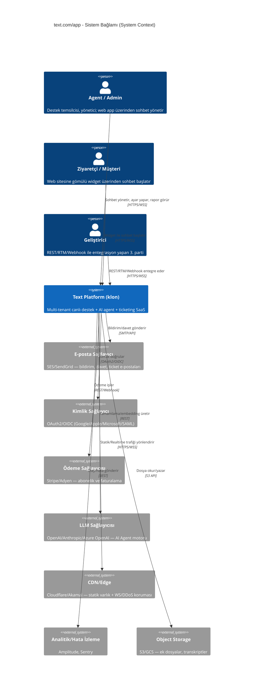
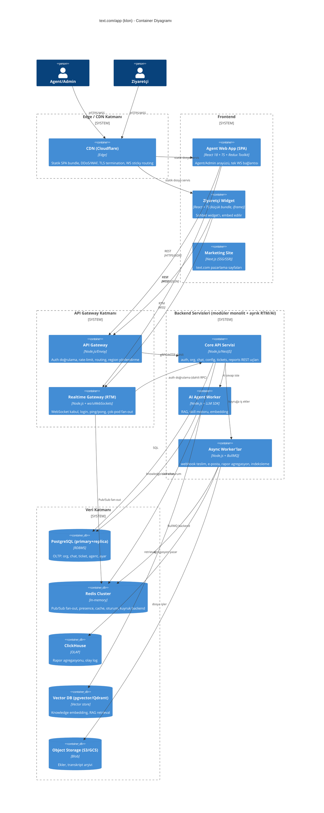
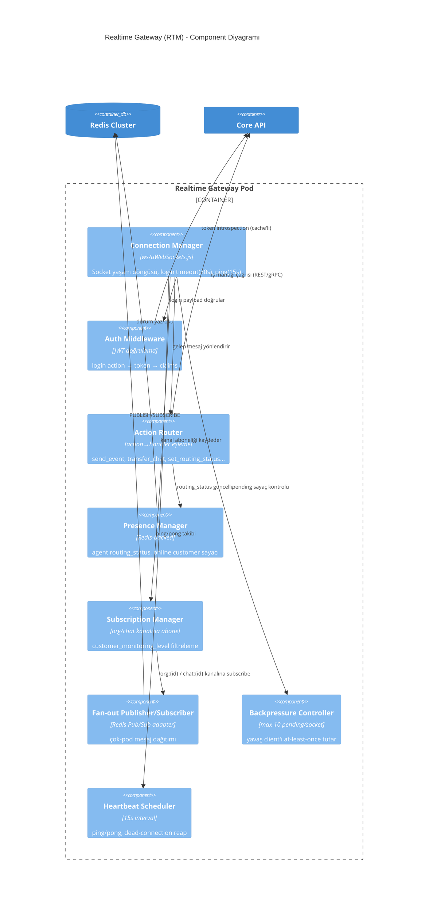
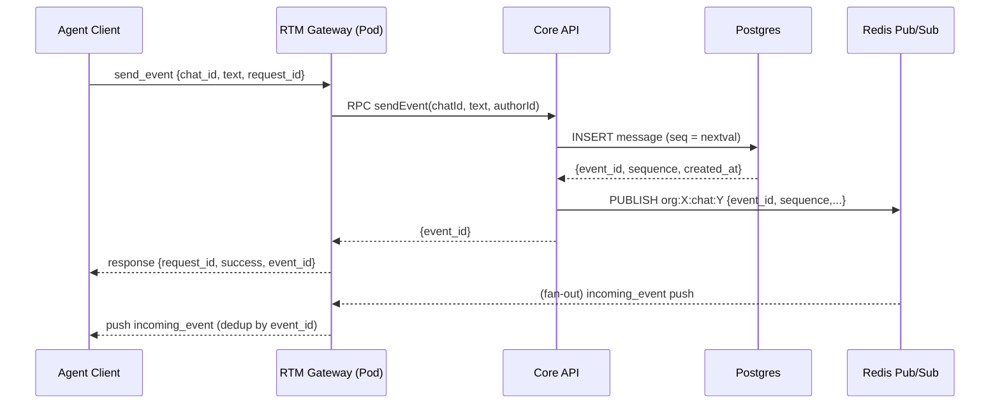
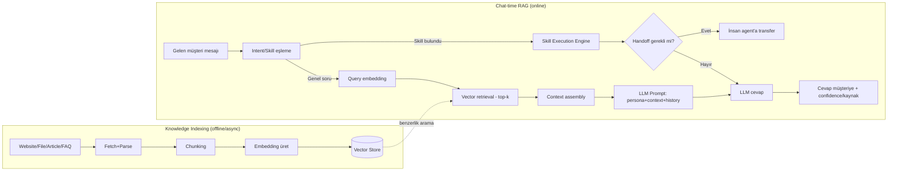

# RAPOR v2 — text.com/app DERİN SİSTEM MİMARİSİ (React + Node.js Klonu)

> **Rol:** Kıdemli Yazılım/Sistem Mimarı — dağıtık sistemler + gerçek-zamanlı uzmanı.
> **Amaç:** `text.com/app` (Text, Inc. / eski LiveChat) platformunun **React + Node.js ile birebir klonu** için üretim-kalitesinde, ölçeklenebilir sistem mimarisi.
> **Konum:** Bu rapor, `02-teknik-mimari.md` (v1) raporunun **farklı ve daha derin bir bakış açısından** tekrarıdır. v1 API/RTM/webhook envanterini çıkardı; bu rapor **ölçekleme, dağıtık gerçek-zamanlı mimari, multi-tenancy ve production-readiness** eksenine odaklanır.
> **Derleme tarihi:** 20 Temmuz 2026
> **İşaretleme:** `[GÖZLEM]` = birincil kaynaktan (canlı uygulama/DevTools/resmî dokümantasyon/SDK kaynak kodu) doğrulanmış · `[TAHMİN]` = gözlemlenen davranışa dayalı mühendislik çıkarımı/öneri.

---

## İÇİNDEKİLER

1. [C4 Model — Context / Container / Component](#1-c4-model--context--container--component)
2. [Frontend Mimarisi](#2-frontend-mimarisi)
3. [Backend Servis Ayrışımı](#3-backend-servis-ayrışımı)
4. [Gerçek-Zamanlı Mimari (DERİN)](#4-gerçek-zamanlı-mimari-derin)
5. [Multi-Tenancy](#5-multi-tenancy)
6. [Veri Katmanı](#6-veri-katmanı)
7. [Asenkron İşlemler](#7-asenkron-i̇şlemler)
8. [AI Agent Mimarisi](#8-ai-agent-mimarisi)
9. [Deployment](#9-deployment)
10. [Gözlemlenebilirlik + SLO](#10-gözlemlenebilirlik--slo)
11. [Klasör Yapıları ve Kritik Kod İskeletleri](#11-klasör-yapıları-ve-kritik-kod-i̇skeletleri)

---

## 1. C4 MODEL — CONTEXT / CONTAINER / COMPONENT

### 1.1 Seviye 1 — System Context

`[GÖZLEM+TAHMİN]` text.com/app'in dış dünyayla ilişkisi: üç ana aktör (Agent/Admin, Ziyaretçi/Müşteri, Geliştirici/3.parti entegrasyon) ve platformun kendisi tek bir "yazılım sistemi" olarak modellenir; gerçekte iç servislere ayrışır (§1.2, §1.3).



**Kritik gözlem `[GÖZLEM]`:** Gerçek sistemde uygulama kabuğu (`www.text.com/app`) ile gerçek-zamanlı/REST çekirdeği (`api.livechatinc.com`) **ayrı host'lardır** — bu, "frontend deploy'u backend deploy'undan bağımsız" mimari bir karardır ve klonda da korunmalıdır (ayrı CDN-servis edilen SPA + ayrı API gateway domaini, ör. `app.example.com` + `api.example.com`).

### 1.2 Seviye 2 — Container Diyagramı

`[TAHMİN — modüler monolit + ayrıştırılmış gerçek-zamanlı çekirdek öneri, gerekçe §3]`



**Mimari karar notu `[TAHMİN]`:** Gerçek-zamanlı Gateway (RTM) ve Core API bilinçli olarak **ayrı container**'lardır — RTM bağlantı-yoğun/uzun-ömürlü, Core API istek-yanıt/kısa-ömürlüdür; farklı ölçekleme eğrileri (bkz. §4) ve farklı kaynak profilleri (RTM: bellek+bağlantı sayısı bound; Core: CPU+DB bound) gerektirir. LiveChat gerçekte bu ayrımı Go tabanlı `go-socket.io`/`go-engine.io` çekirdeği ile REST API'yi ayrı tutarak yapıyor `[GÖZLEM]`.

### 1.3 Seviye 3 — Component Diyagramı (Realtime Gateway odaklı)



---

## 2. FRONTEND MİMARİSİ

### 2.1 SPA App-Shell

`[GÖZLEM]` Gerçek sistemde uygulama tamamen CSR/SPA, tek kalıcı WebSocket bağlantısı ve React+Redux+Emotion temelli. Klon için app-shell şu katmanlardan oluşur:

```
<AppRoot>
  <ErrorBoundary>                    // global crash guard, Sentry'e rapor
    <QueryClientProvider>            // RTK Query / React Query cache
      <StoreProvider>                // Redux store (client-state)
        <AuthProvider>               // token, region, org context
          <RealtimeProvider>         // TEK WS bağlantısı, tüm modüllere event dağıtır
            <FeatureFlagProvider>    // plan bazlı özellik kapılaması (gating)
              <AppShell>
                <PrimaryRail/>
                <TopBar/>
                <ModuleLayout><Outlet/></ModuleLayout>
              </AppShell>
            </FeatureFlagProvider>
          </RealtimeProvider>
        </AuthProvider>
      </StoreProvider>
    </QueryClientProvider>
  </ErrorBoundary>
</AppRoot>
```

`[TAHMİN]` **Neden tek WebSocket + Provider deseni:** Her modül (Inbox, Customers, Reports) kendi WS bağlantısını açsaydı hem sunucu tarafında bağlantı patlaması hem de client'ta event sıralama tutarsızlığı olurdu. `RealtimeProvider` context'i tek soket üzerinden gelen push'ları merkezi bir event-bus'a (`mitt`/`EventEmitter`) yayınlar; her modül kendi slice'ında ilgili event tipine `useEffect` ile abone olur.

### 2.2 Kod Bölme (Code Splitting) Stratejisi

`[GÖZLEM]` Ayrı modül loader'ları gözlemlendi (Playbook/Settings/Billing açılırken). Öneri:

- **Route-bazlı splitting:** `React.lazy()` + her modül (`inbox`, `customers`, `ai-agents`, `reports`, `settings`, `billing`) ayrı chunk.
- **Vendor splitting:** design-system, chart kütüphanesi (recharts/visx), rich-text editör ayrı chunk'larda — yalnızca ilgili sayfa yüklendiğinde indirilir.
- **Prefetch on hover:** PrimaryRail ikonlarına hover'da `import()` prefetch — algılanan gecikmeyi düşürür.
- **Critical CSS:** app-shell + Inbox (varsayılan iniş sayfası `[GÖZLEM: text.com/app → /app/inbox/chats/all]`) senkron; diğerleri lazy.
- Vite `build.rollupOptions.output.manualChunks` ile modül bazlı ayrım; Turborepo (`[GÖZLEM]` LiveChat kullanıyor) ile paket-seviyesi cache.

### 2.3 State Yönetimi — Redux + Server-State Ayrımı

`[GÖZLEM]` React+Redux+Context-API+Emotion tespit edildi. Üç farklı state sınıfı net ayrılmalı:

| Katman | Araç | İçerik | Kaynak |
|---|---|---|---|
| **Global client state** | Redux Toolkit | oturum/kullanıcı, routing_status, aktif sohbet listesi, unread sayaçları, WS bağlantı durumu, seçili org/region | RTM push + kullanıcı aksiyonu |
| **Server-state/cache** | RTK Query (veya React Query) | raporlar, contacts, knowledge kaynakları, ayarlar, faturalar | REST (cache invalidation: tag-bazlı) |
| **Realtime state** | Redux reducer (RTM entegre) | mesaj akışı, typing indicator, presence | WS push → normalize → store |
| **Ephemeral/local** | useState/useReducer | composer taslağı, modal açık/kapalı, akordeon | yalnızca component |

**Neden Redux (global) + RTK Query (server) ayrımı `[TAHMİN]`:** RTM push'ları yüksek frekanslı ve düşük gecikmeli olmalı (mesaj geldiğinde anında render); REST'ten gelen rapor/ayar verisi ise cache-first, stale-while-revalidate mantığıyla yönetilmeli. İkisini tek bir "global store" içinde karıştırmak, gereksiz re-render ve cache-invalidation karmaşası yaratır. Normalizasyon: `chats`, `threads`, `messages`, `customers` entity slice'ları `createEntityAdapter` ile normalize edilir (id → entity map) — chat listesi ve aktif chat penceresi aynı mesaj referansını paylaşır, çift kaynak (dual source of truth) önlenir.

### 2.4 Gerçek-Zamanlı Katman (Frontend)

`[GÖZLEM]` Login ≤30sn, ping 15sn (SDK 10sn), max 10 bekleyen istek. Reconnect nedenleri: `access_token_expired`/`connection_lost`/`misdirected_connection` → otomatik yeniden bağlan; `inactivity_timeout`/`license_expired`/`customer_banned` → bağlanma.

`[TAHMİN]` Frontend RTM istemcisi bir **finite-state-machine** (XState veya elle yazılmış reducer) olarak modellenmeli:

```
disconnected → connecting → authenticating → connected → (degraded ⇄ connected) → reconnecting → disconnected
```

- **Exponential backoff + jitter:** yeniden bağlanma denemeleri `min(30s, base*2^attempt) + random(0,1s)`.
- **Request queue during reconnect:** bağlantı kesikken kullanıcı aksiyonları (`send_event` gibi) bir local kuyruğa alınır, bağlantı kurulunca `request_id` korunarak tekrar gönderilir (idempotency, bkz. §4.6).
- **Optimistic UI:** mesaj gönderiminde composer anında temizlenir, mesaj "gönderiliyor" durumunda balona eklenir; `event_id` dönünce durum "gönderildi"ye geçer; hata durumunda "yeniden dene" rozeti.

### 2.5 Tasarım Sistemi

`[GÖZLEM]` `@livechat/design-system-react-components` (Storybook + Figma tabanlı). Klon için:

- **Token katmanı:** renk/spacing/tipografi/radius/gölge design token'ları (JSON) → Emotion tema nesnesi + CSS custom properties (dark/light tema desteği için).
- **Atomik yapı:** Atoms (Button, Input, Badge, Avatar, Spinner) → Molecules (Modal, Dropdown, Table, DateRangePicker) → Organisms (ChatListItem, KPICard, InviteModal) → Templates (ThreeColumnLayout).
- **Storybook + Chromatic** görsel regresyon testi; `packages/design-system` bağımsız versiyonlanan paket olarak monorepo'da yaşar.
- **Erişilebilirlik (a11y):** Radix UI primitives üzerine kurulmuş headless component'ler (focus-trap, ARIA) — özellikle Modal/Dropdown/Tooltip için.

### 2.6 Mikro-Frontend Değerlendirmesi

`[TAHMİN]` **Önerilmez (v1 için).** Gerekçe:
- Modüller (Inbox/Customers/AI Agents/Team/Reports) arasında **yoğun state paylaşımı** var (tek WS bağlantısı, ortak Redux store, ortak design system) — mikro-frontend'in izolasyon avantajı burada maliyete dönüşür (cross-app state senkronizasyonu, duplicate React/Redux runtime).
- Ekip büyüklüğü ve organizasyonel sınırlar (Conway's Law) mikro-frontend'i haklı çıkaracak kadar büyük değilse, **modüler monorepo + route-bazlı code-splitting** aynı bağımsız-deploy edilebilirlik hissini çok daha düşük karmaşıklıkla verir.
- **İstisna:** Widget (ziyaretçi tarafı) zaten fiilen ayrı bir "mikro-frontend"dir — 3. parti sitelere gömülür, iframe + `postMessage` köprüsü (`[GÖZLEM]` LiveChat `livechat/postmate` kullanıyor) ile izole çalışır. Bu, güvenlik (CSP/sandbox) ve bundle-boyutu (widget script küçük olmalı) zorunluluğundan kaynaklanır — organizasyonel değil, **teknik** bir mikro-frontend kararıdır.
- Marketplace/3. parti "app" widget'ları (Agent App SDK, `[GÖZLEM]` Details/Fullscreen/Messagebox placement'ları) de aynı iframe+postMessage modeliyle mikro-frontend olarak entegre edilir — bu, platformun kendi mimarisi değil, **eklenti izolasyonu** ihtiyacıdır.

---

## 3. BACKEND SERVİS AYRIŞIMI

### 3.1 Öneri: "Modüler Monolit + Ayrıştırılmış Yüksek-Değişkenlik Servisleri"

`[TAHMİN]` Saf mikroservis mimarisi **başlangıç için önerilmez**. Gerekçe:

1. **Domain sınırları henüz stabilize değil** (özellikle AI Agent/Skill motoru hızlı evrim geçiriyor `[GÖZLEM: MOD-6 Playbook'un karmaşıklığı]`) — erken mikroservis bölünmesi yanlış sınırlar çizme riskini artırır (dağıtık monolit anti-pattern'i).
2. **Transaction tutarlılığı:** chat→ticket dönüşümü, agent→group ataması gibi işlemler çoğunlukla tek transaction sınırında kalmalı; mikroservis olsaydı saga/2PC karmaşıklığı gerekirdi.
3. **Operasyonel yük:** küçük/orta ekip için 10+ servisi ayrı deploy/monitor/on-call etmek verimsiz.

Bunun yerine **modüler monolit** (tek deploy edilebilir Core API, net iç modül sınırları, DB şeması modül-bazlı namespace) + **doğal olarak farklı ölçekleme/yaşam-döngüsü profiline sahip 3 servis ayrık** tutulur:

| Servis | Neden ayrık | Ölçekleme profili |
|---|---|---|
| **Realtime Gateway (RTM/WS)** | Uzun-ömürlü bağlantı, bellek/soket-bound, farklı deploy sıklığı (WS protokol değişikliği nadir) | Bağlantı sayısına göre yatay (§4.5) |
| **AI Agent Worker** | LLM çağrıları I/O-bound + yavaş (saniyeler), token/maliyet izlenmeli, GPU/harici API rate-limit farklı | İstek kuyruğu derinliğine göre yatay |
| **Async Worker'lar (BullMQ)** | Batch/arka-plan işler, farklı SLA (dakikalar), CPU patlamaları izole edilmeli | Kuyruk derinliğine göre yatay |

Core API içindeki **modül sınırları** (gelecekte mikroservise ayrılabilir "seam"ler bırakılarak):

```
core-api/
  modules/
    auth/            # OAuth2/OIDC, PAT, session, RBAC
    organizations/   # tenant CRUD, üyelik, roller, kota
    agents/          # agent profil, routing_status, gruplar
    conversations/   # chat/thread/event CRUD (REST tarafı)
    customers/       # visitor/contact CRM
    tickets/         # HelpDesk benzeri ticketing
    tags/            # etiketleme
    canned-responses/
    campaigns/       # proaktif davet/kampanya
    reports/         # agregasyon sorgu API'si (yazma OLAP worker'da)
    webhooks/        # kayıt + config (teslim = jobs modülünde)
    billing/         # abonelik, fatura, kota entegrasyonu
    settings/        # widget config, entegrasyonlar
```

Her modül **kendi Postgres şeması** (`auth.*`, `conversations.*`, `tickets.*`...) ile fiziksel olarak ayrışır ama aynı veritabanı örneğinde yaşar — böylece mikroservise geçiş gerektiğinde önce "schema-per-service", sonra "database-per-service" adımı doğal bir evrim olur (strangler fig deseni).

### 3.2 Servis Sınırları — Sorumluluk Matrisi

| Sınır | Sorumluluk | Veri sahipliği | Dışa açık arayüz |
|---|---|---|---|
| **auth** | AuthN/Z, token yaşam döngüsü, RBAC, PAT | `accounts`, `sessions`, `oauth_clients` | REST (`/v1/auth/*`), tüm servislere JWT introspection |
| **chat/rtm** | Sohbet durum makinesi, mesajlaşma, presence, routing | `conversations`, `threads`, `messages` | RTM WS + REST (`/v1/agent/action/*`) |
| **config** | Agent/group/property/webhook/tag CRUD, ~2dk eventual consistency `[GÖZLEM]` | `agents`, `groups`, `webhooks`, `tags` | REST (`/v1/configuration/action/*`) |
| **reports** | OLAP sorgu, agregasyon okuma | `report_aggregates` (ClickHouse) | REST (`/v1/reports/*`) |
| **billing** | Abonelik, kota, fatura, ödeme sağlayıcı entegrasyonu | `subscriptions`, `invoices`, `usage_counters` | REST + webhook (Stripe) |
| **webhooks (delivery)** | Dış sisteme event teslim, retry, imza | `webhook_deliveries` (log) | Async worker, iç event-bus tüketici |
| **ai** | RAG, skill motoru, embedding, LLM orkestrasyon | `ai_agents`, `knowledge_sources`, `skills`, vector store | REST + iç event (chat mesajı → AI tetik) |

### 3.3 Servisler-Arası İletişim

`[TAHMİN]`
- **Senkron:** Core API içi modüller arası doğrudan fonksiyon çağrısı (aynı process); Core↔RTM Gateway ve Core↔AI Worker arası **gRPC** (düşük gecikme, tip-güvenli, Protobuf ile şema evrimi) veya iç REST+mTLS.
- **Asenkron:** Domain event'leri (`chat.message.created`, `ticket.created`, `agent.status_changed`) bir **event bus** (Redis Streams başlangıçta; ölçek büyüdükçe Kafka) üzerinden yayınlanır. RTM Gateway, AI Worker, Webhook Worker, Reports agregasyon worker'ı bu event'lere bağımsız abone olur — bu, servisler arası sıkı bağımlılığı (tight coupling) azaltır ve her tüketicinin kendi hızında işlemesine izin verir.
- **Outbox Pattern `[TAHMİN — önerilir]`:** Core API bir DB yazma işlemiyle aynı transaction'da `outbox_events` tablosuna yazar; ayrı bir relay process bu tabloyu okuyup event bus'a publish eder. Bu, "DB'ye yazdım ama event yayınlanamadı" tutarsızlığını (dual-write problemi) önler — özellikle webhook teslimi ve RTM fan-out için kritik.

---

## 4. GERÇEK-ZAMANLI MİMARİ (DERİN)

Bu bölüm, v1 raporunun §2.4'ünü (temel RTM envanteri) referans alarak **ölçekleme, sıralama garantisi, backpressure ve kapasite planlamasına** derinlemesine iner.

### 4.1 WebSocket Gateway Tasarımı

`[GÖZLEM]` Gerçek sistem Go + `go-socket.io`/`go-engine.io` kullanıyor — bu, engine.io protokolünün (uzun-polling fallback + heartbeat + reconnect ID) tercih edildiğini gösterir. Node.js klonunda iki seçenek:

| Seçenek | Artı | Eksi |
|---|---|---|
| **`ws` (ham WebSocket)** | Minimal overhead, tam kontrol, en yüksek performans (uWebSockets.js ile ~10x throughput) | Heartbeat/reconnect/fallback elle yazılır |
| **Socket.IO** | Engine.io fallback (long-polling), oda (room) API'si hazır, reconnect otomatik | Ek protokol overhead'i, adapter (redis) ek bağımlılık |

`[TAHMİN — öneri]` **uWebSockets.js + elle yazılmış hafif protokol katmanı** (LiveChat'in kendi zarfını taklit eden `{request_id, action, payload}`), çünkü: (a) sabit, kendi tanımladığımız zarf formatı zaten var, Socket.IO'nun kendi event modeline ihtiyaç yok; (b) 100k+ eşzamanlı bağlantı hedefinde per-connection bellek/CPU overhead'i kritik — uWebSockets.js, `ws`'e göre ~4-8x daha az bellek kullanır.

### 4.2 Presence Yönetimi

`[TAHMİN]` Presence iki katmanlı:

1. **Bağlantı-seviyesi presence** (hangi pod hangi socket'i tutuyor) — Redis'te `TTL`'li key: `presence:conn:{orgId}:{accountId} = {podId, socketId, lastPing}`, TTL=45s (3×ping periyodu), her ping'de yenilenir. Pod çökerse TTL dolar, presence otomatik "offline" olur (kendi kendini temizleyen sistem — açık `disconnect` event'ine bağımlı kalınmaz).
2. **İş-mantığı presence** (`routing_status`: accepting_chats/not_accepting_chats/offline `[GÖZLEM]`) — Postgres'te kalıcı (raporlama için), Redis'te cache (hızlı okuma için); değişiklik `routing_status_set` event'i olarak fan-out edilir.

```
Redis key şeması:
  presence:conn:{orgId}:{accountId}        → {podId, socketId} (TTL 45s)
  presence:status:{orgId}:{accountId}      → "accepting_chats" (kalıcı, Postgres'le senkron)
  presence:customers:{orgId}                → Set<customerId> (online ziyaretçiler, TTL'siz, explicit remove)
  chat:subscribers:{chatId}                 → Set<connId> (o chat'i izleyen agent'lar)
```

### 4.3 Redis Pub/Sub ile Çok-Pod Fan-out

`[TAHMİN, v1 §2.4.4'ün derinleştirilmesi]` Tek bir organizasyondaki agent'lar farklı Gateway pod'larına dağılmış olabilir (yatay ölçek). Bir mesaj geldiğinde tüm ilgili pod'lara ulaşması gerekir:

```
Core API (send_event REST/RTM handler)
   → DB'ye mesaj yaz (transaction)
   → Redis PUBLISH "org:{orgId}:chat:{chatId}" {event payload}
        ↓ (her Gateway pod bu kanala SUBSCRIBE)
   Pod A (agent X bağlı)  → local socket'e yaz
   Pod B (agent Y bağlı)  → local socket'e yaz
   Pod C (bu chat'e ilgili kimse yok) → mesajı görür ama hedef socket yok, drop
```

**Kanal granülaritesi tasarım kararı `[TAHMİN]`:** Redis Pub/Sub'da kanal sayısı arttıkça `SUBSCRIBE` overhead'i artar. Üç seviye kanal önerilir:
- `org:{orgId}` — org-geneli event (agent_created, routing_status_set) — her pod, o org'dan en az 1 bağlı client varsa abone.
- `org:{orgId}:chat:{chatId}` — chat-özel event (incoming_event, typing_indicator) — yalnızca o chat'i açık tutan agent'ların bağlı olduğu pod abone olur (**dinamik subscribe/unsubscribe**, chat açılıp kapandıkça).
- `org:{orgId}:customer:{customerId}` — tekil ziyaretçi izleme (visit_started/ended) — yalnızca "supervising" agent'lar için.

Bu, **Redis Cluster'da her pod'un binlerce kanala abone olma sorununu** önler — dinamik subscribe/unsubscribe, gereksiz fan-out'u %90+ azaltır (bir org'da 50 chat açıksa ve bir pod'da sadece 3'ünün agent'ı varsa, o pod yalnızca 3 chat-kanalına abonedir).

**Redis Pub/Sub'ın sınırı `[TAHMİN]`:** Redis Pub/Sub **at-most-once**'tur — abone olmayan pod mesajı kaybeder, offline pod'a kuyruklama yapılmaz. Bu kabul edilebilir çünkü RTM zaten "push, ama client login'de `list_chats` ile senkronize olur" modelindedir (§4.6). Çok daha büyük ölçekte (500k+ eşzamanlı bağlantı) Redis Pub/Sub yerine **Redis Streams** (consumer group, at-least-once, replay edilebilir) veya **NATS JetStream** değerlendirilmeli — bu raporun kapasite planı (§4.9) 100k ölçeğini hedeflediği için Redis Pub/Sub + Cluster yeterli kabul edilir.

### 4.4 Mesaj Sıralama ve Teslim Garantisi

`[GÖZLEM referans + TAHMİN]` Gerçek API'de her event `id` ve `created_at` taşır (v1 §2.7.1 `messages` tablosu). Sıralama garantisi tasarımı:

- **Yazma sırası = doğruluk kaynağı:** Her `send_event`, Postgres'te `thread_id` bazında **monoton artan bir `sequence` sütunu** ile yazılır (DB-seviye `SERIAL`/`BIGSERIAL`, thread başına değil global ama thread filtreli sorgu ile sıralı okunur). Alternatif: her thread için Redis `INCR thread:{id}:seq` ile uygulama-seviyesi monoton sayaç — DB yazımından **önce** alınır ki WS push'u DB commit'inden önce bile sıra numarasını taşısın.
- **At-least-once + client-side dedup:** WS teslimi garantili değildir (bağlantı kopabilir); bu yüzden client, `event_id` bazında `Set` tutarak yinelenen push'ları at. Reconnect sonrası client, son bilinen `seen_up_to`/`last_event_id`'den itibaren `list_threads`/`get_chat` REST çağrısıyla **gap'i REST üzerinden kapatır** (WS yalnızca "canlı iken" tetik; tarihsel doğruluk REST'ten gelir). Bu tam olarak gerçek platformun modelidir: **RTM = bildirim, REST = doğruluk kaynağı.**
- **Out-of-order koruması (frontend):** Redux reducer, gelen event'i `sequence`'a göre sıralı diziye ekler; eğer bir "gap" tespit edilirse (ör. sequence 5 geldi ama 4 eksik), UI arka planda `get_chat`/`list_threads`'i tetikleyip diff'i kapatır.



### 4.5 Backpressure ve Bağlantı Sağlığı

`[GÖZLEM]` Gerçek sistemde max 10 pending istek/soket, 15sn timeout, 30sn login limiti. Bu limitler **backpressure mekanizmasının kendisidir** — bir client çok fazla eşzamanlı istek gönderirse `pending_requests_limit_reached` ile reddedilir, sunucu boğulmaz.

`[TAHMİN — ek katmanlar]`:
- **Per-connection token bucket:** RTM Gateway seviyesinde her socket için saniyede N action limiti (ör. 20 req/s) — DoS/bug'lı client koruması.
- **Slow-consumer koruması:** `ws.send()` çağrısı `bufferedAmount` kontrolü ile sarılır; `bufferedAmount > threshold` (ör. 1MB) ise yeni push'lar drop edilir/coalesce edilir (ör. ardışık `typing_indicator` event'leri en sonuncusuyla değiştirilir — "son değer kazanır" semantiği düşük öncelikli event'ler için kabul edilebilir).
- **Server-side fair queuing:** Bir org'un patlaması (ör. toplu webhook testi) diğer org'ların gateway pod'unu etkilememeli — event işleme kuyruğu **org_id bazlı** partition'lanır (bkz. §4.8 Kafka partition anahtarı).

### 4.6 Reconnect Mantığı

`[GÖZLEM]` Nedenlere göre otomatik/otomatik-olmayan reconnect ayrımı zaten var. Client FSM (bkz. §2.4) + sunucu tarafı:

- **Session resumption `[TAHMİN]`:** login'de client `last_seen_event_id` gönderebilir (protokol uzantısı); sunucu bu ID'den sonraki event'leri (kısa bir "replay window", ör. son 5 dakika, Redis'te tutulan `chat:{id}:recent_events` listesinden) tek seferde push eder — tam bir Kafka-tarzı offset yönetimi değil, ama kısa kesintilerde REST round-trip'ini önler.
- **Idempotent request replay:** Client, bağlantı koptuğunda yanıtı gelmemiş istekleri `request_id` korunarak yeniden gönderir; sunucu tarafında `request_id` bazlı bir kısa süreli (ör. 60sn TTL) idempotency cache (Redis) tutulur — aynı `request_id` ikinci kez gelirse iş tekrar çalıştırılmaz, önceki yanıt tekrar döndürülür.

### 4.7 Yatay Ölçekte Sticky-Session Sorunu

`[TAHMİN]` WebSocket doğası gereği bağlantı belirli bir pod'a "yapışır" (sticky). İki yaklaşım:

1. **L4/L7 sticky routing (basit, önerilir):** Cloudflare/ALB'de `Cookie`/`IP hash` bazlı sticky session; connection açıldığı pod'da kalır. Pod restart/scale-down'da o pod'daki tüm bağlantılar kopar → client reconnect eder → yeni pod'a düşer. **Trade-off:** deploy sırasında kısa toplu reconnect fırtınası olur — bu yüzden rolling deploy sırasında `maxUnavailable` düşük tutulmalı ve client tarafında reconnect **jitter'lı** olmalı (tüm client'lar aynı anda değil, rastgele 0-5sn içinde).
2. **Stateless gateway + Redis-backed state (daha karmaşık, gerekmiyorsa önerilmez):** Her pod hangi bağlantıyı tuttuğunu Redis'te tutar, ama bağlantının kendisi (TCP/TLS socket) yine de belirli bir pod'da yaşamak zorundadır — WebSocket'in temel kısıtı budur. Bu nedenle "tam stateless" WS gateway mümkün değildir; asıl kazanç **iş mantığının** (Core API) stateless olmasıdır — Gateway yalnızca ince bir routing/fan-out katmanı olarak tutulur, iş mantığı Core API'ye devredilir (böylece Gateway pod'u restart olsa bile veri kaybı olmaz, sadece bağlantı kopar).

### 4.8 Kafka/Redis Streams Değerlendirmesi (Büyük Ölçek)

`[TAHMİN]` 100k eşzamanlı bağlantı ve altı için **Redis Cluster (Pub/Sub + Streams karışımı) yeterlidir**. Kafka'ya geçiş tetikleyicileri:
- Event replay/audit ihtiyacı (uzun süreli event log, "at least once + exactly-once processing" garantisi gereken webhook teslim sistemi).
- Çoklu tüketici grubu (AI Worker, Reports Worker, Webhook Worker) aynı event akışını **bağımsız hızlarda** tüketmeli — Kafka consumer group modeli burada Redis Streams'ten daha olgun.
- **Öneri:** Gateway↔Core arası hala Redis Pub/Sub (düşük gecikme kritik); Core→Worker'lar arası **Kafka (veya Redis Streams başlangıçta, sonra Kafka'ya migrate)** — domain event bus için partition anahtarı `organization_id` (bir org'un event sırası korunur, org'lar arası paralellik sağlanır).

### 4.9 Kapasite Planlama — 100.000 Eşzamanlı Ziyaretçi Hedefi

`[TAHMİN — mühendislik tahmini, gerçek sistem verisi mevcut değil]`

**Varsayımlar:**
- Ortalama bağlantı başına bellek: uWebSockets.js ile ~4-8 KB/soket (TLS session + buffer dahil) → `ws` ile ~30-50 KB/soket.
- Ping/pong trafiği: 15sn periyot × 100k bağlantı = ~6.667 msg/sn (ihmal edilebilir CPU).
- Ortalama aktif sohbet oranı: eşzamanlı 100k ziyaretçinin ~%5-10'u aktif chat'te (5-10k eşzamanlı chat), geri kalanı "browsing"/"queued" (yalnızca presence, düşük event hacmi).
- Mesaj hacmi: aktif chat başına ortalama 1 mesaj/10sn → 10k chat × 0.1 msg/s = ~1.000 msg/sn event işleme yükü.

**Hesaplama (uWebSockets.js ile):**

| Bileşen | Boyut | Not |
|---|---|---|
| RTM Gateway pod'u | ~20k bağlantı/pod (8 vCPU, 4GB RAM, uWebSockets.js) | 100k / 20k = **5-6 pod** (N+1 fazlalıkla 7) |
| Redis Cluster (Pub/Sub+presence) | 3-6 shard, her biri 2-4 vCPU/4-8GB | Presence key sayısı ~100k, Pub/Sub mesaj hacmi ~1-2k msg/sn |
| Core API pod'u | REST istek hacmine göre; her mesaj DB yazımı tetikler | ~1.000 msg/sn × ort. 5ms DB yazım = 5 pod (4 vCPU) yeterli, HPA ile |
| Postgres primary | `messages` tablosuna 1.000 insert/sn | Partition + connection pooling (PgBouncer) zorunlu (bkz. §6.2) |

**Ölçekleme tetikleyicileri (HPA metrikleri) `[TAHMİN]`:**
- RTM Gateway: `active_connections_per_pod > 15.000` → scale-out (buffer payı bırak).
- Core API: `p99_latency > 200ms` veya `cpu > 70%` → scale-out.
- Redis: `used_memory > 75%` veya `pubsub_channels > threshold` → shard ekle.

**Darboğaz noktası tahmini:** 100k ölçekte asıl darboğaz **RTM Gateway'in bağlantı sayısı değil, Postgres yazım throughput'udur** (özellikle `messages` tablosunda tek-primary yazım). Bu yüzden §6'da açıklanan write-path optimizasyonları (batching, partition, async commit onayı) bu ölçekte zorunlu hale gelir.

---

## 5. MULTI-TENANCY

### 5.1 İzolasyon Stratejisi Seçimi

`[TAHMİN]` Üç klasik model karşılaştırması:

| Model | Artı | Eksi | Uygunluk |
|---|---|---|---|
| **Shared schema + `organization_id`** | Basit operasyon, düşük maliyet, kolay cross-tenant analiz (kendi iç analitiğimiz için) | Noisy-neighbor riski, "gürültülü kiracı" büyük org'lar küçükleri etkileyebilir, sıkı RLS disiplini gerekir | **Varsayılan (küçük/orta org'lar için)** |
| **Schema-per-tenant** | Güçlü izolasyon, kolay tenant-bazlı backup/restore | Migration N-kat artar (N=tenant sayısı), connection pool şişer, binlerce tenant'ta yönetilemez | Büyük/Enterprise/regülasyon gerektiren (HIPAA) tenant'lar için opsiyonel |
| **Database-per-tenant** | En güçlü izolasyon, tenant-bazlı ölçekleme/yerleşim | En yüksek operasyonel maliyet | Yalnızca en büyük Enterprise/HIPAA müşteriler `[GÖZLEM: v1 §2.7.3'te HIPAA'da otomatik silme notu]` |

**Öneri: Hibrit — "Shared schema varsayılan + Enterprise tier'da schema/database-per-tenant seçeneği".** Bu, LiveChat'in kendi mimarisiyle de örtüşür: Cloud Spanner `[GÖZLEM]` gibi globally-distributed bir DB, shared-schema + partition-key (org_id benzeri) modeliyle en iyi çalışır; bizim PostgreSQL klonumuzda bu, **Row-Level Security (RLS) + zorunlu `organization_id` partition key** ile taklit edilir.

### 5.2 Row-Level Security (RLS) ile Zorunlu İzolasyon

`[TAHMİN — kritik güvenlik önerisi]` Uygulama-seviyesi `WHERE organization_id = ?` filtresine **güvenilmemeli** (bir geliştirici hatası tüm kiracıların verisini sızdırabilir). PostgreSQL RLS zorunlu kılınmalı:

```sql
ALTER TABLE conversations ENABLE ROW LEVEL SECURITY;
CREATE POLICY tenant_isolation ON conversations
  USING (organization_id = current_setting('app.current_org_id')::uuid);

-- Her istek başında (connection pool checkout sonrası) bağlantı seviyesinde ayarlanır:
-- SET app.current_org_id = '390e44e6-...';
```

Bu, connection pooling (PgBouncer transaction mode) ile birlikte kullanıldığında **her transaction başında** `SET LOCAL app.current_org_id` çağrılmalı — aksi halde bağlantı havuzunda önceki tenant'ın context'i sızabilir (kritik operasyonel tuzak).

### 5.3 Veri Yerleşimi (Bölgesel)

`[GÖZLEM]` İki bölge: `dal` (Dallas) ve `fra` (Frankfurt); `region` parametresi zorunlu, yanlış bölge `misdirected_request` döner. Bu, **veri yerleşimi (data residency) uyumluluğu** (GDPR — AB verisi AB'de kalmalı) için kritiktir.

`[TAHMİN — klon mimarisi]`:
- Organizasyon oluşturulurken `region` seçilir ve **değişmez** (immutable) alan olarak saklanır.
- Her bölge kendi tam-yığın (Postgres + Redis + ClickHouse + Vector DB) kopyasına sahiptir — **veri bölgeler arası replike edilmez** (yalnızca bölgesel failover için aynı bölge içinde replica).
- **Global routing katmanı** (DNS/Anycast + `X-Region` header veya subdomain `dal.api.example.com`/`fra.api.example.com`): kullanıcı login olduğunda token'ın içine `region` claim'i gömülür (`[GÖZLEM]` token formatı `dal:test_...` — bölge öneki token'ın kendisinde); API Gateway bu claim'e göre isteği doğru bölgeye yönlendirir.
- **Global Accounts (auth) katmanı bölgesel değildir `[GÖZLEM: accounts.livechat.com tek host]`** — kimlik/organizasyon üyeliği global bir servistir, yalnızca *veri* (chat, ticket, knowledge) bölgeseldir. Bu ayrım klon mimarisinde de korunmalı: `auth`/`organizations` global tekil DB'de, `conversations`/`tickets`/`knowledge` bölgesel DB'lerde.

### 5.4 Tenant Başına Kota

`[TAHMİN]` Plan bazlı (Essential/Growth/Enterprise `[GÖZLEM: v1 §1.3]`) kota uygulaması:

| Kota tipi | Uygulama noktası | Mekanizma |
|---|---|---|
| Eşzamanlı agent sayısı (seat) | `organization_members` INSERT | DB constraint trigger + billing servis kontrolü |
| Aylık AI Agent mesaj hacmi | AI Worker giriş noktası | Redis `INCR usage:{orgId}:{month}` + limit kontrolü, `check_product_limits_for_plan` `[GÖZLEM: gerçek API'de mevcut action]` benzeri |
| REST rate limit | API Gateway | Token bucket, plan bazlı farklı limit (Essential: 60 req/dk, Enterprise: 600 req/dk) |
| RTM eşzamanlı bağlantı | Gateway login handler | `users_limit_reached` `[GÖZLEM: gerçek error type]` — org bazlı bağlantı sayacı Redis'te |
| Depolama (attachment) | Upload handler | Object storage bucket bazlı kota + org-level toplam boyut sayacı |
| Knowledge kaynak sayısı/boyutu | Knowledge CRUD | Plan bazlı `MAX_SOURCES`, embedding maliyeti kontrolü |

---

## 6. VERİ KATMANI

### 6.1 PostgreSQL Şeması — v1 Genişletmesi

v1 raporunun (§2.7) şeması temel alınır; burada **çok-kiracılı disiplin, indeksleme derinliği ve okuma/yazma ayrımına** odaklanılır. Ek tablolar:

```sql
-- Outbox pattern (§3.3)
CREATE TABLE outbox_events (
  id BIGSERIAL PRIMARY KEY,
  organization_id UUID NOT NULL,
  event_type TEXT NOT NULL,          -- 'chat.message.created' vb.
  payload JSONB NOT NULL,
  created_at TIMESTAMPTZ DEFAULT now(),
  published_at TIMESTAMPTZ           -- NULL = henüz yayınlanmadı
);
CREATE INDEX idx_outbox_unpublished ON outbox_events (created_at) WHERE published_at IS NULL;

-- Idempotency (§4.6)
CREATE TABLE idempotency_keys (
  request_id UUID PRIMARY KEY,
  organization_id UUID NOT NULL,
  response JSONB,
  created_at TIMESTAMPTZ DEFAULT now()
);  -- TTL: pg_cron ile 24h sonra silinir

-- Usage/kota (§5.4)
CREATE TABLE usage_counters (
  organization_id UUID NOT NULL,
  metric TEXT NOT NULL,               -- 'ai_messages', 'attachments_bytes'
  period DATE NOT NULL,               -- ay bazlı bucket
  value BIGINT NOT NULL DEFAULT 0,
  PRIMARY KEY (organization_id, metric, period)
);
```

### 6.2 Okuma/Yazma Ayrımı (Read/Write Splitting)

`[TAHMİN]` §4.9'da tespit edilen darboğaz (mesaj yazım throughput'u) için:

- **Yazma yolu (write path):** Tüm `INSERT`ler primary'ye gider. `messages` tablosu **aylık partition** (`PARTITION BY RANGE (created_at)`) — hem yazım performansı (küçük index) hem de retention (eski partition'ı arşive taşı/drop et `[GÖZLEM: v1 §2.7.3 retention 60gün/sınırsız]`) için.
- **Okuma yolu (read path):** Reports, contact listesi, admin dashboard gibi "gecikmeye toleranslı" okumalar **read replica**'ya yönlendirilir (Postgres streaming replication, 1-2 replica/bölge). Aktif chat penceresi gibi "taze veri şart" okumalar **primary**'den okunur (replica lag riski: chat mesajı gönderilir gönderilmez replica'da görünmeyebilir).
- **Connection pooling:** PgBouncer (transaction mode) — RLS `SET LOCAL` ile uyumlu çalışması için transaction-mode havuzlama zorunlu (session-mode'da tenant context sızıntısı riski).
- **Prisma/Drizzle ORM'de read/write routing:** İki ayrı `DATABASE_URL` (primary/replica), servis katmanında açık seçim (`db.read.query(...)` vs `db.write.query(...)`), otomatik heuristik yerine **açık kod-seviyesi karar** tercih edilir (yanlış replica-okuma bug'larını debug etmeyi kolaylaştırır).

### 6.3 Raporlama için OLAP — ClickHouse

`[TAHMİN, v1 §2.7.1'deki `report_aggregates` fikrinin derinleştirilmesi]` v1'deki basit "materialized view" yaklaşımı, `[GÖZLEM]` gerçek sistemin zengin rapor kırılımları (distribution: hour/day/month/year, çoklu filtre kombinasyonu — agent/group/tag) için yetersiz kalır. Öneri:

```
Postgres (OLTP, doğruluk kaynağı)
   → CDC (Debezium) veya outbox-relay
   → Kafka/Redis Streams topic: "events.chat_message", "events.ticket_status_changed"...
   → ClickHouse Kafka Engine (doğrudan tüketim) veya batch worker (BullMQ, 1dk periyot)
   → ClickHouse tabloları: chat_events (MergeTree, PARTITION BY toYYYYMM(created_at), ORDER BY (organization_id, created_at))
   → Materialized View'lar: chat_daily_agg, agent_performance_agg (SummingMergeTree)
```

**Neden ClickHouse `[TAHMİN]`:** `/reports/chats/response_time`, `/reports/agents/performance` gibi `[GÖZLEM]` sorgular, milyonlarca event üzerinde `GROUP BY organization_id, agent_id, toDate(created_at)` gerektirir — Postgres'te bu tür sorgular index'e rağmen yavaşlar (satır-bazlı depolama); ClickHouse'un sütun-bazlı depolaması ve `SummingMergeTree`/`AggregatingMergeTree` motoru bu iş yükü için 10-100x daha hızlıdır. `distribution=hour/day/month/year` parametresi doğrudan ClickHouse'un `toStartOfHour/Day/Month/Year` fonksiyonlarıyla eşlenir.

### 6.4 Event Log (Audit + Replay)

`[TAHMİN]` Tüm domain event'leri (`outbox_events`'ten relay edilenler) ayrıca **soğuk depoya** (S3/GCS, Parquet formatında, günlük partition) arşivlenir — hem audit/compliance hem de "yeni bir OLAP view eklemek istersek geçmişi yeniden işleyebilme" (event sourcing'in "replay" avantajı) için. Bu, tam event-sourcing değildir (aggregate state hâlâ Postgres'te tutulur) ama event log'un getirdiği esnekliği düşük maliyetle sağlar.

### 6.5 Attachment Object Storage

`[GÖZLEM: v1 §2.7.3]` S3/GCS + imzalı URL. Ek detaylar `[TAHMİN]`:
- Upload akışı: client → Core API `upload_file` action → **pre-signed PUT URL** üretilir → client doğrudan S3'e yükler (Core API'yi bypass ederek bant genişliği tasarrufu) → yükleme tamamlanınca client `event.attachment_confirmed` çağırır → Core API metadata'yı (`content_type`, `size`, `virus_scan_status`) DB'ye yazar.
- **AV tarama:** yükleme sonrası asenkron worker (ClamAV/S3-native tarama) tetiklenir; tarama bitene kadar dosya "quarantine" durumunda, indirilebilir link üretilmez.
- **Bölgesel bucket:** attachment bucket'ı da §5.3'teki bölge kuralına uyar (`dal`-bucket, `fra`-bucket ayrı).

### 6.6 Cache Katmanları (Redis)

`[TAHMİN]` Çok katmanlı cache stratejisi:

| Katman | TTL | İçerik |
|---|---|---|
| L1 — Session/Auth | token ömrüne eşit (8s `[GÖZLEM]`) | JWT introspection cache (token→claims), her istekte DB'ye gitmeyi önler |
| L2 — Config cache | 2 dk `[GÖZLEM: eventual consistency penceresi]` | agent/group/property listesi — Configuration API'nin "~2dk içinde etkin" davranışını taklit eder |
| L3 — Hot data | 30-60sn | Aktif chat listesi, unread sayaçları (WS ile invalide edilir, TTL yalnızca güvenlik ağı) |
| L4 — Rate limit/kota | kayan pencere | Token bucket sayaçları |

### 6.7 CQRS / Event-Sourcing Değerlendirmesi

`[TAHMİN]` **Tam event-sourcing önerilmez** (aggregate'lerin tüm geçmişinin event'lerden yeniden inşası — chat/thread gibi yüksek-hacimli, düşük-karmaşıklıklı domain'ler için gereksiz operasyonel yük). Bunun yerine **hafif CQRS**:
- **Command tarafı:** Core API, Postgres'e normalize yazar (doğruluk kaynağı).
- **Query tarafı:** Reports/Dashboard sorguları ClickHouse'daki denormalize/agregatlanmış görünümlerden okur (§6.3).
- Bu, "CQRS'in okuma-yazma modelini ayırma faydasını" event-sourcing'in karmaşıklığı olmadan sağlar — outbox+CDC zaten command→query senkronizasyonunu event-driven yapar.

---

## 7. ASENKRON İŞLEMLER

### 7.1 Kuyruk Seçimi: BullMQ (Redis) vs Kafka

`[TAHMİN]` **BullMQ (Redis-backed)** iş kuyruğu için (webhook teslim, e-posta, rapor agregasyon, dosya işleme) — çünkü bu işler **iş-bazlı** (job), event-akış değil; retry/backoff/priority/delay gibi job-queue özellikleri BullMQ'da hazır. **Kafka** ise §4.8'de tartışıldığı gibi **domain event bus** için (çoklu bağımsız tüketici, replay). İkisi birlikte kullanılır — birbirinin yerine geçmez.

### 7.2 Webhook Teslimi + Retry

`[GÖZLEM]` Gerçek sistem: 10sn timeout, HTTP 200 beklenir, ~1dk içinde 3 tekrar. `[TAHMİN — klon geliştirmesi]`:

```
outbox_events → relay → BullMQ "webhook-delivery" queue (job payload: {webhookId, url, event})
  → Worker: HMAC-SHA256 imza hesapla (X-Signature header) [TAHMİN: gerçek sistemde secret_key karşılaştırması var,
     HMAC daha güvenli — v1 §2.8.1'deki öneriyle tutarlı]
  → POST url, timeout 10s
  → başarısız/200 değilse: BullMQ exponential backoff (1s, 5s, 25s — toplam ~1dk içinde 3 deneme, [GÖZLEM]'e uyumlu)
  → 3 deneme sonrası kalıcı başarısız: "dead letter queue" + webhook sağlığı düşürülür
     (bir webhook art arda N kez başarısız olursa otomatik disable + org'a bildirim — "circuit breaker" deseni)
```

- **İdempotency:** her teslimde `delivery_id` (UUID) gönderilir; alıcı sistem bunu dedup için kullanabilir (gerçek sistemde yok, klon için önerilir).
- **Sıralama:** aynı chat'e ait webhook event'leri sırayla teslim edilmeli — BullMQ job'ları `chat_id` bazlı **FIFO grup** (BullMQ'nun `group` özelliği veya tek-worker-per-key deseni) ile işlenir.

### 7.3 E-posta

`[TAHMİN]` BullMQ "email" kuyruğu — davet e-postası, ticket bildirim, haftalık özet (`[GÖZLEM: v1'deki email_subscriptions:["weekly_summary"]]`), fatura bildirimi. Template motoru (React Email/MJML) + sağlayıcı-agnostik adapter (SES/SendGrid) — sağlayıcı değişimi tek adapter dosyasıyla yapılabilsin diye.

### 7.4 Rapor Agregasyonu

`[TAHMİN]` İki mod:
1. **Gerçek-zamanlıya yakın (near-real-time):** ClickHouse materialized view'lar otomatik günceller (insert-time agregasyon, §6.3).
2. **Ağır/periyodik:** BullMQ "report-aggregation" cron job'u (ör. her saat başı) — `agents/performance`, `chats/queued_visitors_left` gibi çok-tablolu, çok-adımlı hesaplamalar için batch worker; sonuç `report_aggregates` tablosuna/cache'e yazılır, API bu önceden hesaplanmış sonucu sunar (ağır sorguyu istek anında çalıştırmamak için).

### 7.5 AI Knowledge İndeksleme

`[TAHMİN, detay §8]` BullMQ "knowledge-indexing" kuyruğu:
```
Website/File/Article/FAQ eklendi (MOD-6.4 [GÖZLEM])
  → job: fetch/parse (website: crawl+HTML→text, file: PDF/DOCX→text)
  → chunk (§8.2)
  → embedding üret (LLM API)
  → vector store'a upsert
  → knowledge_sources.status = 'indexed', last_updated = now()
```
Yeniden tarama (re-crawl) periyodik cron ile (website kaynakları için, ör. haftalık) tetiklenir.

---

## 8. AI AGENT MİMARİSİ

### 8.1 Genel Akış

`[GÖZLEM: MOD-6 — Profile/Skills/Knowledge/Performance sekmeleri]` AI Agent, üç bileşenin birleşimidir: **Persona** (instructions/tone/language, §8.4), **Knowledge** (RAG, §8.2) ve **Skills** (adım-tabanlı yürütme motoru, §8.3).



### 8.2 RAG Hattı Detayı

`[TAHMİN]`

1. **Knowledge kaynak → parse:** Website (Readability/Cheerio ile ana içerik çıkarımı), File (PDF: `pdf-parse`, DOCX: `mammoth`), Article (zaten düz metin), FAQ (soru-cevap çifti, doğrudan chunk).
2. **Chunking stratejisi:** Sabit-boyut değil, **semantik/başlık-bazlı chunking** (Markdown/HTML başlıklarına göre böl, ~300-500 token hedef, %10-15 overlap) — FAQ için her Q&A çifti tek chunk (bölünmemeli).
3. **Embedding:** `text-embedding-3-small` (veya benzeri) ile chunk başına vektör; metadata (`source_id`, `knowledge_source_type`, `organization_id`, `updated_at`) vektörle birlikte saklanır.
4. **Vector Store seçimi:** Başlangıç ölçeğinde **pgvector** (Postgres eklentisi — ayrı altyapı yok, transaction tutarlılığı DB ile birlikte) yeterli; org sayısı/knowledge hacmi büyüdükçe **Qdrant/Pinecone**'a geçiş (özellikle HNSW index performansı ve tenant-bazlı collection izolasyonu için).
5. **Retrieval:** Kullanıcı mesajı embed edilir → `organization_id` + `ai_agent_id` filtresiyle (multi-tenant izolasyon burada da zorunlu — bir org'un knowledge'ı başka org'a asla sızmamalı) top-k (k=4-6) benzerlik araması (cosine similarity) → **re-ranking** (opsiyonel, cross-encoder ile ilk top-20'yi top-4'e daraltma, doğruluğu artırır).
6. **Context assembly:** Persona (instructions, tone, language `[GÖZLEM: MOD-6.3]`) + retrieval edilen chunk'lar + son N mesajlık konuşma geçmişi → prompt şablonu.
7. **LLM çağrısı:** Sağlayıcı-agnostik adapter (OpenAI/Anthropic/Azure) — streaming yanıt (SSE veya WS üzerinden agent/müşteriye token-token akış, algılanan gecikmeyi düşürür).
8. **Halüsinasyon sınırlama `[GÖZLEM: v1 MOD-6.4 notu]`:** Sistem promptunda "yalnızca verilen context'ten cevapla, bilmiyorsan handoff öner" talimatı zorunlu; retrieval sonucu boş/düşük-benzerlikli ise (skor eşiği altında) doğrudan insana devret.

### 8.3 Skill Yürütme Motoru (Adım-Tabanlı)

`[GÖZLEM: MOD-6.2 — 6 adımlı "Withdrawal Issue Escalation" örneği]` Skill, bir **sonlu durum makinesi (deterministik adım zinciri)** + her adımda opsiyonel LLM-çağrısı kombinasyonudur — saf "ajana her şeyi bırak" (agentic loop) değil, **yönetilebilir/denetlenebilir** bir akış:

```typescript
// Skill tanımı (Prisma'daki `definition` jsonb alanının şeması)
interface SkillDefinition {
  steps: SkillStep[];
}

type SkillStep =
  | { type: 'detect_intent'; description: string }                       // 1) niyet tespiti (LLM sınıflandırma)
  | { type: 'collect_data'; fields: { name: string; prompt: string }[] }  // 2) müşteriden veri iste
  | { type: 'tag_conversation'; tag: string }                             // 3) etiketle
  | { type: 'summarize'; instruction: string }                            // 4) özet üret (LLM)
  | { type: 'inform_customer'; template: string }                         // 5) müşteriye bilgilendirme mesajı
  | { type: 'transfer'; target: { type: 'group' | 'agent'; id: string } } // 6) handoff
  | { type: 'api_call'; endpoint: string; method: string }                // (genel) harici sistem entegrasyonu
  | { type: 'condition'; expr: string; then: SkillStep[]; else: SkillStep[] };
```

**Yürütme motoru `[TAHMİN]`:** Her adım bir **interpreter** tarafından sırayla işlenir; `detect_intent`/`summarize` gibi adımlar LLM çağrısı yapar, diğerleri deterministik (DB/API işlemi). Bu tasarım, saf "LLM her şeyi kendi kararıyla yapsın" (agentic) yaklaşımına göre **daha öngörülebilir, test edilebilir ve denetlenebilir** — üretim ortamında (özellikle regüle sektörlerde, `[GÖZLEM: örnek skill'ler "KYC Verification", "Responsible Gambling Escalation" — bahis/finans sektörü]`) bu kritik bir gereksinim.

### 8.4 Persona ve Handoff

`[GÖZLEM: MOD-6.3]` `instructions` (≤10k karakter), `language`, `tone`, `answerLength` — sistem promptunun sabit kısmını oluşturur. **Handoff tetikleyicileri `[TAHMİN]`:**
- Skill'in son adımı `transfer` ise (açık handoff).
- LLM confidence/self-assessment düşükse ("bilmiyorum" tespiti).
- Retrieval skoru eşik altındaysa (§8.2 madde 8).
- Müşteri açıkça "insanla konuşmak istiyorum" derse (intent classifier).
- Skill zinciri N adımda çözülemezse (timeout/max-turn koruması).

Handoff, RTM `chat_transferred` `[GÖZLEM]` event'i ile aynı mekanizmayı kullanır — AI Agent, sistemin gözünde bir "bot kullanıcı" (`is_bot: true` `[GÖZLEM: MOD-2.4 incoming_greeting agent.is_bot alanı]`) olarak modellenir, transfer akışı insan-insan transferiyle birebir aynıdır.

### 8.5 Copilot (Agent-tarafı AI) Ayrımı

`[GÖZLEM: MOD-6.6]` Copilot, müşteriye değil **agent'a** hizmet eder — aynı RAG altyapısını (knowledge store) kullanır ama farklı bir "consumer": yanıt taslağı üretme (composer'daki "Reply suggestions" `[GÖZLEM: MOD-4.4.2]`), iç BI sorgu-cevap. Mimari olarak aynı `aiw` (AI Worker) servisinin farklı bir endpoint'i/modu — knowledge store paylaşılır, prompt şablonu ve çıktı formatı farklıdır.

---

## 9. DEPLOYMENT

### 9.1 Docker + Kubernetes Topolojisi

`[TAHMİN]`

```
Namespace: text-clone-prod-dal / text-clone-prod-fra   (bölge başına ayrı namespace/cluster)

Deployments:
  spa-web            (statik — aslında CDN'den servis edilir, K8s'e gerek yok, ama SSR marketing için ayrı)
  api-gateway         replicas: HPA(min=3,max=20)   cpu-target
  rtm-gateway         replicas: HPA(min=5,max=40)   custom-metric: connections_per_pod
  core-api            replicas: HPA(min=4,max=30)   cpu+latency
  ai-worker           replicas: HPA(min=2,max=15)   queue-depth (KEDA)
  async-workers       replicas: HPA(min=2,max=10)   queue-depth (KEDA, BullMQ)

StatefulSets/Managed:
  postgres            Cloud SQL/RDS (managed, primary+2 read replica, bölge içi)
  redis-cluster       Managed (ElastiCache/Memorystore) veya self-hosted Redis Cluster (6+ node)
  clickhouse          Managed (ClickHouse Cloud) veya self-hosted (3+ shard, 2 replica)

Ingress:
  rtm-gateway → dedicated Ingress/Service (WebSocket upgrade desteği, sticky session annotation)
  api-gateway → standart HTTP Ingress
```

**Pod Disruption Budget + rolling update:** `rtm-gateway` için `maxUnavailable: 10%`, `minReadySeconds: 30` — deploy sırasında toplu reconnect fırtınasını sınırlamak için (§4.7).

### 9.2 CDN

`[GÖZLEM]` Gerçek sistem Akamai+Cloudflare kullanıyor. Klon: **Cloudflare** — statik SPA bundle (immutable asset + hash'li dosya adları, `Cache-Control: max-age=31536000, immutable`), widget script (`tracking.js` benzeri, agresif cache + versiyon parametresi), WAF/DDoS koruması, WebSocket proxy desteği (Cloudflare Argo/Spectrum ile WS trafiğini de edge'den yönlendirme).

### 9.3 Çok-Bölge Mimarisi

`[GÖZLEM referans §5.3]` `dal`/`fra` — her biri **tam bağımsız stack** (API+DB+Redis+ClickHouse), yalnızca global auth/routing paylaşılır. Failover: bir bölge tamamen düşerse, o bölgedeki org'lar geçici olarak erişilemez (cross-region failover **yapılmaz** — veri yerleşimi/GDPR taahhüdü ile çelişir); bunun yerine **bölge-içi** yüksek erişilebilirlik (multi-AZ) hedeflenir.

### 9.4 CI/CD

`[TAHMİN]`
```
PR açıldı → lint+typecheck+unit test (Turborepo cache ile hızlı) → preview deploy (ephemeral namespace)
main'e merge → build (Docker multi-stage) → image registry → staging deploy → e2e (Playwright) + WS kontrat testi
  → manuel onay → canary deploy (prod, %5 trafik) → metrik izleme (30dk) → tam rollout (progressive delivery, Argo Rollouts/Flagger)
```
- **Feature flag'ler** (LaunchDarkly/kendi çözüm) ile kod deploy'u ile özellik-aktivasyonu ayrıştırılır — riskli değişiklikler (ör. yeni RTM protokol alanı) kademeli açılır.
- **Database migration:** expand/contract deseni (önce yeni sütun eklenir + eski/yeni kod ikisi de çalışır, sonra eski sütun temizlenir) — zero-downtime deploy için zorunlu.

### 9.5 IaC (Terraform)

`[GÖZLEM]` LiveChat `terraform-google-cloud-spanner` gibi modüller kullanıyor. Klon: Terraform modülleri `modules/{vpc,gke,cloudsql,redis,clickhouse,cdn}` — her bölge bir Terraform workspace (`dal`, `fra`), ortak modüllerden instantiate edilir. State: uzak backend (GCS/S3) + kilitleme (DynamoDB/Cloud Storage lock).

---

## 10. GÖZLEMLENEBİLİRLİK + SLO

### 10.1 Üç Sinyal — OpenTelemetry

`[GÖZLEM]` LiveChat kendi `opentelemetry-go` katkısına sahip — OTel platformun gerçek gözlemlenebilirlik standardı. Klon: **OpenTelemetry SDK (Node.js)** her serviste, tek bir **Collector** (OTel Collector) üzerinden merkezi backend'e (Grafana Tempo/Loki/Mimir, veya Datadog/Honeycomb) export.

| Sinyal | Araç | Kritik metrik/etiket |
|---|---|---|
| **Metrics** | Prometheus/OTel Metrics | `ws_active_connections{pod,org_id}`, `ws_message_latency_p99`, `api_request_duration{route,status}`, `queue_depth{queue_name}`, `db_pool_utilization` |
| **Logs** | Loki/ELK (yapılandırılmış JSON) | `trace_id` korelasyonlu, `organization_id` zorunlu etiket (multi-tenant debug için) |
| **Traces** | Tempo/Jaeger | Uçtan uca: SPA fetch → API Gateway → Core API → DB; RTM: login→action→DB→fan-out zinciri de trace'lenir (WS bağlamında context propagation özel dikkat gerektirir — `request_id` trace ID olarak taşınır) |

`[GÖZLEM]` Amplitude (ürün analitiği) + Sentry (hata izleme) — klon: Sentry (frontend+backend hata/performans), PostHog/Amplitude (ürün analitiği, funnel/retention).

### 10.2 SLO Tanımları ve Hata Bütçesi

`[TAHMİN — öneri SLO'lar]`

| Servis | SLI | SLO Hedefi | Hata Bütçesi (30 gün) |
|---|---|---|---|
| RTM Gateway — bağlantı kurulumu | login başarı oranı | %99.9 | ~43 dk |
| RTM Gateway — mesaj teslim gecikmesi | p99 fan-out latency (publish→client receive) | < 500ms | — |
| Core API — REST | p99 latency | < 300ms (yazma), < 150ms (okuma) | — |
| Core API — kullanılabilirlik | başarılı yanıt oranı (5xx hariç) | %99.95 | ~21 dk |
| AI Worker | p95 yanıt süresi (ilk token) | < 2s | — |
| Webhook teslimi | 3 deneme içinde başarı oranı | %99 | — |

**Hata bütçesi politikası `[TAHMİN]`:** Bir servis SLO'sunu aştığında (bütçe tükendiğinde), o servise yönelik **yeni özellik deploy'ları dondurulur**, yalnızca güvenilirlik/bugfix değişiklikleri kabul edilir (Google SRE hata bütçesi disiplini). RTM Gateway gibi kullanıcı deneyimini doğrudan etkileyen servislerde bu politika özellikle katı uygulanır.

### 10.3 Alarm Stratejisi

`[TAHMİN]` Sembptom-bazlı alarm (nedene değil etkiye göre) — ör. "Redis CPU %90" değil "WS mesaj p99 latency > 1s" alarm verir (kök neden Redis olabilir ama alarm kullanıcı etkisine odaklanır). Multi-tenant ortamda **tek bir büyük org'un anomalisi** genel alarmı tetiklememeli — org-bazlı outlier tespiti (ör. bir org'un hata oranı genel ortalamadan 10x fazlaysa ayrı, düşük öncelikli alarm).

---

## 11. KLASÖR YAPILARI VE KRİTİK KOD İSKELETLERİ

### 11.1 Monorepo Kök Yapısı

```
text-clone/
  apps/
    web/                    # Agent/Admin SPA (React+Vite)
    widget/                 # Ziyaretçi widget (React, küçük bundle)
    marketing/              # Next.js pazarlama sitesi
    api-gateway/            # Node.js edge gateway (auth, rate-limit, routing)
    rtm-gateway/             # WebSocket gateway (uWebSockets.js)
    core-api/                # Modüler monolit (NestJS/Fastify)
    ai-worker/               # RAG + skill motoru
    async-workers/           # BullMQ worker'lar (webhook, email, reports, indexing)
  packages/
    design-system/          # Storybook + component kütüphanesi
    types/                  # Paylaşılan TS tipleri (API contract, event şemaları)
    realtime-protocol/       # RTM zarf/action tip tanımları (client+server ortak)
    sdk/                     # Public API SDK (3.parti geliştiriciler için)
    config/                  # Ortak eslint/tsconfig/tailwind config
  infra/
    terraform/{modules,envs/dal,envs/fra}
    k8s/{base,overlays/dal,overlays/fra}   # Kustomize/Helm
  .github/workflows/
  turbo.json
  package.json
```

### 11.2 `core-api` İç Yapısı (Modüler Monolit)

```
apps/core-api/src/
  modules/
    auth/            {auth.controller.ts, auth.service.ts, jwt.strategy.ts, rbac.guard.ts}
    organizations/   {org.controller.ts, org.service.ts, quota.service.ts}
    agents/          {agents.controller.ts, routing-status.service.ts}
    conversations/   {chats.controller.ts, chats.service.ts, chats.repository.ts, events.gateway-client.ts}
    tickets/
    customers/
    tags/
    canned-responses/
    campaigns/
    reports/         {reports.controller.ts — ClickHouse client kullanır}
    webhooks/        {webhooks.controller.ts — CRUD; teslim async-workers'ta}
    billing/
    settings/
  outbox/            {outbox.service.ts, outbox-relay.worker.ts}
  shared/
    db/              prisma/ (schema.prisma, migrations/)
    middleware/      tenant-context.middleware.ts (RLS SET LOCAL)
    errors/          domain-error.ts (LiveChat error type taxonomy'e benzer: {type, message, data})
  main.ts
```

### 11.3 Kritik Kod İskeleti — RTM Gateway (uWebSockets.js + Redis, çok-pod)

```typescript
// apps/rtm-gateway/src/server.ts
import uWS from 'uWebSockets.js';
import { createClient } from 'redis';
import { verifyAccessToken } from './auth';
import { ConnectionRegistry } from './connection-registry';

const pub = createClient({ url: process.env.REDIS_URL });
const sub = createClient({ url: process.env.REDIS_URL });
await Promise.all([pub.connect(), sub.connect()]);

const registry = new ConnectionRegistry(); // in-memory: connId -> {ws, orgId, accountId, pendingCount}

interface WSUserData {
  orgId: string;
  region: string;
  accountId?: string;
  authed: boolean;
  loginTimer?: NodeJS.Timeout;
  pendingRequests: number;      // backpressure: max 10 (§4.5)
  lastPong: number;
}

const app = uWS.App().ws<WSUserData>('/v1/agent/rtm/ws', {
  idleTimeout: 30,              // 30s login/ping deadline [GÖZLEM]
  maxBackpressure: 1024 * 1024, // 1MB slow-consumer eşiği (§4.5)

  upgrade: (res, req, context) => {
    const url = new URL(req.getUrl() + '?' + req.getQuery(), 'http://x');
    const orgId = url.searchParams.get('organization_id');
    const region = url.searchParams.get('region');
    if (!orgId || region !== process.env.DEPLOY_REGION) {
      // [GÖZLEM] misdirected_request davranışı
      return res.writeStatus('400').end(JSON.stringify({
        error: { type: 'misdirected_request', data: { region: process.env.DEPLOY_REGION } },
      }));
    }
    res.upgrade<WSUserData>(
      { orgId, region, authed: false, pendingRequests: 0, lastPong: Date.now() },
      req.getHeader('sec-websocket-key'),
      req.getHeader('sec-websocket-protocol'),
      req.getHeader('sec-websocket-extensions'),
      context,
    );
  },

  open: (ws) => {
    const d = ws.getUserData();
    // login zorunlu: 30sn içinde 'login' action gelmezse kapat [GÖZLEM]
    d.loginTimer = setTimeout(() => {
      if (!d.authed) ws.end(4001, 'login_timeout');
    }, 30_000);
  },

  message: async (ws, message, isBinary) => {
    const d = ws.getUserData();
    let msg: { action: string; request_id: string; payload: any };
    try { msg = JSON.parse(Buffer.from(message).toString()); }
    catch { return ws.send(JSON.stringify({ error: { type: 'validation', message: 'invalid json' } })); }

    if (msg.action === 'login') return handleLogin(ws, d, msg);
    if (msg.action === 'ping') return ws.send(JSON.stringify({ action: 'pong' }));
    if (!d.authed) return ws.end(4003, 'authorization');

    // Backpressure: max 10 pending [GÖZLEM]
    if (d.pendingRequests >= 10) {
      return ws.send(JSON.stringify({
        request_id: msg.request_id, action: msg.action, type: 'response',
        success: false, error: { type: 'pending_requests_limit_reached' },
      }));
    }
    d.pendingRequests++;
    try {
      const result = await routeAction(msg.action, msg.payload, { orgId: d.orgId, accountId: d.accountId! });
      ws.send(JSON.stringify({ request_id: msg.request_id, action: msg.action, type: 'response', success: true, payload: result }));
    } catch (err) {
      ws.send(JSON.stringify({ request_id: msg.request_id, action: msg.action, type: 'response', success: false, error: toDomainError(err) }));
    } finally {
      d.pendingRequests--;
    }
  },

  close: (ws, code, message) => {
    const d = ws.getUserData();
    clearTimeout(d.loginTimer);
    if (d.accountId) registry.remove(d.orgId, d.accountId, ws);
  },
});

async function handleLogin(ws: uWS.WebSocket<WSUserData>, d: WSUserData, msg: any) {
  const token = (msg.payload.token as string)?.replace('Bearer ', '');
  const claims = await verifyAccessToken(token); // cache'li introspection (§6.6 L1)
  if (!claims || claims.orgId !== d.orgId) {
    return ws.end(4003, 'authentication');
  }
  clearTimeout(d.loginTimer);
  d.authed = true;
  d.accountId = claims.accountId;
  registry.add(d.orgId, claims.accountId, ws);

  // Org-geneli kanala abone ol (fan-out §4.3)
  await sub.subscribe(`org:${d.orgId}`, (raw) => {
    if (ws.getBufferedAmount() > 1_000_000) return; // slow consumer, drop (§4.5)
    ws.send(raw);
  });

  ws.send(JSON.stringify({
    request_id: msg.request_id, action: 'login', type: 'response', success: true,
    payload: { my_profile: claims.profile },
  }));
}

// 15sn heartbeat — tüm bağlantılar için [GÖZLEM]
setInterval(() => {
  registry.forEachStale(30_000, (ws) => ws.end(4002, 'ping_timeout'));
}, 15_000);

app.listen(process.env.PORT ? Number(process.env.PORT) : 8080, (token) => {
  if (!token) throw new Error('rtm-gateway: bind failed');
});
```

### 11.4 Kritik Kod İskeleti — Dinamik Chat-Kanalı Abonelik (§4.3 granülerlik)

```typescript
// apps/rtm-gateway/src/subscription-manager.ts
export class SubscriptionManager {
  private chatSubs = new Map<string, Set<string>>(); // chatId -> Set<connId>

  async subscribeToChat(connId: string, orgId: string, chatId: string, sub: RedisClientType) {
    const key = `org:${orgId}:chat:${chatId}`;
    if (!this.chatSubs.has(chatId)) {
      this.chatSubs.set(chatId, new Set());
      await sub.subscribe(key, (raw) => this.dispatch(chatId, raw)); // pod ilk kez abone oluyorsa gerçek SUBSCRIBE
    }
    this.chatSubs.get(chatId)!.add(connId);
  }

  async unsubscribeFromChat(connId: string, orgId: string, chatId: string, sub: RedisClientType) {
    const set = this.chatSubs.get(chatId);
    if (!set) return;
    set.delete(connId);
    if (set.size === 0) {
      this.chatSubs.delete(chatId);
      await sub.unsubscribe(`org:${orgId}:chat:${chatId}`); // pod'da kimse kalmadıysa gerçek UNSUBSCRIBE
    }
  }

  private dispatch(chatId: string, raw: Buffer) {
    for (const connId of this.chatSubs.get(chatId) ?? []) {
      registry.getById(connId)?.send(raw);
    }
  }
}
```

### 11.5 Kritik Kod İskeleti — RAG Retrieval + Skill Yürütme (AI Worker)

```typescript
// apps/ai-worker/src/rag/retrieval.service.ts
import { embed } from './embedding.client';
import { db } from '../db';

export async function retrieveContext(orgId: string, aiAgentId: string, query: string, k = 5) {
  const queryVector = await embed(query);
  // pgvector: cosine distance, tenant izolasyonu ZORUNLU filtre (multi-tenant sızıntı önleme, §8.2)
  const rows = await db.$queryRaw<{ content: string; source_id: string; score: number }[]>`
    SELECT content, source_id, 1 - (embedding <=> ${queryVector}::vector) AS score
    FROM knowledge_chunks
    WHERE organization_id = ${orgId} AND ai_agent_id = ${aiAgentId}
    ORDER BY embedding <=> ${queryVector}::vector
    LIMIT ${k}
  `;
  const CONFIDENCE_THRESHOLD = 0.72; // [TAHMİN] eşik altı => handoff öner (§8.2 madde 8)
  return {
    chunks: rows.filter(r => r.score >= CONFIDENCE_THRESHOLD),
    lowConfidence: rows.every(r => r.score < CONFIDENCE_THRESHOLD),
  };
}
```

```typescript
// apps/ai-worker/src/skills/skill-executor.ts
import type { SkillDefinition, SkillStep } from '@text-clone/types';

export class SkillExecutor {
  constructor(private llm: LlmClient, private chatApi: ChatApiClient) {}

  async run(def: SkillDefinition, ctx: { chatId: string; orgId: string; customerMessage: string }) {
    for (const step of def.steps) {
      await this.executeStep(step, ctx);
    }
  }

  private async executeStep(step: SkillStep, ctx: RunContext): Promise<void> {
    switch (step.type) {
      case 'detect_intent': {
        const intent = await this.llm.classify(ctx.customerMessage, step.description);
        ctx.vars.intentMatched = intent.matched;
        if (!intent.matched) throw new SkillAbort('intent_not_matched');
        break;
      }
      case 'collect_data': {
        for (const field of step.fields) {
          const answer = await this.chatApi.askAndWait(ctx.chatId, field.prompt); // WS üzerinden müşteriye sor, cevabı bekle
          ctx.vars[field.name] = answer;
        }
        break;
      }
      case 'tag_conversation':
        await this.chatApi.tagThread(ctx.chatId, step.tag); // [GÖZLEM] tag_thread action'ına eşlenir
        break;
      case 'summarize': {
        ctx.vars.summary = await this.llm.complete(step.instruction, ctx.vars);
        break;
      }
      case 'inform_customer':
        await this.chatApi.sendMessage(ctx.chatId, renderTemplate(step.template, ctx.vars));
        break;
      case 'transfer':
        await this.chatApi.transferChat(ctx.chatId, step.target); // [GÖZLEM] transfer_chat action
        break;
      case 'condition': {
        const result = evalExpr(step.expr, ctx.vars);
        for (const s of (result ? step.then : step.else)) await this.executeStep(s, ctx);
        break;
      }
    }
  }
}
```

### 11.6 Kritik Kod İskeleti — BullMQ Webhook Delivery Worker

```typescript
// apps/async-workers/src/webhook-delivery.worker.ts
import { Worker, Queue } from 'bullmq';
import crypto from 'node:crypto';

export const webhookQueue = new Queue('webhook-delivery', { connection: redisConnection });

export const webhookWorker = new Worker(
  'webhook-delivery',
  async (job) => {
    const { webhookId, url, secretKey, event, deliveryId } = job.data;
    const body = JSON.stringify({ webhook_id: webhookId, delivery_id: deliveryId, ...event });
    const signature = crypto.createHmac('sha256', secretKey).update(body).digest('hex'); // [TAHMİN] HMAC öneri, v1 §2.8.1

    const res = await fetch(url, {
      method: 'POST',
      headers: { 'Content-Type': 'application/json', 'X-Signature': signature, 'X-Delivery-Id': deliveryId },
      body,
      signal: AbortSignal.timeout(10_000), // [GÖZLEM] 10sn timeout
    });
    if (res.status !== 200) throw new Error(`webhook_delivery_failed_${res.status}`);
  },
  {
    connection: redisConnection,
    concurrency: 50,
    // [GÖZLEM] ~1dk içinde 3 deneme
    settings: { backoffStrategy: (attemptsMade) => [1000, 5000, 25000][attemptsMade - 1] ?? null },
  },
);

// job ekleme (outbox-relay tarafından):
await webhookQueue.add(
  'deliver',
  { webhookId, url, secretKey, event, deliveryId: crypto.randomUUID() },
  { attempts: 3, backoff: { type: 'custom' }, removeOnComplete: 1000, removeOnFail: false },
);
```

### 11.7 Frontend — RTM Reconnect FSM

```typescript
// apps/web/src/shared/realtime/connection-machine.ts
type State = 'disconnected' | 'connecting' | 'authenticating' | 'connected' | 'reconnecting';

export class RealtimeConnection {
  private state: State = 'disconnected';
  private attempt = 0;
  private pendingQueue: { requestId: string; message: object }[] = [];

  connect(url: string, token: string) {
    this.state = 'connecting';
    this.ws = new WebSocket(url);
    this.ws.onopen = () => {
      this.state = 'authenticating';
      this.send({ action: 'login', request_id: uuid(), payload: { token: `Bearer ${token}` } });
    };
    this.ws.onmessage = (e) => this.handleMessage(JSON.parse(e.data));
    this.ws.onclose = (ev) => this.handleClose(ev.code, ev.reason);
  }

  private handleClose(code: number, reason: string) {
    this.state = 'disconnected';
    const noReconnectReasons = ['inactivity_timeout', 'license_expired', 'customer_banned']; // [GÖZLEM]
    if (noReconnectReasons.includes(reason)) return this.emit('permanently_disconnected', reason);

    this.state = 'reconnecting';
    const delay = Math.min(30_000, 1000 * 2 ** this.attempt) + Math.random() * 1000; // exponential backoff+jitter (§4.7)
    this.attempt++;
    setTimeout(() => this.connect(this.lastUrl, this.lastToken), delay);
  }

  private handleMessage(msg: any) {
    if (msg.type === 'response' && msg.action === 'login' && msg.success) {
      this.state = 'connected';
      this.attempt = 0;
      this.flushPendingQueue(); // reconnect sonrası bekleyen istekleri gönder (§4.6)
    }
    this.emit('message', msg);
  }

  send(message: { action: string; request_id: string; payload: object }) {
    if (this.state !== 'connected' && message.action !== 'login') {
      this.pendingQueue.push({ requestId: message.request_id, message }); // idempotent replay
      return;
    }
    this.ws.send(JSON.stringify(message));
  }
}
```

---

## KAPANIŞ NOTU

Bu rapor, `02-teknik-mimari.md` (v1) raporunun temel envanterini (§ API/RTM/webhook/veri modeli) referans alarak **ölçekleme, dağıtık gerçek-zamanlı sistemler ve multi-tenant izolasyon** eksenlerinde derinleşmiştir. En kritik mimari kararlar:

1. **Modüler monolit + 3 doğal-olarak-ayrık servis** (RTM Gateway, AI Worker, Async Worker'lar) — erken mikroservis bölünmesinden kaçınırken doğru ölçekleme eksenlerini izole eder.
2. **Redis Pub/Sub ile dinamik chat-kanalı fan-out** (org/chat/customer üç seviye granülerlik) — 100k eşzamanlı bağlantı hedefinde gereksiz mesaj trafiğini büyük ölçüde azaltır.
3. **RTM = bildirim, REST = doğruluk kaynağı** deseni — at-least-once teslim + client-side dedup + reconnect'te REST gap-kapama ile basit ve sağlam bir tutarlılık modeli.
4. **RLS-zorunlu shared-schema multi-tenancy + bölgesel tam-yığın izolasyon** (`dal`/`fra`) — hem operasyonel sadelik hem de veri yerleşimi uyumluluğu sağlar.
5. **Hafif CQRS (outbox+CDC→ClickHouse)** — tam event-sourcing'in karmaşıklığı olmadan raporlama performansı.
6. **Adım-tabanlı, denetlenebilir Skill motoru** — saf agentic LLM döngüsüne göre üretimde daha öngörülebilir ve regüle sektörler için uygun.

*Rapor sonu.*
