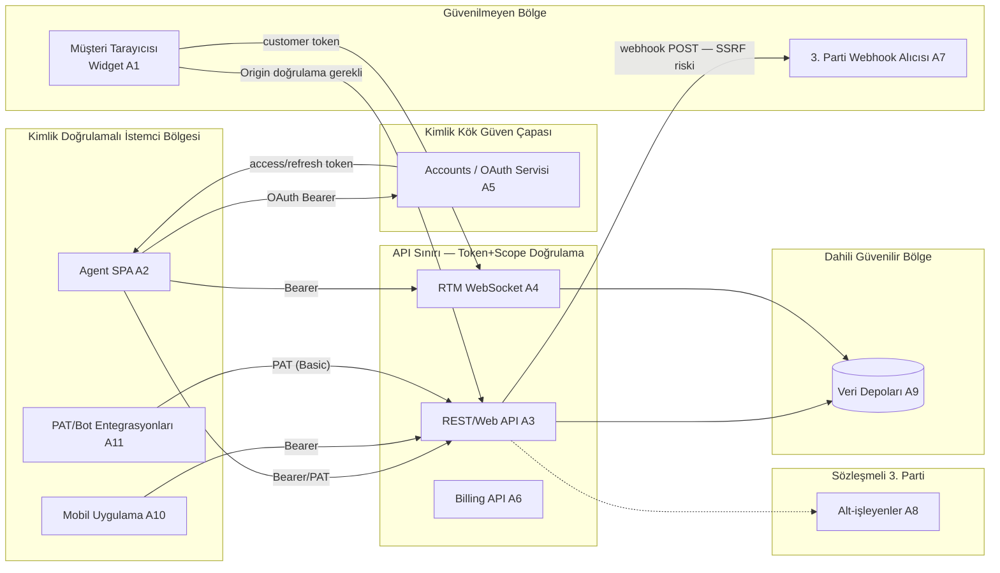

# RAPOR v2-04 — text.com/app (Text, Inc. / LiveChat) GÜVENLİK MİMARİSİ & UYUMLULUK MÜHENDİSLİĞİ DOKÜMANI

> **Rol:** Güvenlik Mimarı + AppSec/Uyumluluk uzmanı bakış açısı.
> **Amaç:** text.com/app platformunun güvenlik & uyumluluk duruşunu analiz etmek ve **birebir klonun güvenli şekilde inşa edilmesi** için mühendislik seviyesinde bir güvenlik dokümanı üretmek.
> **İlişki:** Bu rapor, `01-api-developer-platform.md`, `02-product-pricing-features.md` ve `02-teknik-mimari.md` raporlarının güvenlik-odaklı derinleştirmesidir; aynı sistemi tekrar anlatmaz, güvenlik/uyumluluk katmanını ekler.
> **Derleme tarihi:** 20 Temmuz 2026.
> **İşaretleme kuralı:** `[GÖZLEM]` = resmî dokümantasyon/canlı sayfa/SDK kaynağından doğrulanmış olgu · `[TAHMİN]` = davranışa dayalı mühendislik çıkarımı veya klon için öneri.

---

## İÇİNDEKİLER

1. [Varlık Envanteri ve Güven Sınırları (Trust Boundaries)](#1-varlık-envanteri-ve-güven-sınırları-trust-boundaries)
2. [STRIDE Tehdit Modeli](#2-stride-tehdit-modeli)
3. [Kimlik & Yetkilendirme](#3-kimlik--yetkilendirme)
4. [Widget Güvenliği](#4-widget-güvenliği)
5. [Girdi Doğrulama & Dosya Yükleme Güvenliği](#5-girdi-doğrulama--dosya-yükleme-güvenliği)
6. [Webhook Güvenliği](#6-webhook-güvenliği)
7. [Multi-Tenant Veri İzolasyonu, PII & Retention](#7-multi-tenant-veri-izolasyonu-pii--retention)
8. [Rate Limiting / DoS / Bot Koruması](#8-rate-limiting--dos--bot-koruması)
9. [Uyumluluk Haritası](#9-uyumluluk-haritası)
10. [Klon İçin Güvenlik Kontrol Listesi + Kritik Kod Önlemleri](#10-klon-için-güvenlik-kontrol-listesi--kritik-kod-önlemleri)
11. [Öncelikli Güvenlik Riskleri Tablosu ve Azaltma Yol Haritası](#11-öncelikli-güvenlik-riskleri-tablosu-ve-azaltma-yol-haritası)

---

## 0. Yönetici Özeti

text.com/app; tarayıcı-yerleşik bir müşteri widget'ı, ayrı bir agent SPA'sı, OAuth 2.1 tabanlı bir kimlik servisi, REST + WebSocket (RTM) tabanlı bir API katmanı ve çok sayıda üçüncü-taraf alt-işleyeni (AWS, Google Cloud, Cloudflare, Akamai, OpenAI, Sentry, FullStory, Sprig, ActiveCampaign/Postmark) bir araya getiren çok-kiracılı (multi-tenant) bir SaaS'tır `[GÖZLEM]`. Platformun güvenlik duruşu genel olarak olgun görünmektedir (OAuth 2.1, PAT scope modeli, trusted-domains, CC masking, DPA/SCC, HackerOne VDP), ancak **iki somut zayıflık** klon için özellikle önemlidir: (a) webhook imzalama modeli HMAC değil düz `secret_key` karşılaştırmasıdır `[GÖZLEM]`, ve (b) REST API için sayısal, yayınlanmış bir rate-limit yoktur `[GÖZLEM]`. Bu rapor, bu tespitleri STRIDE tehdit modeliyle sistematikleştirir ve klonun bu zayıflıkları miras almadan, daha güvenli inşa edilmesi için somut TypeScript kontrolleri sunar.

---

## 1. Varlık Envanteri ve Güven Sınırları (Trust Boundaries)

### 1.1 Varlık envanteri

| # | Varlık | Güven seviyesi | Barındığı yer | Kaynak |
|---|---|---|---|---|
| A1 | **Müşteri widget'ı** (chat balonu, `tracking.js`) | **Güvenilmeyen** (halka açık, üçüncü-taraf sitelerine gömülü) | Müşterinin web sitesi, `cdn.livechatinc.com/tracking.js` | `[GÖZLEM]` |
| A2 | **Agent SPA** (`www.text.com/app/*`) | Kimlik doğrulamalı, orta-yüksek güven | `www.text.com` | `[GÖZLEM]` |
| A3 | **REST/Web API** (Agent/Customer/Configuration/Reports) | Sınır kontrolü — token+scope | `api.livechatinc.com` | `[GÖZLEM]` |
| A4 | **RTM/WebSocket sunucusu** | Sınır kontrolü — token+scope, bağlantı ömrü sınırlı | `wss://api.livechatinc.com/v3.6/...` | `[GÖZLEM]` |
| A5 | **Kimlik servisi (OAuth/Accounts)** | Yüksek güven — sistemin kök güven çapası | `accounts.livechat.com` | `[GÖZLEM]` |
| A6 | **Billing/Monetization API** | Yüksek güven (finansal işlem) | `billing.text.com` | `[GÖZLEM]` |
| A7 | **Webhook alıcıları (3. parti müşteri sunucuları)** | **Güvenilmeyen çıkış (egress) hedefi** — SSRF riski | Müşteri tanımlı `url` | `[GÖZLEM]` |
| A8 | **Üçüncü-parti alt-işleyenler** — AWS (dosya depolama), Google Cloud (Spanner/işleme), Cloudflare (DNS), Akamai (CDN/WAF), OpenAI (AI Agent/Copilot), Sentry (hata izleme), FullStory (deneyim analitiği/session replay), Sprig (anket), ActiveCampaign/Postmark (e-posta) | Orta güven — sözleşmeli DPA'lı işleyenler | Çok bölgeli (USA/EU) | `[GÖZLEM: livechat.com/help/livechat-list-of-subprocessors]` |
| A9 | **Veri depoları** — Cloud Spanner (ilişkisel çekirdek), dosya deposu (AWS S3 sınıfı), Redis/cache (varsayım) | Yüksek güven, çok-kiracılı | GCP US/EU | `[GÖZLEM: terraform-google-cloud-spanner]` / `[TAHMİN: cache katmanı]` |
| A10 | **Mobil uygulamalar** (iOS/Android agent app) | Kimlik doğrulamalı istemci | App Store/Play Store | `[GÖZLEM]` |
| A11 | **Personal Access Token (PAT) / Bot token sahibi entegrasyonlar** | Değişken güven — kapsam(scope)a bağlı | 3. parti sunucular | `[GÖZLEM]` |

### 1.2 Güven sınırları (trust boundary) diyagramı



**Kritik gözlem:** A1 (widget) ↔ A3/A4 sınırı, sistemin en geniş saldırı yüzeyidir çünkü kimliksiz/anonim trafiği kabul eder; A3 → A7 (webhook çıkışı) sınırı ise **tersine** bir SSRF riskidir çünkü sistem kendi ağından müşteri tanımlı bir URL'ye istek yapar `[TAHMİN: mimari çıkarım]`.

---

## 2. STRIDE Tehdit Modeli

Aşağıdaki tablo, her bileşen için STRIDE kategorilerine göre somut tehditleri ve platformda gözlemlenen/klon için önerilen önlemleri listeler.

### 2.1 Müşteri Widget'ı (A1)

| Tehdit | Senaryo | Önlem |
|---|---|---|
| **S**poofing | Saldırgan widget script'ini kendi kötü amaçlı sitesine gömer, marka sahibi gibi davranır | Trusted Domains — widget yalnızca kayıtlı domainlerde çalışır `[GÖZLEM: livechat.com/help/trusted-domains]` |
| **T**ampering | Widget DOM'u tarayıcı-içi enjeksiyonla değiştirilir, sahte mesaj/form gösterilir | CSP (`script-src`, `frame-src` allowlist) `[GÖZLEM: livechat.com/help/use-livechat-with-content-security-policy]`; iframe izolasyonu |
| **R**epudiation | Müşteri "bu mesajı ben göndermedim" der | Sunucu tarafı `created_at`/`author_id`/IP loglama, immutable event log `[TAHMİN]` |
| **I**nfo Disclosure | `__lc_cid`/`__lc_cst` çerezleri XSS ile çalınır → kimlik ele geçirme | `HttpOnly`+`Secure`+`SameSite` çerez bayrakları `[GÖZLEM: token cookie modeli]` |
| **D**oS | Widget üzerinden `start_chat`/`send_event` flood | Per-IP + per-`entity_id` rate limit `[TAHMİN]` |
| **E**levation | Müşteri token'ı ile agent-only aksiyonlara (`transfer_chat`, `ban_customer`) erişim denemesi | Scope ayrımı: müşteri token'ı yalnızca Customer Chat API scope'larını taşır, PAT Customer Chat API'yi hiç kullanamaz `[GÖZLEM]` |

### 2.2 Agent SPA (A2)

| Tehdit | Senaryo | Önlem |
|---|---|---|
| **S** | Çalınan `access_token` ile başka bir agent gibi API çağrısı | Kısa token ömrü (varsayılan 8s `expires_in=28800`) + refresh rotasyonu `[GÖZLEM]` |
| **T** | Tarayıcı-içi state (Redux store) manipülasyonu ile UI'da yetki varmış gibi gösterme | **Sunucu her isteği yeniden yetkilendirir** — istemci state'i asla yetki kaynağı değildir `[TAHMİN: zorunlu ilke]` |
| **R** | Admin bir agent'ı sildiğini inkâr eder | Audit log (Enterprise'da mevcut) `[GÖZLEM: Access restriction/Audit log Enterprise-only]` |
| **I** | Yanlış organizasyona ait chat verisinin sızması (IDOR) | Her sorguda `organization_id` + RBAC kontrolü zorunlu (bkz. §3.4) |
| **D** | Aşırı büyük rapor sorgusu ile backend'i kilitleme | Sorgu zaman aralığı sınırı, sayfalama zorunluluğu |
| **E** | Member rolündeki bir agent, Owner'a özel billing ekranına rota manipülasyonuyla erişmeye çalışır | Rota-seviyesi yetki kontrolü — canlı uygulamada gözlemlenen "You don't have access to this view" boş-durumu `[GÖZLEM: 02-teknik-mimari.md §2.2.1]` |

### 2.3 REST/Web API (A3)

| Tehdit | Senaryo | Önlem |
|---|---|---|
| **S** | PAT/Bearer token çalınması ile API'ye taklit erişim | TLS zorunlu, token rotasyonu, IP allowlist (Enterprise) `[GÖZLEM: Access Restriction]` |
| **T** | `update_chat_properties` gibi eylemlerle başka bir org'un verisinin değiştirilmesi | Her `configuration`/`agent` eyleminde `organization_id` sunucu tarafında token'dan türetilir, **istemciden asla kabul edilmez** `[TAHMİN]` |
| **R** | API üzerinden yapılan değişikliklerin izlenememesi | Configuration API "eylemler sisteme yansıması 2 dk sürer" — bu eventual-consistency modelinin audit log ile eşleştirilmesi gerekir `[GÖZLEM]` |
| **I** | `chat_id`/`organization_id` tahmin edilerek başka kiracının chat'ine erişim (IDOR) | Chat ID'lerin yüksek entropili olması (gözlemlenen `PJ0MRSHTDG` formatı — 10 karakter alfanumerik, base32/62 benzeri) yeterli değildir; **her istekte org+scope kontrolü zorunlu** `[GÖZLEM formatı + TAHMİN kontrolü]` |
| **D** | Yayınlanmamış rate limit nedeniyle brute-force/scraping | `too_many_requests` hata tipi var ama sayısal limit/`Retry-After` yok — klon için **açıkça belgelenmiş** token-bucket limiti önerilir `[GÖZLEM boşluk + TAHMİN öneri]` |
| **E** | `customers:own` scope'lu bot token'ının agent-only `ban_customer` çağırması | Scope-aksiyon eşleşme matrisi sunucu tarafında zorunlu kılınmalı `[GÖZLEM: scope listesi]` |

### 2.4 RTM/WebSocket (A4)

| Tehdit | Senaryo | Önlem |
|---|---|---|
| **S** | Soket açılışında sahte `organization_id` query param ile başka kiracıya bağlanma girişimi | `login` payload'ındaki token claim'i ile query `organization_id` **eşleşmezse** bağlantı reddedilmeli (`authorization`/`misdirected_request`) `[GÖZLEM: hata tipleri]` |
| **T** | Soket üzerinden push mesajlarının araya girilip değiştirilmesi (MITM) | WSS zorunlu (TLS), HSTS |
| **R** | Gerçek zamanlı olayların log'lanmaması | Tüm push'lar aynı zamanda REST audit trail'e yazılmalı `[TAHMİN]` |
| **I** | `customer_monitoring_level: highest_available` ile agent'ın yetkisiz tüm müşterileri izlemesi | Bu scope'un yalnızca supervisor/admin rolüne açılması `[GÖZLEM: alan var + TAHMİN kısıtlama]` |
| **D** | Soket flood (çok sayıda bağlantı açma) | `users_limit_reached` (lisans başına çevrimiçi müşteri sınırı) zaten var `[GÖZLEM]`; klon için per-IP soket sayısı sınırı da eklenmeli `[TAHMİN]` |
| **E** | `pending_requests_limit_reached` bypass ederek DoS + kaynak tükenmesi | Sunucu tarafı sabit limit (max 10 bekleyen istek/soket) zorunlu kılınmalı `[GÖZLEM]` |

### 2.5 Kimlik Servisi / OAuth (A5)

| Tehdit | Senaryo | Önlem |
|---|---|---|
| **S** | Açık redirect / `redirect_uri` manipülasyonu ile authorization code hırsızlığı | Registered `redirect_uri` tam eşleşme + path traversal reddi + query/fragment yasak `[GÖZLEM: authorizing-api-calls]` |
| **T** | `state` parametresi olmadan CSRF ile OAuth callback'e sahte code enjeksiyonu | `state` zorunlu + PKCE (`S256`) önerilir `[GÖZLEM: PKCE mevcut]` |
| **R** | Token'ın kim tarafından/ne zaman verildiğinin izlenmemesi | `/v2/info` ile validation + audit `[GÖZLEM]` |
| **I** | `client_secret`'ın front-end kodunda sızması | Authorization Code + secret yalnızca sunucu tarafı; SPA'lar için Implicit/PKCE zorunlu `[GÖZLEM: 4 akış ayrımı]` |
| **D** | Token endpoint'e brute-force | 3 redirect/30sn limiti + 25 token/kullanıcı limiti `[GÖZLEM]` |
| **E** | Düşük scope'lu bir token ile scope yükseltme denemesi | Scope'lar **PAT oluşturulurken sabitlenir, sonradan değiştirilemez** `[GÖZLEM]` |

### 2.6 Webhook Alıcıları / SSRF Yüzeyi (A7)

| Tehdit | Senaryo | Önlem |
|---|---|---|
| **S** | Sahte webhook — imza HMAC olmadığı için üçüncü bir taraf `secret_key`'i tahmin/sızdırarak sahte payload gönderebilir | **[GÖZLEM: mevcut sistemde HMAC yok, düz string karşılaştırma]** → klon: HMAC-SHA256 + zaman damgası |
| **T** | Payload transit sırasında değiştirilir | HTTPS zorunlu + HMAC imza (mesaj bütünlüğü) |
| **R** | Webhook'un gerçekten gönderildiğinin ispatlanamaması | İmzalı + `webhook_id` + gönderim log'u |
| **I** | `secret_key`'in payload içinde taşınması, log/APM sistemlerinde yanlışlıkla loglanma riski | HMAC modelinde secret asla payload'da taşınmaz, yalnızca imza taşınır `[TAHMİN öneri]` |
| **D** | Kayıtlı `url`'in saldırgan tarafından dahili bir IP'ye (169.254.169.254 metadata endpoint, `localhost`, RFC1918) yönlendirilmesi → **SSRF** | Webhook `url` kayıt anında DNS çözümlenip private/loopback/link-local aralık kontrolü + redirect takibi kapatma `[TAHMİN — kritik boşluk]` |
| **E** | Webhook alıcısının 200 dönmesi karşılığında retry mekanizmasının kötüye kullanılması (amplifikasyon) | Retry sayısı sabit (3× ~1dk) zaten sınırlı `[GÖZLEM]` |

### 2.7 Veri Depoları (A9)

| Tehdit | Senaryo | Önlem |
|---|---|---|
| **S** | Sızan DB kimlik bilgileriyle doğrudan erişim | Servis hesapları + IAM, secrets manager, ağ izolasyonu (VPC) |
| **T** | Yetkisiz satır güncellemesi | Row-level security / uygulama katmanında `organization_id` zorunlu filtre |
| **R** | Kim neyi ne zaman değiştirdi bilinmiyor | `created_at`/`updated_at`/`updated_by` + audit tablosu |
| **I** | Bir kiracının verisinin sorgu hatası ile başka kiracıya sızması (multi-tenant leak) | Bkz. §7 — tenant-scoped repository katmanı, testlerde zorunlu izolasyon kontrolü |
| **D** | Ağır rapor sorgularının OLTP DB'yi kilitlemesi | Reports için ayrı okuma replikası / OLAP (ClickHouse) `[TAHMİN, 02-teknik-mimari.md §2.9.2 ile tutarlı]` |
| **E** | Uygulama servis hesabının aşırı geniş DB yetkisi (`GRANT ALL`) | En az ayrıcalık — servis başına ayrı DB rolü |

---

## 3. Kimlik & Yetkilendirme

### 3.1 OAuth 2.1 akışları — güvenlik değerlendirmesi

`[GÖZLEM]` Platform dört akış sunar: **Authorization Code** (+refresh token, `client_secret` gerekli — sunucu uygulamaları), **Implicit Grant** (`response_type=token`, secret yok, token URL fragment'ında — yalnızca legacy/JS uygulamaları için, modern OAuth 2.1 rehberliğinde **kullanımdan kaldırılması önerilen** bir akıştır), **PKCE** (code_verifier 43–128 karakter, `S256` önerilen yöntem) ve **"Sign in with LiveChat"** SDK'sı (PKCE varsayılan açık).

**Güvenlik değerlendirmesi:** OAuth 2.1 taslağı Implicit Grant'i tamamen kaldırır çünkü token URL fragment'ında tarayıcı geçmişine/yönlendirme zincirine sızabilir. text.com'un hâlâ Implicit'i desteklemesi **geriye dönük uyumluluk ödünleşimi**dir `[GÖZLEM + TAHMİN değerlendirme]`. **Klon önerisi:** Implicit'i hiç uygulamayın; SPA'lar için yalnızca Authorization Code + PKCE kullanın (RFC 8252 / OAuth 2.1 best practice).

### 3.2 Token yaşam süresi ve rotasyon

- `expires_in` varsayılan **28800 sn (8 saat)** `[GÖZLEM]` — sektör pratiğine göre (genelde 15dk–1sa access token) **uzun**. Çalınan bir token'ın kullanım penceresi geniştir.
- **Klon önerisi:** access token ömrünü 15–60 dakikaya indirin; uzun oturumlar için **rotasyonlu refresh token** (her kullanımda yeni refresh token, eskisi iptal — refresh token reuse detection) uygulayın `[TAHMİN — OAuth 2.1 best practice]`.
- Maks. **25 access + 25 refresh token**/istemci/kullanıcı (en eski otomatik iptal) — token sprawl'a karşı makul bir üst sınır `[GÖZLEM]`, klonda korunmalı.
- **Revocation:** `DELETE /v2/token` mevcut `[GÖZLEM]` — klonda çıkış (logout) işleminde hem access hem refresh token'ın **sunucu tarafı deny-list/iptal** ile derhal geçersiz kılınması gerekir (yalnızca istemci tarafı silme yetersizdir).

### 3.3 PAT (Personal Access Token) scope minimizasyonu

`[GÖZLEM]` PAT'lar `Basic base64(account_id:PAT)` şeması ile taşınır (Bearer değil); **scope'lar oluşturma anında sabitlenir, sonradan değiştirilemez** — bu iyi bir tasarım çünkü bir PAT'ın yetkisi zaman içinde sessizce genişleyemez. Ancak PAT'lar Customer Chat API dışında her yerde çalışır; geniş scope'lu bir PAT'ın (`chats--all:rw`, `agents--all:rw`) sızması tüm organizasyonu etkileyebilir.

**Klon önerileri:**
- PAT oluşturma ekranında **en az ayrıcalık şablonları** sunun (ör. "yalnızca raporlama", "yalnızca webhook yönetimi") — kullanıcıyı `*:rw` seçmekten caydırın.
- PAT'lara **son kullanım tarihi (expiry)** ve **son kullanılma zamanı görünürlüğü** ekleyin (mevcut platformda expiry olup olmadığı doğrulanamadı — `[TAHMİN: eksik olabilir, klon için zorunlu kılın]`).
- PAT kullanımını ayrı bir audit akışında loglayın (`used_at`, `source_ip`).

### 3.4 RBAC (Owner/Admin/Member/Agent) — rota düzeyinde yetki

`[GÖZLEM]` LiveChat standalone üründe üç rol vardır: **Owner** (tek, subscription kontrolü, devredilebilir), **Administrator** (tüm özellikler + per-admin subscription toggle, tüm grupların verisini görür ama yalnızca atanmış gruplarda chat yapar), **Agent** (chat/supervise/archive/report görüntüleme, yalnızca canned-response+tag düzenleme, yalnızca atanmış gruplara sınırlı). Unified text.com/app'te terminoloji **Owner/Admin/Member** olarak gözlemlenmiştir (`02-teknik-mimari.md` — invite modal `RoleSelect(Admin|Member)`).

**Kritik gözlem — rota düzeyinde yetki kontrolü:** Canlı uygulamada Member rolüyle Teams/Billing gibi ekranlara girildiğinde **"You don't have access to this view"** boş-durumu gözlemlenmiştir `[GÖZLEM: 02-teknik-mimari.md §2.2.1]`. Bu, yetkilendirmenin yalnızca UI'da (menüyü gizleyerek) değil, **rota/API seviyesinde de** uygulandığının bir işaretidir — iyi bir örnektir çünkü salt istemci-taraflı gizleme "security through obscurity" olur ve doğrudan URL/API çağrısıyla bypass edilebilir.

**Klon için RBAC matrisi (öneri):**

| Rol | Chat okuma | Chat yazma | Agent yönetimi | Billing | Webhook yönetimi | Audit log |
|---|---|---|---|---|---|---|
| Owner | ✓ (tüm gruplar) | ✓ | ✓ | ✓ | ✓ | ✓ |
| Admin | ✓ (tüm gruplar) | ✓ (atanmış gruplar) | ✓ | ✗ (opsiyonel) | ✓ | ✓ (Enterprise) |
| Member/Agent | ✓ (atanmış gruplar) | ✓ (atanmış gruplar) | ✗ | ✗ | ✗ | ✗ |

**Zorunlu ilke:** Her RBAC kontrolü **hem frontend (UX için) hem backend'de (güvenlik için)** ayrı ayrı uygulanmalı; backend kontrolü olmayan hiçbir yetki UI'da "gizlenerek" güvenli sayılmamalıdır.

### 3.5 Bot/Customer token izolasyonu

`[GÖZLEM]` Üç token sınıfı net şekilde ayrılmıştır: **Agent token** (Bearer/PAT — agent kapsamlı scope'lar), **Customer token** (`accounts.livechat.com/v2/customer/token` — Cookie/agent-token/identity-token grant'leri, PAT ile **hiç** üretilemez, Customer Chat API dışına çıkamaz), **Bot token** (`issue_bot_token` — `agents-bot--{my,all}:{ro,rw}` scope'ları, agent token'dan ayrı bir namespace). Bu üçlü izolasyon **doğru bir tasarım**dır çünkü bir müşteri (widget) token'ının sızması agent yetkilerine sıçramaz.

**Klon zorunluluğu:** JWT claim'lerinde `token_class: "agent"|"customer"|"bot"` alanı taşınmalı ve API middleware'i her endpoint için **izin verilen token sınıflarını** açıkça beyaz listeye almalı (bkz. §10 kod örneği). Örn. `POST /agent/action/ban_customer` yalnızca `token_class=agent` + uygun scope kabul etmeli; `token_class=customer` olan bir istek scope'u ne olursa olsun 403 almalı.

### 3.6 IDOR riskleri: `chat_id` / `organization_id`

`[GÖZLEM]` Gözlemlenen chat ID formatı (`PJ0MRSHTDG`, `PW94SJTGW6`) 10 karakterlik yüksek-entropili alfanumerik dizgelerdir — kaba kuvvetle tahmin edilmeleri pratik olarak zordur, ancak **entropi tek başına yetkilendirme değildir**. `organization_id` müşteri isteklerinde zorunlu query param olarak taşınır `[GÖZLEM: Customer Chat API]`.

**IDOR saldırı senaryosu (klon için kritik):** Kimlik doğrulamalı bir agent, kendi `organization_id`'sine ait olmayan ama bir şekilde ele geçirdiği/tahmin ettiği bir `chat_id` ile `GET /agent/action/get_chat` çağırırsa, backend yalnızca "chat var mı" kontrolü yapıp `organization_id` eşleşmesini atlarsa veri sızar.

**Zorunlu kontrol (klon):**
```ts
// HER kaynak erişiminde: kaynak sorgusu WHERE koşuluna organization_id dahil edilmeli
const chat = await prisma.conversation.findFirst({
  where: { id: chatId, organizationId: req.auth.orgId },  // asla sadece { id: chatId }
});
if (!chat) return reply.code(404).send({ error: { type: 'not_found' } }); // 403 değil 404 — enumeration'ı azalt
```
Bu desen tüm repository katmanına (chat, ticket, customer, tag, webhook, rapor) sistematik olarak uygulanmalıdır; aksi halde tek bir unutulmuş `WHERE` cümlesi tüm izolasyonu kırar.

---

## 4. Widget Güvenliği

### 4.1 Trusted Domains ile origin doğrulama

`[GÖZLEM]` Ayar yolu: *Settings → Security → Trusted domains*. Etkinleştirildiğinde tracking kodu **yalnızca listelenen domainlerde çalışır**; ana domain güveni alt-domainlere otomatik yayılır (ör. `example.com` güvenilirse `en.example.com` de güvenilir), ama tersi geçerli değildir. Bu, widget'ın kopyalanıp spam/flood amacıyla başka bir siteye yapıştırılmasını engeller `[GÖZLEM: livechat.com/help/trusted-domains]`.

**Klon önerisi:** Widget başlatma isteğinde (`start_chat`/token grant) sunucu tarafında `Origin`/`Referer` header'ı kayıtlı domain listesiyle karşılaştırılmalı; eşleşmezse `403 origin_not_trusted` döndürülmeli. Yalnızca istemci-taraflı bir kontrol (`window.location.hostname` kontrolü) **yetersizdir** çünkü saldırgan JS kodunu doğrudan çalıştırabilir — kontrol backend'de tekrarlanmalıdır.

### 4.2 XSS: rich message ve mesaj sanitizasyonu

`[GÖZLEM]` Rich Message şablonu (`cards`, `quick_replies`, `sticker`) yapılandırılmış `elements[]`/`Button{text, postback_id, value, target}` alanları taşır (bkz. `01-api-developer-platform.md §6`). Bu, serbest metin yerine **şema doğrulanmış** bir yapı olduğu için doğası gereği XSS riskini azaltır — ancak `text`, `title`, `subtitle` gibi serbest metin alanları render sırasında HTML olarak yorumlanırsa saklı (stored) XSS oluşur.

**Klon zorunlulukları:**
1. Mesaj metni **her zaman** metin düğümü (`textContent`) olarak render edilmeli, asla `dangerouslySetInnerHTML`/`innerHTML` ile değil.
2. Eğer zengin biçimlendirme (markdown/link) desteklenecekse, sunucu tarafında **allowlist tabanlı bir sanitizer** (ör. DOMPurify sunucu tarafında, veya markdown → sınırlı HTML dönüşümünde yalnızca `<b>,<i>,<a href>,<br>` gibi izinli etiketler) kullanılmalı.
3. `Button.value`/`postback_id` gibi alanlar sunucu tarafında da doğrulanmalı (istemci `onclick` handler'ına doğrudan enjekte edilmemeli).
4. Dosya adı (`file.name`) render edilirken de HTML-escape edilmeli — dosya adı kullanıcı tarafından tam kontrol edilebilir bir alandır.

### 4.3 Clickjacking ve iframe izolasyonu

`[GÖZLEM]` Agent App/Products SDK, widget'lar arası köprü olarak `livechat/postmate` (promise-tabanlı `postMessage`) kullanır `[GÖZLEM: 01-api-developer-platform.md §7]`. Bu, marketplace uygulamalarının agent arayüzüne **iframe** olarak gömüldüğünü gösterir.

**Klon zorunlulukları:**
- **Ana uygulama (agent SPA):** `X-Frame-Options: DENY` veya CSP `frame-ancestors 'none'` — ana uygulamanın başka bir sitede iframe'e alınıp tıklama-kaçırma (clickjacking) saldırısına maruz kalmaması için.
- **Widget (müşteri tarafı):** Müşteri sitesine gömüldüğü için `frame-ancestors` gevşetilmeli ama widget'ın **kendi içinde barındırdığı** 3. parti içerik (ör. video, harici form) ayrı bir `sandbox` iframe içinde izole edilmeli.
- **`postMessage` alıcı tarafı:** `event.origin` her zaman **beklenen tam origin** ile karşılaştırılmalı (`*` asla kullanılmamalı); gönderilen `targetOrigin` de spesifik olmalı.
```ts
window.addEventListener('message', (event) => {
  if (event.origin !== 'https://app.text-clone.com') return; // asla '*' kabul etme
  const data = JSON.parse(event.data);
  // ...
});
```

### 4.4 Müşteri kimliği çerezleri: `__lc_cid` / `__lc_cst`

`[GÖZLEM]` Cookie grant akışında sunucu `__lc_cid` (customer ID) ve `__lc_cst` (customer session token) çerezlerini set eder: **`Secure`, `HttpOnly`, `SameSite=None`, 2 yıl ömür**, her çağrıda ömür uzatılır (dönen ziyaretçi kimliği için) `[GÖZLEM: 01-api-developer-platform.md §3.4]`.

**Değerlendirme:** `SameSite=None` zorunludur çünkü widget çapraz-origin (müşteri sitesi → `livechatinc.com`) bir iframe/script bağlamında çalışır; bu nedenle `Secure` bayrağı **olmazsa olmaz**dır (`SameSite=None` + `Secure` olmadan modern tarayıcılar çerezi reddeder). 2 yıllık ömür, "dönen ziyaretçi" UX'i için makul ama CSRF yüzeyini genişletir.

**Klon zorunlulukları:**
- `HttpOnly` → XSS ile çerez hırsızlığını engeller (JS `document.cookie` erişemez). **Korunmalı.**
- `Secure` + `SameSite=None` → **Korunmalı** (çapraz-origin gömme için zorunlu).
- CSRF telafisi: `SameSite=None` CSRF korumasını devre dışı bıraktığı için, durum-değiştiren her istekte (ör. `send_event`) **ek bir CSRF token'ı olmayan** ama **kimlik doğrulaması token-tabanlı** bir model tercih edilmeli — yani çerez yalnızca kimlik taşımalı, gerçek yetkilendirme `Authorization` header'ındaki Bearer token ile yapılmalı (çerez + header ikilisi CSRF'yi anlamsızlaştırır çünkü saldırgan sitenin JS'i cross-origin `Authorization` header'ı okuyup gönderemez).
- 2 yıllık ömür yerine klon için **90 gün + sliding renewal** düşünülebilir — GDPR "veri minimizasyonu" ilkesiyle daha uyumlu `[TAHMİN]`.

---

## 5. Girdi Doğrulama & Dosya Yükleme Güvenliği

### 5.1 Girdi doğrulama

`[GÖZLEM]` API'de `validation` hata tipi mevcuttur ("wrong format") — sunucu tarafı şema doğrulaması olduğunu gösterir, ancak şemaların tam kuralları (uzunluk sınırları, regex) yayınlanmamıştır.

**Klon zorunluluğu — her endpoint için Zod şeması:**
```ts
const SendEventSchema = z.object({
  chat_id: z.string().regex(/^[A-Z0-9]{10}$/),
  event: z.discriminatedUnion('type', [
    z.object({ type: z.literal('message'), text: z.string().min(1).max(10_000), visibility: z.enum(['all','agents']) }),
    z.object({ type: z.literal('file'), url: z.string().url(), content_type: z.string(), size: z.number().max(50 * 1024 * 1024) }),
  ]),
});
```
Tüm sayısal alanlar (`days` in `ban_customer`, `size` in dosya) **üst/alt sınırlarla** doğrulanmalı; tüm string alanlar **maksimum uzunlukla** sınırlandırılmalı (DoS + depolama şişmesi önleme).

### 5.2 Dosya yükleme güvenliği

`[GÖZLEM]` `upload_file` eylemi `multipart/form-data` ile çalışır, yanıt `{url}` döner. AI Agent bilgi kaynakları için belirtilen dosya tipi/boyut sınırı: **PDF/DOCX/PPTX/TXT/CSV/TSV/MD, 50 MB'a kadar** `[GÖZLEM: 02-product-pricing-features.md §3.8]`.

**Klon zorunlulukları:**
1. **MIME-type doğrulaması içerikten** yapılmalı (magic-byte/sniffing kütüphanesi, ör. `file-type` paketi), yalnızca istemci-bildirilen `Content-Type`'a güvenilmemeli.
2. **Uzantı allowlist**'i sunucu tarafında zorlanmalı (`.exe`, `.sh`, `.html`, `.svg` gibi çalıştırılabilir/aktif içerik türleri reddedilmeli — özellikle `.svg` XSS taşıyabilir).
3. **Boyut sınırı** hem reverse-proxy/CDN katmanında hem uygulama katmanında (çift savunma).
4. **AV taraması** (ör. ClamAV entegre worker, ya da bulut AV servis — S3 event → Lambda tarzı) — yüklenen dosya kullanıcıya sunulmadan önce taranmalı.
5. **İçerik doğrudan API domain'inden değil, ayrı bir cookie'siz "içerik domaini"nden** servis edilmeli (ör. `files-text.com` — gözlemlenen ayrı CDN domaini `[GÖZLEM: CSP img-src *.files-text.com]`), böylece yüklenen bir HTML/SVG dosyası ana uygulamanın origin'inde çalışıp session çerezine erişemez (origin izolasyonu / "sandbox domain" pratiği).
6. **İmzalı URL (signed URL)** ile süreli, tek kullanımlık erişim — dosya deposu (S3/GCS) `public-read` olmamalı; her indirme isteği kısa ömürlü (ör. 5 dk) imzalı URL ile yapılmalı.
```ts
import { S3Client, GetObjectCommand } from '@aws-sdk/client-s3';
import { getSignedUrl } from '@aws-sdk/s3-request-presigner';

async function signedDownloadUrl(key: string, orgId: string) {
  if (!key.startsWith(`${orgId}/`)) throw new Error('cross_tenant_access_denied'); // tenant path prefix zorunlu
  const cmd = new GetObjectCommand({ Bucket: 'clone-attachments', Key: key });
  return getSignedUrl(s3, cmd, { expiresIn: 300 });
}
```

### 5.3 Rich message enjeksiyonu

`Button.value`/`postback_id` gibi alanlar backend eylemlerini tetikleyebildiği için (`send_rich_message_postback`), bu değerler **asla doğrudan SQL/komut/şablon motoruna** geçirilmemeli; sunucu tarafında bir allowlist'e (kayıtlı postback ID'leri) karşı doğrulanmalıdır `[TAHMİN]`.

---

## 6. Webhook Güvenliği

### 6.1 Mevcut modelin zayıflığı

`[GÖZLEM]` text.com/LiveChat webhook doğrulaması **HMAC değildir**: kayıt sırasında verilen `secret_key`, her webhook payload'ının **içinde düz metin olarak** tekrar gönderilir; alıcı uygulama bunu kendi sakladığı değerle karşılaştırır (*"We'll include your secret key in the payload of each webhook…your application can verify the webhooks came from us."*) `[GÖZLEM: platform.text.com/docs/getting-started/app-guides/chat-webhooks]`.

**Bu modelin zayıflıkları:**
1. **Mesaj bütünlüğü yok** — `secret_key` doğru olsa bile payload'ın transit sırasında değiştirilmediğinin kriptografik garantisi yoktur (yalnızca TLS'e güveniliyor).
2. **Sızıntı riski** — secret her payload'da taşındığı için alıcı tarafın loglama/APM/hata-izleme sistemine (Sentry vb.) yanlışlıkla yazılma riski yüksektir; sızan bir secret, saldırganın sahte webhook üretmesine izin verir.
3. **Replay koruması yok** — aynı payload + secret tekrar gönderilirse (ör. yakalanmış bir istek tekrar oynatılırsa) alıcı bunu ayırt edemez.
4. **Rotasyon zorluğu** — secret döndürüldüğünde tüm geçmiş doğrulama mantığı geçersiz olur, geçiş penceresi yönetimi net değil.

### 6.2 Klon önerisi: HMAC-SHA256 + timestamp/nonce

**İmzalama (gönderen taraf):**
```ts
import crypto from 'node:crypto';

function signWebhook(payload: object, secret: string) {
  const timestamp = Math.floor(Date.now() / 1000).toString();
  const nonce = crypto.randomUUID();
  const body = JSON.stringify(payload);
  const signedPayload = `${timestamp}.${nonce}.${body}`;
  const signature = crypto.createHmac('sha256', secret).update(signedPayload).digest('hex');
  return {
    headers: {
      'X-Webhook-Timestamp': timestamp,
      'X-Webhook-Nonce': nonce,
      'X-Webhook-Signature': `sha256=${signature}`,
    },
    body,
  };
}
```

**Doğrulama (alıcı taraf — dokümantasyonda alıcıya önerilir):**
```ts
function verifyWebhook(rawBody: string, headers: Record<string, string>, secret: string, seenNonces: Set<string>) {
  const timestamp = Number(headers['x-webhook-timestamp']);
  const nonce = headers['x-webhook-nonce'];
  const now = Math.floor(Date.now() / 1000);

  if (Math.abs(now - timestamp) > 300) throw new Error('stale_timestamp'); // replay penceresi: 5 dk
  if (seenNonces.has(nonce)) throw new Error('replayed_nonce');            // nonce tekilliği (Redis SETNX + TTL)

  const expected = crypto.createHmac('sha256', secret)
    .update(`${timestamp}.${nonce}.${rawBody}`).digest('hex');
  const provided = headers['x-webhook-signature']?.replace('sha256=', '') ?? '';
  const ok = expected.length === provided.length &&
    crypto.timingSafeEqual(Buffer.from(expected), Buffer.from(provided)); // zamanlama saldırısına karşı sabit-zaman karşılaştırma
  if (!ok) throw new Error('invalid_signature');
  seenNonces.add(nonce); // Redis'te TTL=310s ile sakla
}
```
Bu model, secret'i **hiçbir zaman ağ üzerinde taşımaz** (yalnızca imza), replay'i nonce+timestamp penceresiyle engeller, ve `timingSafeEqual` ile zamanlama yan-kanal saldırısını önler.

### 6.3 SSRF koruması

Webhook `url` alanı kullanıcı (müşteri) tarafından girilir ve sistem bu URL'ye **sunucudan** POST isteği yapar — klasik bir **Sunucu Taraflı İstek Sahteciliği (SSRF)** yüzeyidir. Saldırgan `url`'i `http://169.254.169.254/latest/meta-data/` (bulut metadata endpoint'i), `http://localhost:6379` (dahili Redis) veya RFC1918 özel aralığa (`10.0.0.0/8`, `172.16.0.0/12`, `192.168.0.0/16`) ayarlayabilir.

**Klon zorunlulukları:**
1. **Kayıt anında** `url`'in DNS'i çözümlenip elde edilen IP'nin private/loopback/link-local/reserved aralıklarda **olmadığı** doğrulanmalı (yalnızca hostname string kontrolü yeterli değildir — DNS rebinding saldırısına açık).
2. **Her gönderim anında da tekrar** çözümleme yapılmalı (TOCTOU/DNS rebinding'e karşı) — ya da giden isteği izole bir egress-proxy/network segment üzerinden yapıp o segmentte dahili IP'lere erişim ağ katmanında engellenmeli (en sağlam çözüm).
3. HTTP **redirect'leri otomatik takip etmeyin** (veya her redirect hedefini de aynı kontrole tabi tutun) — `url` dış görünüşte güvenli olup 302 ile dahili adrese yönlendirebilir.
4. Yalnızca `http(s)://` şeması kabul edilmeli (`file://`, `gopher://`, `ftp://` reddedilmeli).
5. Giden webhook isteklerinin zaman aşımı kısa tutulmalı (ör. 10 sn — mevcut sistemle tutarlı `[GÖZLEM]`) ve yanıt gövdesi boyutu sınırlanmalı.
```ts
import dns from 'node:dns/promises';
import { isIP } from 'node:net';
import ipaddr from 'ipaddr.js';

async function assertSafeWebhookUrl(rawUrl: string) {
  const u = new URL(rawUrl);
  if (!['http:', 'https:'].includes(u.protocol)) throw new Error('invalid_scheme');
  const addresses = isIP(u.hostname) ? [u.hostname] : (await dns.lookup(u.hostname, { all: true })).map(a => a.address);
  for (const addr of addresses) {
    const parsed = ipaddr.parse(addr);
    const range = parsed.range(); // 'private' | 'loopback' | 'linkLocal' | 'uniqueLocal' | ...
    if (range !== 'unicast') throw new Error(`ssrf_blocked_range:${range}`);
  }
}
```

---

## 7. Multi-Tenant Veri İzolasyonu, PII & Retention

### 7.1 İzolasyon riskleri

`[GÖZLEM]` Platform GCP **Cloud Spanner** üzerinde çalışır (`livechat/terraform-google-cloud-spanner` — CMEK destekli) `[GÖZLEM: 01-api-developer-platform.md §7]`. Kiracı ayrımı `organization_id` sütun-tabanlı izolasyon ile yapılıyor gibi görünmektedir (ayrı DB-per-tenant değil, paylaşılan şema) `[TAHMİN — Spanner'ın ölçek modeliyle tutarlı]`.

**Paylaşımlı-şema modelinin riski:** Tek bir eksik `WHERE organization_id = ?` filtresi, bir sorguda **çapraz-kiracı veri sızıntısına** yol açabilir. Bu, SaaS'lardaki en yaygın kritik güvenlik açığı sınıflarından biridir (OWASP Top 10 — Broken Access Control, A01:2021).

**Klon zorunlulukları:**
1. **Repository katmanında merkezi tenant-scoping** — her `findMany`/`findFirst` çağrısı bir taban sınıf/yardımcı fonksiyondan geçmeli, `organization_id` filtresi *asla* çağıran koda bırakılmamalı:
```ts
class TenantScopedRepository<T> {
  constructor(private model: any, private orgId: string) {}
  findMany(where: object) { return this.model.findMany({ where: { ...where, organizationId: this.orgId } }); }
  findFirst(where: object) { return this.model.findFirst({ where: { ...where, organizationId: this.orgId } }); }
}
```
2. **Veritabanı seviyesinde Row-Level Security** (PostgreSQL kullanılıyorsa `CREATE POLICY ... USING (organization_id = current_setting('app.current_org')::uuid)`) — uygulama hatası olsa bile DB son savunma hattı olarak işlev görür.
3. **Otomatik izolasyon testi** — CI'da her repository metodu için "org A'nın token'ı ile org B'nin ID'sini sorgula, sonuç boş dönmeli" testi zorunlu kılınmalı.
4. **Nesne depolama (S3/GCS) path prefix'i** `organization_id` ile başlamalı (bkz. §5.2 kod örneği) — imzalı URL üretiminde çapraz-tenant prefix kontrolü.

### 7.2 PII maskeleme — kredi kartı

`[GÖZLEM]` "Credit Card Masking" tüm planlarda mevcut bir güvenlik özelliğidir `[GÖZLEM: 02-product-pricing-features.md §6]`. Bu, chat/ticket metninde kredi kartı numarası deseni tespit edilip **gerçek zamanlı olarak maskelendiği** (agent ekranında `**** **** **** 1234` gibi) bir yetenektir — PCI DSS SAQ A kapsamının önkoşuludur (kart verisinin düz metin olarak saklanmaması).

**Klon uygulaması:**
```ts
const CC_PATTERN = /\b(?:\d[ -]*?){13,19}\b/g;
function luhnValid(digits: string) { /* Luhn algoritması */ }

function maskCardNumbers(text: string): string {
  return text.replace(CC_PATTERN, (match) => {
    const digits = match.replace(/[ -]/g, '');
    if (!luhnValid(digits)) return match; // yanlış-pozitifi azalt (Luhn geçmeyen sayı = kart değil)
    return `**** **** **** ${digits.slice(-4)}`;
  });
}
```
Maskeleme **yazma anında** (mesaj kaydedilmeden önce) uygulanmalı, böylece ham kart numarası hiçbir zaman DB'ye/log'a yazılmaz — yalnızca UI'da göstermek yeterli değildir, çünkü backend depolaması da PCI kapsamına girer.

### 7.3 Veri saklama/silme (retention)

`[GÖZLEM — dikkat: eski/arşiv kaynak]` LiveChat'in genel yardım sayfasında geçmişte "saklanan veride son kullanma tarihi yok… lisans sona erdikten sonra bile veri sunucularda kalır" ifadesi bulunmaktadır `[GÖZLEM: livechat.com/help/livechat-security-and-data-storage — sayfa Softlayer/Texas ve TLS 1.1 gibi güncelliğini yitirmiş ayrıntılar içerdiğinden içerik eski olabilir, dikkatle yorumlanmalı]`. Buna karşın plan bazlı geçmiş erişim penceresi mevcuttur — Starter/Essential planı **60 gün**, Team+/Growth+ **sınırsız geçmiş** `[GÖZLEM: 02-product-pricing-features.md §2]`. Bu iki gözlem birlikte okunduğunda: "geçmişe erişim" ile "verinin fiziksel silinmesi" farklı kavramlardır — düşük planlarda 60 gün sonrası veri **arşivlenmiş/erişilemez** olabilir ama **silinmemiş** olabilir.

**GDPR ile gerilim:** GDPR'ın "depolama sınırlaması" ilkesi (Md. 5(1)(e)) süresiz saklamayı **haklı bir amaç olmadan** desteklemez. DPA'da Text'in "Processor" rolü ve müşteri (Controller) talimatıyla hareket etme yükümlülüğü açıkça belirtilmiştir `[GÖZLEM: text.com/legal/data-processing-addendum]`.

**Klon zorunlulukları:**
1. Her kiracı için **yapılandırılabilir retention politikası** (ör. 30/60/365 gün/sınırsız) ve süre dolduğunda **gerçek silme** (soft-delete değil, cron job ile hard-delete veya kriptografik silme — encryption key'i atarak).
2. **"Sil" (right to erasure) API'si** — GDPR Md. 17 için müşteri/agent/ticket verisinin belirli bir `data subject` için silinebilmesi.
3. Silme işlemlerinin **audit log'da** (kim, ne zaman, hangi veri) tutulması — silme kaydı verinin kendisi değil meta-veridir, saklanabilir.
4. Yedeklerin (backup) de retention politikasına tabi olması — "DB'den sildim ama 2 yıllık yedekte hâlâ var" GDPR ihlali sayılabilir.

### 7.4 Audit log

`[GÖZLEM]` Audit log **yalnızca Enterprise planında** (LiveChat) / HIPAA+SSO ile birlikte sunulur `[GÖZLEM: 02-product-pricing-features.md §2.2, §6]`. Bu ticari bir katmanlandırmadır ama güvenlik açısından risklidir: düşük planlı bir kiracı, hesabında kim neyi değiştirdiğini göremez.

**Klon önerisi:** Audit log'u **tüm planlarda temel seviyede** (son 30 gün, temel olaylar: login, rol değişikliği, veri silme, webhook değişikliği) sunun; Enterprise'da genişletilmiş saklama + export + SIEM entegrasyonu (Enterprise farkı olarak) sağlayın. Güvenlik-kritik loglama bir "premium özellik" olarak tamamen kapatılmamalı — bu, düşük planlı kiracıları saldırı tespitinden mahrum bırakır.

---

## 8. Rate Limiting / DoS / Bot Koruması

### 8.1 Mevcut durum

`[GÖZLEM]` REST API için **yayınlanmış sayısal bir limit veya `Retry-After` header'ı yoktur** — yalnızca aşıldığında `too_many_requests` hatası döner ve "bir süre sonra açılır" denir `[GÖZLEM: 01-api-developer-platform.md §5.1]`. RTM/WebSocket tarafında ise somut sınırlar vardır: **max 10 bekleyen istek/soket**, **istek başına 15 sn timeout**, **login 30 sn içinde zorunlu**, **15 sn'de bir ping** (aksi halde ~30 sn sonra kapanır), **lisans başına çevrimiçi müşteri sınırı** (`users_limit_reached`) `[GÖZLEM]`. OAuth katmanında **25 access + 25 refresh token/istemci-kullanıcı** ve **3 redirect/30 sn** sınırları vardır `[GÖZLEM]`.

**Değerlendirme:** RTM/OAuth limitleri somut ve iyi tanımlı; REST tarafındaki belirsizlik hem geliştirici deneyimi hem güvenlik şeffaflığı açısından bir eksikliktir — saldırganlar deneme-yanılmayla eşiği keşfetmek zorunda kalır ama meşru entegratörler de aynı belirsizlikle karşılaşır.

### 8.2 Klon için rate limiting mimarisi

**Katmanlı yaklaşım (öneri):**
1. **Edge/CDN katmanı** (Cloudflare benzeri) — IP-bazlı kaba filtre, bilinen bot/scraper imzaları, coğrafi anomaliler.
2. **API Gateway katmanı** — token-bucket, kimlik doğrulamalı istekler için **`account_id`+`organization_id`** bazlı, kimliksiz istekler için **IP** bazlı:

```ts
// Fastify + ioredis token-bucket örneği
import { RateLimiterRedis } from 'rate-limiter-flexible';

const authedLimiter = new RateLimiterRedis({
  storeClient: redis, keyPrefix: 'rl:authed',
  points: 300, duration: 60,          // 300 istek / 60 sn / hesap
});
const anonLimiter = new RateLimiterRedis({
  storeClient: redis, keyPrefix: 'rl:anon',
  points: 30, duration: 60,           // 30 istek / 60 sn / IP (widget public uçları)
});
const wsPendingLimiter = new Map<string, number>(); // per-socket bekleyen istek sayacı — max 10 [GÖZLEM ile tutarlı]

export async function rateLimitMiddleware(req, reply) {
  const key = req.auth?.accountId ?? req.ip;
  const limiter = req.auth ? authedLimiter : anonLimiter;
  try {
    await limiter.consume(key);
  } catch (rej) {
    reply.header('Retry-After', Math.ceil(rej.msBeforeNext / 1000)); // gerçek platformun eksik bıraktığı header
    return reply.code(429).send({ error: { type: 'too_many_requests' } });
  }
}
```
3. **Yavaşlatıcı (throttling) aksiyon-bazlı sınırlar** — `start_chat`, `send_event` gibi yazma-ağır eylemler okuma eylemlerinden daha sıkı limitlenmeli (ör. `send_event`: 1 istek/sn/chat).
4. **`Retry-After` header'ı her zaman döndürülmeli** — mevcut platformdaki boşluğu kapatan bir iyileştirme.

### 8.3 WS bağlantı limitleri

`[GÖZLEM]` uyumlu şekilde: login 30 sn zorunlu, ping/pong 15 sn, max 10 pending request/soket, `users_limit_reached`. **Ek klon önerileri:** per-IP eşzamanlı soket sayısı sınırı (ör. 5), per-organizasyon toplam eşzamanlı soket sınırı (plan bazlı), ve anomali tespiti (aynı token ile çok sayıda farklı IP'den eşzamanlı bağlantı → olası token hırsızlığı sinyali) `[TAHMİN]`.

### 8.4 Bot koruması

Widget public uçları (`start_chat`, pre-chat form gönderimi) için CAPTCHA/PoW (ör. Cloudflare Turnstile) düşünülmeli, özellikle **anti-spam** özelliğinin zaten pazarlandığı Essential katmanı ile tutarlı olarak `[GÖZLEM: 02-product-pricing-features.md §2.2 "antispam"]`.

---

## 9. Uyumluluk Haritası

### 9.1 Genel tablo

| Çerçeve | Durum | Kanıt/Not | Kaynak |
|---|---|---|---|
| **GDPR** | Uyumlu — DPA mevcut, SCC Module 2, UK Addendum | Text = Processor, müşteri = Controller; 10 gün alt-işleyen bildirim + 5 gün itiraz penceresi | `[GÖZLEM: text.com/legal/data-processing-addendum]` |
| **CCPA/CPRA** | Uyumlu | Text = "Service Provider", müşteri = "Business" | `[GÖZLEM: aynı DPA]` |
| **Swiss-US DPF** | Sertifikalı | 15 Eylül 2024 itibarıyla yeterlilik kararı tanınmış | `[GÖZLEM: DPA]` |
| **HIPAA** | Şartlı uyumlu — yalnızca imzalı BAA + **yalnızca US hosting** seçilirse | HIPAA Enterprise-only özellik; EU/`fra` bölgesinde HIPAA kapsamı **yok** görünüyor | `[GÖZLEM: 02-product-pricing-features.md §6]` |
| **PCI DSS** | **SAQ A** seviyesi | Kart verisi platformda saklanmaz/işlenmez (CC Masking ile); tam PCI DSS Level 1 sertifikasyonu değil, SAQ A kendi-beyan formu | `[GÖZLEM]` |
| **SOC 2** | Rapor mevcut ama **Tip belirtilmemiş**, NDA altında paylaşılıyor | Tip I mi Tip II mi doğrulanamadı — klon dokümantasyonunda bu belirsizlik netleştirilmeli | `[GÖZLEM: 02-product-pricing-features.md §6]` |
| **ISO 27001** | **Doğrulanamadı** — kamuya açık kanıt yok | Sertifika sayfası/rozet bulunamadı | `[GÖZLEM boşluk]` |
| **WCAG** | 2.1 AA (widget) / 2.2 (genel iddia) — tutarsızlık var | Farklı kaynaklarda 2.1 AA vs 2.2 ifadeleri geçiyor, netleştirilmeli | `[GÖZLEM: 02-product-pricing-features.md §3.1 vs §6]` |
| **BBB** | Akredite | Pazarlama sayfası rozeti | `[GÖZLEM]` |

### 9.2 Veri sakinliği (data residency) ve alt-işleyenler

`[GÖZLEM]` **İki bölge:** `dal` (Dallas, ABD) ve `fra` (Frankfurt, AB) — kiracı hangi bölgede barındırılacağını seçer, kayıt anında sabitlenir görünmektedir (`region` parametresi hem token hem RTM bağlantısında zorunlu). Yanlış bölgeye istek `misdirected_request` hatası verir.

**Alt-işleyen listesi** `[GÖZLEM: livechat.com/help/livechat-list-of-subprocessors]`:

| Alt-işleyen | Amaç | Konum |
|---|---|---|
| AWS | Dosya depolama | US, EU |
| Google Cloud Platform | Bulut altyapı/işleme (Spanner) | US, EU |
| Cloudflare | DNS | US, EU |
| Akamai | CDN + güvenlik duvarı | Dünya geneli |
| OpenAI | Müşteri iletişimi/AI Agent iyileştirme | US, Dünya geneli |
| Google (ayrı satır) | Müşteri iletişimi/AI iyileştirme | US, EU |
| Google (e-posta/doküman) | E-posta ve dahili doküman depolama | US, EU |
| ActiveCampaign (Postmark) | Transaksiyonel e-posta | US |
| FullStory | Müşteri deneyimi analitiği (session replay) | US |
| Sprig | Kullanıcı araştırması/anket | US |
| Sentry (Functional Software) | Performans/hata izleme | US |

**Önemli uyumluluk çıkarımı:** **OpenAI'ın "Worldwide"** işleme bölgesi olarak listelenmesi, AI Agent/Copilot özelliklerini kullanan bir **EU (`fra`) kiracısının verisinin dahi** AI çıkarımı için ABD merkezli bir işleyene gidebileceği anlamına gelir. Bu, "EU veri sakinliği" vaadi ile **gerilim** yaratabilir ve SCC'lerle telafi edilmesi gerekir `[TAHMİN — DPA metninde SCC bu senaryoyu kapsıyor olmalı]`. Klon dokümantasyonunda bu **AI alt-işleyen istisnası** açıkça müşteriye bildirilmelidir (GDPR şeffaflık ilkesi).

**Session replay (FullStory) uyumluluk riski:** Session replay araçları, formlara girilen PII'yi (isim, e-posta, hatta yanlışlıkla kart no) yakalayabilir. Klon için **input maskeleme kuralları** (ör. `data-fs-mask` benzeri özellik, tüm hassas alan türlerinde varsayılan maskeleme) zorunlu tutulmalı `[TAHMİN]`.

### 9.3 Klon için uyumluluk tasarım ilkeleri

1. **"Privacy by design"** — veri modelinde `organization_id`'nin bölgesini (`region: 'dal'|'fra'`) ilk günden itiraz edilemez bir alan olarak tutun; bölgeler arası veri taşımayı (migration) yalnızca açık müşteri onayıyla yapın.
2. **DPA şablonu** hazırlayın: Controller/Processor rolleri, SCC Module 2, alt-işleyen bildirim penceresi (10 gün + 5 gün itiraz — mevcut modelle tutarlı iyi bir pratik).
3. **HIPAA modunu** bir "bayrak" (feature flag) olarak modelleyin: etkinleştirildiğinde (a) yalnızca US bölgesine kilitle, (b) BAA imzalanmadan etkinleştirmeyi engelle, (c) o kiracının verisinin hiçbir zaman EU alt-işleyene gitmediğini kod-seviyesinde garanti edin (routing katmanında bölge kontrolü).
4. **PCI SAQ A** kapsamını korumak için kart verisinin **hiçbir zaman** ham olarak DB'ye/loglara yazılmadığından emin olun (bkz. §7.2); ödeme işlemeyi tamamen bir PCI-sertifikalı üçüncü tarafa (Stripe vb.) devredin.

---

## 10. Klon İçin Güvenlik Kontrol Listesi + Kritik Kod Önlemleri

### 10.1 Kontrol listesi (checklist)

**Kimlik & Erişim**
- [ ] OAuth 2.1 — Implicit Grant **uygulanmadı**, yalnızca Authorization Code + PKCE
- [ ] Access token ömrü ≤ 60 dk; refresh token rotasyonu + reuse detection
- [ ] PAT'lar scope-immutable + **expiry zorunlu** + kullanım audit log
- [ ] Token sınıfı (`agent`/`customer`/`bot`) her middleware'de whitelist ile kontrol ediliyor
- [ ] RBAC hem frontend (UX) hem backend (güvenlik) katmanında ayrı ayrı uygulanıyor
- [ ] Her kaynak sorgusunda `organization_id` filtresi merkezi repository katmanından geçiyor (IDOR önleme)
- [ ] 404 (not 403) ile enumeration'ı azaltma — kaynak var mı yok mu bilgisini sızdırma

**Widget & Frontend**
- [ ] Trusted-domains: `Origin`/`Referer` sunucu tarafında da doğrulanıyor
- [ ] CSP: `script-src`, `frame-src`, `connect-src`, `img-src` allowlist (wildcard yok, `unsafe-eval` minimize)
- [ ] `X-Frame-Options: DENY` / `frame-ancestors 'none'` (ana uygulama)
- [ ] `postMessage` alıcılarında `event.origin` tam eşleşme kontrolü
- [ ] Zengin mesaj/rich message render'ı `textContent`/sanitizer ile, asla ham `innerHTML` değil
- [ ] Müşteri kimlik çerezleri: `HttpOnly` + `Secure` + `SameSite=None`(çapraz-origin) veya `Lax`(same-site)

**Girdi/Dosya**
- [ ] Her endpoint Zod/Joi şeması ile doğrulanıyor (uzunluk/tip/aralık sınırları)
- [ ] Dosya yükleme: magic-byte MIME kontrolü + uzantı allowlist + AV tarama + boyut sınırı
- [ ] Yüklenen içerik ayrı, cookie'siz bir domainden servis ediliyor
- [ ] İndirme URL'leri imzalı + kısa ömürlü + tenant-prefix kontrollü

**Webhook**
- [ ] HMAC-SHA256 imza (secret asla payload'da taşınmıyor)
- [ ] Timestamp + nonce ile replay koruması (pencere ≤5 dk)
- [ ] `timingSafeEqual` ile sabit-zamanlı imza karşılaştırması
- [ ] SSRF koruması: DNS çözümleme + private/loopback/link-local IP reddi + redirect kontrolü + yalnızca `http(s)`

**Multi-tenant/Veri**
- [ ] Row-Level Security (DB seviyesinde ikinci savunma hattı)
- [ ] CI'da otomatik çapraz-tenant izolasyon testleri
- [ ] Kredi kartı deseni tespiti + maskeleme **yazma anında** (Luhn doğrulamalı)
- [ ] Yapılandırılabilir retention + gerçek silme (hard-delete) + "right to erasure" API
- [ ] Audit log **temel seviyede tüm planlarda**, genişletilmiş Enterprise'da

**Rate Limiting/DoS**
- [ ] Katmanlı rate limit: Edge (IP) + API (account/org) + aksiyon-bazlı (ör. `send_event`)
- [ ] Her 429 yanıtında `Retry-After` header'ı (platformdaki eksikliği kapatıyor)
- [ ] WS: login 30 sn, ping 15 sn, max 10 pending/soket, per-IP soket sayısı sınırı
- [ ] Public uçlarda CAPTCHA/PoW (Turnstile) bot koruması

**Genel/Headers**
- [ ] HSTS (`Strict-Transport-Security: max-age=63072000; includeSubDomains; preload`)
- [ ] `X-Content-Type-Options: nosniff`
- [ ] Secrets yönetimi: Vault/Secrets Manager, kod/ENV dosyasında düz metin secret yok
- [ ] Bağımlılık taraması (Dependabot/Snyk) + SAST (Semgrep) CI'da zorunlu
- [ ] VDP/Bug bounty programı (HackerOne benzeri) — platformda mevcut olduğu doğrulandı `[GÖZLEM: hackerone.com/livechat-3]`

### 10.2 Kritik kod önlemleri (TypeScript)

**a) JWT doğrulama middleware (RS256, tam claim kontrolü):**
```ts
// apps/api/src/modules/auth/verifyAccessToken.ts
import { jwtVerify, createRemoteJWKSet } from 'jose';

const JWKS = createRemoteJWKSet(new URL('https://accounts.clone.internal/.well-known/jwks.json'));

export async function verifyAccessToken(token: string) {
  try {
    const { payload } = await jwtVerify(token, JWKS, {
      issuer: 'https://accounts.clone.internal',
      audience: 'api.clone.internal',
      clockTolerance: 5, // sn
    });
    if (!payload.sub || !payload.org_id || !payload.token_class) return null;
    return {
      accountId: payload.sub as string,
      orgId: payload.org_id as string,
      tokenClass: payload.token_class as 'agent' | 'customer' | 'bot',
      scopes: (payload.scope as string ?? '').split(',').filter(Boolean),
    };
  } catch { return null; } // expired, bad signature, malformed → tekdüze reddet (bilgi sızdırma)
}
```

**b) Scope + token-class birleşik yetkilendirme:**
```ts
export const requireAuth = (opts: { scope: string; allow: Array<'agent'|'customer'|'bot'> }) =>
  async (req, reply) => {
    const token = req.headers.authorization?.replace(/^Bearer /, '');
    if (!token) return reply.code(401).send({ error: { type: 'authentication' } });
    const claims = await verifyAccessToken(token);
    if (!claims) return reply.code(401).send({ error: { type: 'authentication' } });
    if (!opts.allow.includes(claims.tokenClass))
      return reply.code(403).send({ error: { type: 'authorization', message: 'token_class_not_allowed' } });
    if (!claims.scopes.includes(opts.scope) && !claims.scopes.includes('*'))
      return reply.code(403).send({ error: { type: 'authorization', message: 'scope_missing' } });
    req.auth = claims;
  };

// Kullanım — yalnızca agent token'ı, yalnızca chats--all:rw scope'u ban_customer çağırabilir:
fastify.post('/agent/action/ban_customer',
  { preHandler: requireAuth({ scope: 'customers.ban:rw', allow: ['agent'] }) },
  banCustomerHandler);
```

**c) CSRF savunması (double-submit + SameSite kombinasyonu, çerez+form akışları için):**
```ts
import crypto from 'node:crypto';

export function issueCsrfToken(reply) {
  const token = crypto.randomBytes(32).toString('hex');
  reply.setCookie('csrf_token', token, { httpOnly: false, secure: true, sameSite: 'strict', path: '/' });
  return token; // ayrıca yanıt body'sinde/meta tag'de client'a verilir
}

export function verifyCsrf(req, reply, done) {
  if (['GET', 'HEAD', 'OPTIONS'].includes(req.method)) return done();
  const header = req.headers['x-csrf-token'];
  const cookie = req.cookies?.csrf_token;
  if (!header || !cookie || header !== cookie)
    return reply.code(403).send({ error: { type: 'csrf_validation_failed' } });
  done();
}
```
*Not:* Bearer-token tabanlı API çağrıları (Authorization header) doğası gereği CSRF'ye bağışıktır çünkü saldırgan sitesi cross-origin bir `Authorization` header ekleyemez; CSRF savunması yalnızca **çerez-tabanlı** oturum akışları (ör. tarayıcı-içi widget cookie-grant) için gereklidir.

**d) Güvenlik header'ları (Fastify helmet yapılandırması):**
```ts
import helmet from '@fastify/helmet';

fastify.register(helmet, {
  contentSecurityPolicy: {
    directives: {
      defaultSrc: ["'self'"],
      scriptSrc: ["'self'", 'https://cdn.clone.com'],           // wildcard yok
      connectSrc: ["'self'", 'https://api.clone.com', 'wss://api.clone.com'],
      frameSrc: ["'self'", 'https://youtube.com'],
      frameAncestors: ["'none'"],                                 // clickjacking koruması
      imgSrc: ["'self'", 'https://files.clone.com', 'data:'],
      objectSrc: ["'none'"],
      upgradeInsecureRequests: [],
    },
  },
  hsts: { maxAge: 63072000, includeSubDomains: true, preload: true },
  noSniff: true,
  referrerPolicy: { policy: 'strict-origin-when-cross-origin' },
});
```

**e) Secrets yönetimi (ENV yerine Secrets Manager çekimi, önyükleme anında):**
```ts
import { SecretsManagerClient, GetSecretValueCommand } from '@aws-sdk/client-secrets-manager';

async function loadSecrets() {
  const client = new SecretsManagerClient({ region: 'eu-central-1' });
  const { SecretString } = await client.send(new GetSecretValueCommand({ SecretId: 'clone/api/prod' }));
  const secrets = JSON.parse(SecretString!);
  // process.env'e YAZMAYIN — sızıntı yüzeyini (crash dump, child_process env inherit) azaltmak için
  // bunun yerine bir kapalı (closured) config modülünde tutun.
  return Object.freeze(secrets);
}
```
Kural: hiçbir secret (`DB_PASSWORD`, `JWT_SIGNING_KEY`, `WEBHOOK_HMAC_SEED`) `.env` dosyasında commit edilmemeli; CI/CD pipeline'ında yalnızca runtime'da inject edilmeli; secret rotasyonu için versiyonlanmış secret ID'leri kullanılmalı.

---

## 11. Öncelikli Güvenlik Riskleri Tablosu ve Azaltma Yol Haritası

### 11.1 Risk matrisi (Olasılık × Etki)

| # | Risk | Olasılık | Etki | Skor (O×E, 1-5) | Kategori |
|---|---|---|---|---|---|
| R1 | Webhook sahteciliği (HMAC yokluğu miras alınırsa) | Orta (3) | Yüksek (4) | 12 | Bütünlük |
| R2 | Webhook alıcı URL'i üzerinden SSRF (dahili ağ/metadata erişimi) | Orta (3) | **Kritik (5)** | 15 | Gizlilik/Bütünlük |
| R3 | IDOR — eksik `organization_id` filtresiyle çapraz-kiracı veri sızıntısı | Orta (3) | **Kritik (5)** | 15 | Gizlilik |
| R4 | Rate-limit belirsizliği/yokluğu → API scraping, brute-force, maliyet DoS'u | Yüksek (4) | Orta (3) | 12 | Kullanılabilirlik |
| R5 | Widget rich-message alanlarında stored XSS | Düşük-Orta (2) | Yüksek (4) | 8 | Bütünlük/Gizlilik |
| R6 | Uzun access-token ömrü (8s) + zayıf revocation ile çalınan token'ın geniş kullanım penceresi | Düşük (2) | Yüksek (4) | 8 | Erişim Kontrolü |
| R7 | Dosya yükleme — AV/MIME doğrulaması atlanırsa kötü amaçlı dosya barındırma | Düşük (2) | Yüksek (4) | 8 | Bütünlük |
| R8 | Kredi kartı verisinin maskesiz DB/log'a yazılması (PCI SAQ A ihlali) | Düşük (2) | **Kritik (5)** | 10 | Uyumluluk |
| R9 | AI alt-işleyen (OpenAI) üzerinden EU verisinin ABD'ye taşınması — DPA/SCC eksikliği | Orta (3) | Orta (3) | 9 | Uyumluluk |
| R10 | Audit log'un yalnızca üst planda olması — düşük planlı kiracılarda saldırı görünürlüğü yok | Yüksek (4) | Orta (3) | 12 | Tespit/Yanıt |
| R11 | `postMessage`/iframe origin kontrolü eksikse clickjacking/cross-frame veri sızıntısı | Düşük (2) | Orta (3) | 6 | Bütünlük |
| R12 | Session-replay (FullStory benzeri) araçların PII/form verisini maskesiz yakalaması | Orta (3) | Orta (3) | 9 | Gizlilik/Uyumluluk |

### 11.2 Azaltma yol haritası (öncelik sırasına göre)

**Faz 0 — Tasarım aşamasında (ilk sprint, "güvenlik borcu" oluşmadan önce):**
1. R3 (IDOR) — Merkezi `TenantScopedRepository` deseni + RLS + CI izolasyon testleri (§7.1).
2. R2 (SSRF) — Webhook URL doğrulama + egress izolasyonu ilk webhook özelliğiyle birlikte teslim edilmeli, sonradan eklenmemeli (§6.3).
3. R1 (Webhook HMAC) — İlk webhook sürümünden itibaren HMAC+nonce; geriye dönük "sonra ekleriz" riskli çünkü entegratörler eski modele bağımlı hale gelir (§6.2).

**Faz 1 — MVP güvenlik sertleştirmesi (launch öncesi):**
4. R8 (CC masking) — Ödeme/PCI kapsamını daraltmak için launch'tan önce zorunlu (§7.2).
5. R5 (XSS) — Rich message render pipeline'ında sanitizer launch'tan önce (§4.2).
6. R7 (Dosya yükleme) — MIME+AV+signed URL launch'tan önce (§5.2).
7. R6 (Token ömrü) — Access token ömrünü kısaltma + refresh rotasyonu ilk kimlik implementasyonunda (§3.2).

**Faz 2 — Ölçeklenme öncesi (ilk 100 kiracıya kadar):**
8. R4 (Rate limiting) — Katmanlı rate limit + `Retry-After` (§8.2).
9. R10 (Audit log) — Temel audit log'u tüm planlara açma (§7.4).
10. R11 (postMessage/frame) — CSP + origin kontrolü sertleştirme (§4.3).

**Faz 3 — Uyumluluk olgunlaşması (kurumsal müşteri kazanmadan önce):**
11. R9 (AI alt-işleyen/DPA) — DPA + SCC + AI alt-işleyen şeffaflık bildirimi (§9.2).
12. R12 (Session replay maskeleme) — Analitik SDK'sının PII maskeleme varsayılanları (§9.2).
13. SOC 2 Tip II denetimi başlatma, HackerOne benzeri VDP kurma (`[GÖZLEM: text.com/LiveChat modeli]`), ISO 27001 değerlendirmesi.

---

## Kaynak Özeti

Bu rapor şu kaynaklardan derlenmiştir: `platform.text.com/docs/*` (OAuth, webhook, scope, rate-limit dokümantasyonu), `livechat.com/help/trusted-domains`, `livechat.com/help/livechat-security-and-data-storage` (kısmen eski/arşiv içerik — dikkatle yorumlanmalı), `livechat.com/help/use-livechat-with-content-security-policy`, `livechat.com/help/livechat-list-of-subprocessors`, `text.com/legal/data-processing-addendum`, `hackerone.com/livechat-3` (VDP varlığı doğrulandı, detaylı politika JS-render engeli nedeniyle tam okunamadı), ve önceki araştırma raporları `01-api-developer-platform.md`, `02-product-pricing-features.md`, `02-teknik-mimari.md`. STRIDE metodolojisi ve rate-limiting/CSRF/SSRF önerileri genel OWASP (Top 10, ASVS, SSRF Prevention Cheat Sheet) ve OAuth 2.1 taslak rehberliğine dayanan mühendislik pratikleridir `[TAHMİN — sektör best-practice, text.com'a özgü bir gözlem değildir]`.

*Rapor sonu.*
